深度学习原理

作者  乔大大 Qisheng

 

说明

本文旨在围绕通用机器人的发展，分析深度学习相关的神经系统、数学、模型等原理，以及应用和扩展话题。

作者水平所限，文理可能存在偏误，欢迎读者否正。

注，本文多用网络图例，以便概念说明。若及版权或不适，请联系移去！

信箱， ThinkingLearning@163.com

2026年1月

 

目录

总体概要篇	1
工程意义	2
工程创新	4
神经系统	5
一、 神经系统	5
二、 神经元	5
三、 神经网络	6
深度学习	10
一、 神经元	13
二、 表征	14
三、 模型	15
四、 损失函数	16
五、 优化算法	16
六、 偏差与方差	16
七、 并行训练	18
数学原理	20
扩展研究	22
数学篇	24
第一章 数学概史	26
第二章 集合与空间	29
一、 集合	29
二、 空间	30
1.	向量空间	31
2.	张量空间	32
3.	拓扑空间	32
第三章 代数与微分	35
一、	线性代数	35
1.	向量与向量空间	35
2.	内积	35
3.	线性变换与矩阵	36
4.	矩阵算子(Matrices as Operators)	37
5.	Vector Norm	38
6.	Matrix Norm	39
7.	特征值与特征向量	39
8.	矩阵迹(Trace)运算	39
9.	矩阵分解	39
10.	伪逆计算	40
11.	四元数	40
二、	微分方程	44
1.	常微分方程	44
2.	偏微分方程	45
3.	随机微分方程(Stochastic Differential Equations)	49
三、	抽象代数	51
1.	群	51
2.	环	51
3.	域	52
4.	李群、李代数	52
四、 向量微积分	54
1.	梯度	54
2.	散度	55
3.	旋度	55
第四章 微分几何	57
一、 流形	57
1.	定义	57
2.	特性	58
3.	类型	59
二、 流形分析	60
第五章 数学分析	62
一、 函数	62
1.	映射关系	62
2.	实解析函数(Real Analytic Function)	63
二、 函数级数	63
1.	泰勒级数	63
2.	傅立叶级数	66
3.	高斯级数	73
4.	B-Spline	80
三、 泛函分析	84
1.	函数空间	84
2.	范数	85
3.	内积	85
4.	希尔伯特空间	85
5.	算子	85
6.	连续可微分析	86
第六章 概率统计	87
一、	概率	87
1.	概率及概率分布	87
2.	条件概率	87
3.	全概率定律	88
4.	似然率	88
5.	联合概率(Joint Probability)	90
6.	边缘概率	91
7.	贝叶斯定理	91
二、	描述性统计(Descriptive Statistics)	92
三、	推理统计	93
1.	证据下边界(ELBO, Evidence Lower Bound)	93
2.	均值期望	96
3.	方差	97
4.	协方差	97
5.	协方差矩阵	97
四、	熵与测量	98
1． 信息熵	98
2． 交叉熵	98
3． 散度	99
机器学习篇	101
第一章 模型表征	103
一、 归一化(Normalization)	104
第二章 模型框架	107
第三章 参数估计	109
一、 经验风险最小(ERM, Empirical Risk Maxinimum)	109
1.	目标函数	110
2.	损失函数	110
3.	正则项(Regularization)	111
4.	度量(Metrics)	112
5.	基于最小误差原理。	112
6.	基于信息熵-交叉熵原理	112
二、 最大似然估计(MLE, Maximum Likelihood Estimation)	113
1.	定义	113
2.	实质	114
3.	交叉熵	116
4.	基于似然率下边界	117
三、 贝叶斯估计(Bayesian Estimation)	118
四、 矩估计方法(Method of Moment)	119
第四章 优化计算	120
一、	数值分析	120
1.	牛顿法	120
2.	随机梯度下降法	122
3.	最小二乘法	123
4.	黑盒法	124
二、	启发式算法(Heuristic Algorithms)	125
1.	启发式(Heuristic)	125
5.	元启发式(Meta-Heuristic)	126
6.	超启发式(Hyper-Heuristic)	128
第五章 评估度量	129
一、 回归模型的度量	129
二、 分类模型的度量(Evaluation Metric)	129
三、 自然语言处理模型的度量	130
四、 目标检测模型的度量	131
五、 分割模型的度量	131
传统机器学习篇	132
第一章	分类	134
一、 决策树	134
1.	CART	134
2.	ID3	137
3.	C4.5	138
4.	C5	138
二、 随机森林	139
三、 AdaBoost	139
四、 GBDT	141
五、 XGBoost	143
六、 K近邻	146
七、 SVM	146
五、	147
六、	147
七、	147
八、 朴素贝叶斯	147
第二章	回归	150
一、 线性回归	150
二、 Lasso回归	151
三、 Ridge回归	152
四、 逻辑回归	153
第三章	降维	155
一、 PCA	155
二、 LDA	158
三、 ICA	159
第四章	聚类	160
一、	K聚类	160
二、	期望最大(EM)	160
第五章	序列模型(Sequential Models)	164
一、 HMM	164
二、 条件随机场(CRF, Conditional Random Field)	164
深度学习篇(Deep Learning)	166
第一章	前馈网络	167
第二章	卷积网络	168
第三章	循环网络	169
第四章	长短期记忆网络(LSTM)	170
第五章	自编码器(Autoencoder)	171
第六章	深度置信网络	172
第七章	变分自编码器	174
第八章	生成对抗网络(GAN)	179
第九章	去噪扩散模型	181
1.	基本原理	182
1.	损失函数	183
2.	生成原理	184
3.	扩散算法(Training and Sampling)	184
第十章	流匹配	186
第十一章	变换器	188
1.	Transformer框架	188
2.	Encoders原理	189
3.	Decoder原理	194
4.	大模型	196
第十二章	扩散变换器	197
第十三章	视觉变换器	198
第十四章	语言监督视觉模型	199
第十五章	混合专家模型	200
第十六章	图神经网络	203
扩展研究篇	205
第一章	流形学习	206
第二章	迁移学习	208
第三章	强化学习	209
一、 DQN	210
二、 Actor-Critic	212
三、 世界模型	213
四、 Alpha Zero	213
第四章	模仿学习	214
第五章	联邦学习	219
第六章	主动学习	220
第七章	元学习	221
第八章	终身学习	225
第九章	世界模型	228
第十章	可解释AI	229
一、 泛函分析	229
二、 神经正切核(NTK)	230
应用篇	234
第一章	图像识别	235
一、 图像分类	235
1． AlexNet	235
2． ViT	235
二、 目标检测	236
1.	YOLO	236
2.	DETR	237
三、 语义分割	237
1.	FCN	237
2.	U-Net	240
3.	Segmenter	241
四、 行为识别	241
第二章	语音应用	243
一、 语音识别	243
1.	数据处理	243
2.	模型分析	246
3.	多任务	249
二、 语音合成	250
1． 多级管路框架	250
2． 端到端框架	253
三、 语音翻译	254
第三章	自然语言	256
一、 Transformer	256
二、 模型优调(Fine-Tuning)	259
三、 多模态	260
第四章	内容生成	261
第五章	机器人运动控制	262
一、 总体框架	262
二、 未来隐表征对齐(FLARE)	263
三、 DreamGen	267
第六章	机器人手控制	271
一、 任务定义	272
二、 环境定义	272
三、 策略学习	273
四、 奖励定义	274
五、 仿真	275
第七章	三维重建	276
一、 NeRF	276
二、 Gaussian Splatting	277
第八章	SLAM	279
一、 DROID-SLAM	279
二、 NeRF-SLAM	280
三、 Gaussian Splatting SLAM	282
第九章	推荐系统	283
实践篇	284
第一章 深度学习框架	284
第二章 大模型训练	284
一、 预处理	284
二、 训练	290
三、 微调	291
四、 压缩	293
第三章 大模型推理	294
第四章 大模型评估	294
第五章 文件格式	295
参考文献	296

 

总体概要篇

知识的问题，常在于概念多，逻辑少；逻辑多，共性少；共性多，意义少。

概念的了解，逻辑直观性远要于逻辑严谨性，逻辑骨网的形成远优先于网络的细密度。

基于此，本篇先从自然、社会及个体三个方面分析科学发现、工程创新的意义。

然后，通过对人类神经系统、深度学习框架及相关数学原理的阐述，来概括深度学习的整体逻辑、要素及模块算法共性。

再之后，通过对深度学习技术可能的延展、交叉分支进行分析，以探索深度学习在纵向、横向可能的发展或扩展。

本文余篇基本是对总体概要的细节展开。

数学篇，数学发展史及机器人、深度学习相关的数学原理。

机器学习篇，传统机器学习的方法以及与深度学习的关系。

深度学习篇，基本的神经网络模式、框架、模块、优化方法等。

基本模型篇，支持深度学习应用发展的基本模型。

扩展研究篇，流形学习、强化学习、模仿学习及可解释性等扩展分析。

应用篇，图像、语音、自然语言、内容生成、运动控制等相关应用。

 

工程意义

今天这个时代,是星际时代、无限清洁能源时代及超级计算时代的开端,同时也是人工智能时代的发轫。这些时代将相互促进发展，形成前所未有的理性文明。

 

但是，为实现更快、更理性的发展，对科技的意义略作探讨及声明应该是需要的。

1、人类社会几千年是遍布战争的历史。原因很大程度在于，在社会自然法则下，资源总是会趋向少部分人，以致引发社会大多数的资源不足。不同社会的区别，只是在于社会制度多大程度加剧这一趋势，怎样找到解决这一问题的方法。

在存量社会，人类应对这个问题的方法便是朝代周期律。在增量社会，人类则发现大概可通过自由贸易、开拓与科技创新应对这个问题，使其弱化为经济周期。

通过增量扩展的方法，而不是存量内战方法，社会在不大量削弱社会既有财富阶层的情况下，实现新的资产人群及社会架构的迁移。

扩展方法中，科技创新是本质方法，因为只有科技创新可以获得贸易优势，可以支持开拓探索，可以发掘埋藏的资源。

2、同时，从第一哲学层面来看，应该说，人类社会存在的意义便是发展，发现、发展个体、社会与自然这三大主体的理性，否则，人类便会陷于存量社会的周期性大暴乱。

 

社会存在的意义在发展！这不只是哲学的隐义，更是避免社会陷于存量内乱、阶层固化剥削、规则朽化专制的要求，以及实现个体期冀的前提。

发展的方法在认识自然理性、社会理性、个体理性！发展的实质在引领科学发现、工业革命、走向星际文明；发展的基石在自主、自由、正义、保障、民主、理性，防止极权专制、官僚专制、阶层专制；发展的基本在促进个体理性与强大，实现大时空尺度健康。

商贸、殖民、科技、战争是人类历史发展中呈现的方式。可以看到，科技不只是商贸等优势的支撑，更是实现社会增量发展的直接原因。

因此，科学发现、工程创新应是普遍、持续了解、分析、研究、实践的。

 

个体、社会与自然这三个主体虽然都存在理性，但是这些理性并不是唾手可得。比方，个体的理性常为情感、利弊心等所扰，社会的理性常为权力、功名、金钱等世俗价值所羁縻，自然的理性则常隐藏在各类纷繁的现象下。

3、人类对于自然理性，从天体观测、经济生活中涌现的技术开始研究，归纳成欧几里德几何原本，再发展到解析几何、经典力学、分析力学及量子力学等。

作为引领第四次工业革命的自然理性分支-人工智能，发端于20世纪50年代，基于神经、生物科学及计算机等学科的发展，试图通过研究、分析、模仿人类智能实现机器智能的科学技术。

基于人的大脑的组成及功能，神经元的作用及信息传递原理，人工智能科学家利用多层连接、激活函数等方法模仿人类神经网络实现对各类任务的学习。

工程创新

相对于科学发现，工程创新越发展越主要体现为在数学原理、物理定律框架下的整合、演绎及创新。

在数学层面，工程创新大部分是对已知数学定理、引理的获知、理解及应用。可以看到，近四百年来，数学体系、分支、概念的开创者不过数百位，比方，牛顿-莱布尼茨微积分、傅立叶三角级数变换、伽罗华-阿贝尔-李群等；基于数学体系、分支、概念的工程整合、方法演绎虽相对多样，具有基石作用的依然极少，比方，香农信息论、卡尔曼滤波、图像量化压缩、深度学习神经网络等。

在技术层面，大部分工程创新是更特定方向的数学概念的整合应用，比方，Transformer框架、扩散模型等。

 

神经系统

深度学习实质在于参照人类神经系统，利用数学基函数模仿神经元，通过基函数神经元大规模、多层级连接形成的函数来近似人类思维推理过程。

注，数学基函数，形式可以多样。比方，输入向量与权重向量进行点积运算，再执行Sigmoid激活。

一、神经系统

人类神经系统包括中枢神经系统(Central Nervous System)及周围神经系统(Peripheral Nervous System)。

 

二、神经元

神经元细胞的连接部分，一般包括树突(Dendrite)、轴突(Axion)及突触(Synapse, Axion Terminal)。

一个神经元细胞的神经冲动通过轴突、突触与另一神经元细胞的树突进行传递。

 

三、神经网络

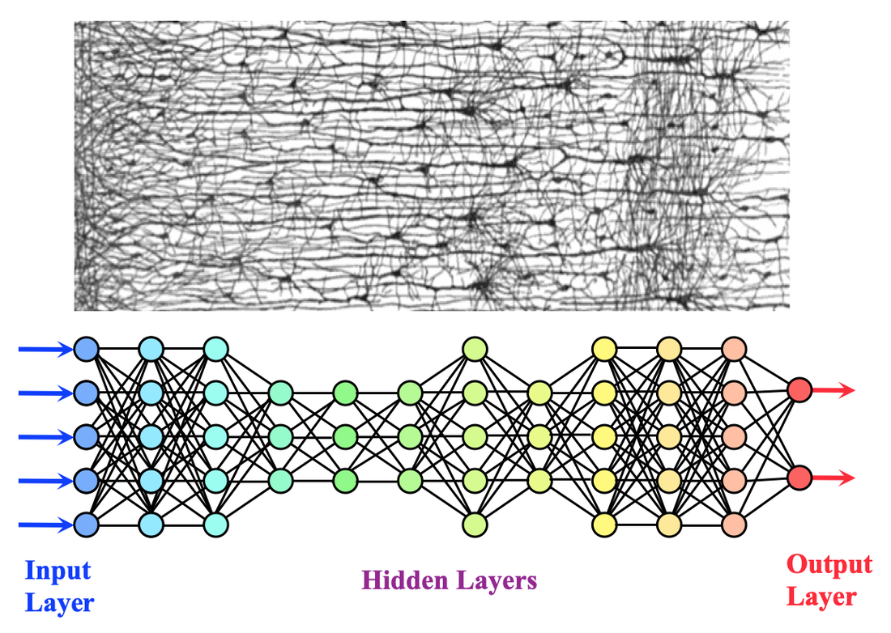
 

人类大脑从表到里分两部分，大脑皮质(Pallium)、下皮质(Sub-Pallium)。

大脑皮质又称灰质,集中着神经元胞体,相当于处理器。厚度一般在1.5-5mm，可分6层，自表向里为分子层、外部颗粒层、外部锥体层、内部颗粒层、内部锥体层、多形细胞层，不同的神经元分层排列。

下皮质是基底神经结的脑白质, 不含胞体，只有神经纤维(Nerve-Fibers)、毛细血管等。神经纤维即神经元的轴突及外周用于绝缘、提高神经传导速度等作用的髓鞘(Myelin Sheath)，相当于排线。

大脑皮质分层。

 

大脑皮质神经元是多极神经元，大致分为锥体细胞、颗粒细胞及梭形细胞。颗粒细胞分为星形(Stellate)细胞、水平(Horizontal)细胞、篮状(Basket)细胞等。

 

大脑皮质内微环路。
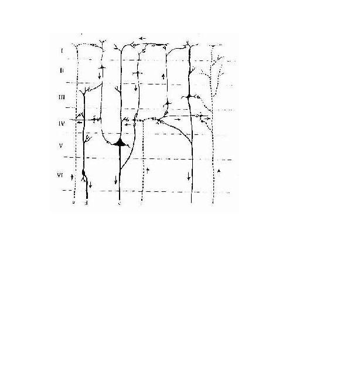

 

小脑皮质神经元与传入纤维。
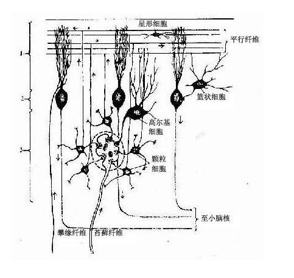

 

基于大脑及小脑皮质、神经元连接，可以看到神经元之间可串行连接或跨层连接。这与深度学习神经网络中神经元的顺序连接、残差连接是相似的。

 

深度学习

深度学习的实质，在数学层面是基于异构基函数不同形式的组合或连接，利用数据统计拟合人类思维函数。不同基函数，比方，点积运算与激活函数，模仿人类神经系统中神经元的连接形式来组合。

基函数方法，是定义及分析函数的普遍方法。比方，信号处理中，傅里叶级数(Series)或积分(Integral)基于正弦函数、余弦函数或指数函数(Complex Exponentials)表示周期或非周期函数；语音识别中，高斯混合模型(GMM, Gaussian Mixed Model)基于高斯分布基函数定义隐状态到声学特征向量帧的发射概率；机器人轨迹规划中，样条曲线(B-Spline)基于基函数线性组合定义轨迹等。

机器学习要素，表征、模型架构、目标函数、优化算法。数据及算力次之。

然后，是确定模型训练架构。比方，监督、非监督；预训练、后训练等。

再之后，业务应用。模型及业务层协同向用户提供支持。

1、表征，数据集尽量转换到正交或独立的高维空间进行表示，以提炼尽可能多的特征，同时去冗余。比方，傅里叶级数中，函数基于一系列正交的三角函数变换；支持向量机(SVM, Support Vector Machine)算法中的基函数(Base Function)变换；LLaMA模型中旋转位置编码(RoPE, Rotary Positional Encoding)等。

注，表征(Representation)与特征(Feature)意义基本相似。表征学习(Representation Learning)，利用可训练的带参函数或神经网络层学习数据特征；特征提取(Feature Extraction)，用特定方法，比方，SIFT工具，提取图像数据特征。

2、模型架构，基于数据表征进行一系列的高维或低维空间转换，计算表征在不同维度空间的特征；在同维度空间计算特征的拓扑关系；两者独立计算或交替进行，以实现对目标的预测。比方，支持向量机，数据基于基函数转换到高维空间，再基于核函数(Kernel Function)计算关系；图像分类，图像基于卷积核提炼图像特征、池化特征，再分类；大模型语言翻译，分词表征基于不同权重矩阵转换到特征空间，进行注意力计算，再基于新的不同权重矩阵转换到新的特征空间，再进行注意力计算等。

深度学习模型作为神经网络函数，无法计算解析解，因此一般利用模型对样本的预测结果与真实值比对所定义的目标函数的最优解来确定模型参数。

3、目标函数，对预测的数据进行对齐或比对，同时防止过拟合或欠拟合。比方，变分自编码器(VAE, Variational Auto Encoder)基于编码图像到一个隐变量高斯分布函数，再采样该分布函数来生成图像，生成的图像分布尽量与原始图像分布相似的同时，应使得正则项(Regularizer)-编码后的隐变量后验分布与隐变量先验分布相似，以便基于隐变量分布的采样是平滑的，或者说采样点不容易聚集于训练数据所对应的隐变量点，防止推理时图像生成缺乏泛化性。

注，VAE实际就是用编码器的后验分布去近似解码器(生成器)的后验分布。

深度学习模型作值函数时，目标函数可基于误差形式定义；作概率函数时，可基于似然函数定义；作信息函数时，可基于信息熵定义。

当目标函数不便进行优化计算时，可通过一些变换、等价方法，比方，贝叶斯定理、琴生不等式等找到适合进行优化计算的函数作目标函数。

目标函数确定后，综合模型训练性能及效率需求，可选适当的优化算法。

4、优化算法，以有效、实用的方法计算目标函数关于模型参数的最优解，以便模型预测尽可能接近真值。可用最小二乘法、牛顿法、梯度下降法等。

比方，随机梯度下降法，基于函数的链式规则反向传播(BP, Backpropagation)计算目标函数的参数变量梯度，以更新参数。基于牛顿法，目标函数泰勒级数展开，涉及雅可比矩阵或海塞矩阵，计算量易过大。

机器学习模型训练示例。

基于多项式逻辑回归模型判别文本情感类型。

已知，文本数据集，(X, Y)。

X，n个文本段样本；Y，对应于X中每个文本段的情感分类，取值 1或0。

要求，基于文本数据集训练逻辑回归模型，计算合适的参数，以便对于新文本段，可用训练的模型判别文本类型。

训练过程。

第一步，定义数据集样本的特征向量。

假定，以文本段中正向(Positive)单词数量(Count)作样本第1个特征，x1 ； 相反(Negative)情感的单词数量作样本第2个特征，x2。定义样本特征向量，[ x1, x2 ]。

第二步，定义逻辑回归模型方程，y = δ (w1x1+w2x2+b)。

δ ， Sigmoid 激活函数。δ(z)，概率取值 [0, 1]。

w1 及w2 ，权重参数。

b ， 偏置参数。

第三步，定义损失函数。

假定，数据集中任意样本，x ；相应的真实类型，y 。模型预测值，y’ = δ (w1x1+w2x2+b)。

注，当δ(z)概率大于0.5 ，使y’ = 1 ; 否则， y’ = 0 。此时，在δ坐标图中，0.5 对应的水平线可称决策边界(Decision Boundary)。

 

可基于交叉熵定义损失函数，L( y’ , y ) = - [ y log y’ + ( 1 – y ) log ( 1 – y’ )]。

注，基于伯努利分布最大似然率可推得二分类任务的交叉熵损失函数形式。

第四步，基于随机梯度下降法计算损失函数最优值。

计算单个样本损失函数对参数的梯度，∇L。

参数更新方程，θt+1 = θt – η ∇L 。θ 对应参数列向量，[w1 , w2 , b ]。

η ， 学习率。用于调整参数更新步伐。

基于样本数据集每个样本的损失函数梯度，更新模型参数，直到参数值基本不再变化。

注，优化算法常基于小批量(Mini-Batch)样本训练，此时损失函数L是多个样本估算结果的均值。

基于逻辑回归模型训练示例，可以看到，样本特征、模型架构、目标函数、优化算法的定义及应用。

深度学习模型中，主体基本便是类似逻辑回归模型的纵向排列、横向堆栈连接形式。图像样本可以像素作特征，文本可以标记(Token)作特征，语音可以频率作特征。

一、神经元

深度学习中，利用矩阵乘及激活函数来模仿神经元。X，表示信号数据；W，表示权重；Y，表示输出的信号。

 

 

二、表征

表征(Representation)，图像、视频、语音、音频、文本等数据的像素、音素(Phonem)、标记(Token)等元素(Elements)的向量表示。向量之间尽可能的相互正交化，以便提炼元素特征，移去冗余信息，识别元素之间模式(Pattern)，促进模型的泛化，加快训练推理。

表征学习(Representation Learning)，通过深度学习神经网络层等自动学习原始数据的特征。

 

学习方法，可分作传统的浅表征学习、深度表征学习等。比方，基于线性方法的主成分分析(PCA)计算数据方差(Data Variance)；语言模型中，Word2VEC、GloVE、BPE(Byte Pair Encoding)、WordPiece、SentencePiece等通过神经网络非线性方法对单词或标记进行嵌量化(Embeddings)；在机器人运动动作控制模型中，可通过视觉语言模型对场景图像及用户语言指令进行嵌量化；在迁移学习中，预训练模型学习表征以适应下游任务。

三、模型

深度学习模型，用于图像分类、目标检测、语义分割、语音识别、问答、运动控制等任务。

基本可分作前馈神经网络、卷积神经网络、循环神经网络、生成对抗神经网络模型等。

很多情况，模型框架融合了表征学习。

注，归纳偏置(Inductive Biases)或推理偏差，机器学习模型关于模型架构设计以及数据特性的假设。极大影响着模型的泛化能力。

传统算法，每一算法都存在推理偏差，比方机器学习中的推理偏差， 贝叶斯模型( Bayesian Model )的各变量独立性假设；K近邻 ( KNN, K-Nearest Neighbors )假定相似的变量相邻，不相似的距离远；线性回归，假定因变量y线性的依赖于自变量x ； 逻辑回归，假定存在超平面可以分离两个类型。 

深度学习中的关系型推理偏差，假定神经元之间相互独立(弱联系)因此可以用全连接来表示该关系；假定卷积可以提炼图像像素之间的局部关系，则多层可以提炼全局信息；假定存在序列关系，则可以用循环网络；假定元素之间存在图结构，以便可以对关系进行建模，解决群组问题。

深度学习中的非关系型推理偏差，比方，非线性激活函数( Non-linear Activation Functions )，假定可以捕获隐藏在数据中的非线性；Dropout方法，纠偏技术(Regularization )防过拟合，随机丢弃一些连接，避免形成固定数据记忆，以增强模型的泛化能力； 权重衰减( Weight Decay )，纠偏技术(Regularization )防过拟合，对模型权重施加约束，阻止权重过大，常用方法L1和L2 ； 归一化( Normalization )，最重要的是减少激活函数分布中的变化，同时加速训练等，常用方法，批归一化(Batch Normalization ), 实例归一化( Instance Normalization ), 层归一化(Layer Normalization )； 数据增强( Data Augmentation )， 纠偏技术(regularization )防过拟合，比方， 在语句中添加噪声或进行单词替代，不会改变句子类型 ； 优化算法，比方，不同的梯度下降算法导致不同的优化结果，形成不同的模型可能有不同的泛化能力，同时不同的算法有不同的参数，影响训练收敛性及优化计算。

四、损失函数

损失函数，深度学习中用来作训练目标，以更新模型参数，使模型尽可能接近真实的函数。

通常可表示作全部或批次样本基于模型的预测结果与真值(Ground Truth)逐个对齐的和形式，同时，加正则项以防止模型训练过拟合。

单个样本的预测结果与真值的对齐，基于任务类型，可采用不同方法，比方，最小平方差、最大似然率、交叉熵等。

五、优化算法

对损失函数进行优化计算的方法，可采用牛顿法、梯度下降法等。基于计算便利性，常用随机梯度下降法。

随机梯度下降法，随机选一批样本进行预测，损失函数视作模型参数的函数，计算梯度，基于梯度方向迭代更新参数，逐步趋近使损失函数最优。

六、偏差与方差

深度学习中，常需基于偏差、方差评估模型的拟合度，以调整网络规模、样本数据集。

偏差，多个样本的估计值的期望或均值与真实值的差。

$\text{bias}(\hat{\theta}) \triangleq \mathbb{E}\left[\hat{\theta}\right] - \theta$

方差，或统计误差(statistical error)。每个样本的估计值与全部样本估计均值的差的平方的期望。

$\mathbb{V}(\hat{\theta}) = \text{var}(\hat{\theta}) \triangleq \mathbb{E}\left [ ( \hat{\theta} -\mathbb{E}\left[\hat{\theta}\right] )^2 \right]$

注，偏差，是模型预测与真值的关系；方差，是模型预测与模型预测期望的关系。

深度学习中，神经网络充分大，则可以在不影响方差的前提下，减少偏差；样本数据充分多样，则可以在不影响偏差的情况下，减少方差。

基于偏差、方差的调整过程。

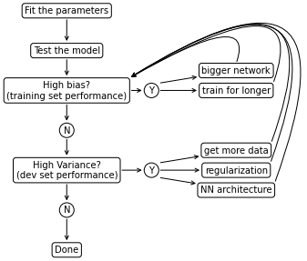

 

 

七、并行训练

深度学习模型常需通过并行计算来提高训练效率。并行方案主要基于对模型框架、优化算法的分析，利用对模型参数、梯度、优化器参数的划分，以及训练过程中参数的暂存等方法来设计。

基本的分布式训练框架，Accelerate(HuggingFace) 、 DeepSpeed(MicroSoft) 、 FSDP(Meta Pytorch) 、Megatron-LM(Nvidia)。

DeepSpeed 与 FSDP 是相同理念的不同实现，都是对**1、优化器状态、2、梯度及3、参数**进行跨GPU分片。同时，都支持卸载训练信息到CPU或闪存设备。

DeepSpeed 的**零冗余优化器 ZeRO(Zero Redundancy Optimizer)**允许跨GPU对模型划分(Partition)，**不用每个GPU都复制模型参数**。

**ZeRO三个阶段**.

ZeRO Stage 1 将优化器状态及优化算法公式中的参数及因变量划分到不同GPU(partitions optimizer states)

ZeRO Stage 2 划分梯度。

ZeRO Stage 3 划分模型参数。

**优化器状态举例, 12倍于模型参数规模**。

Adam的动量及方差(Momentum + Variance)，占 2*4Byte。
混合精度(mixed-precision, 比方模型参数FP16, 优化器参数FP32以提高计算精度)的实现中，需要复制一份fp32的参数作为被optimizer更新的参数， 1*4Byte

 

总的来说，深度学习模型的设计，与现在利用对宇宙的观测数据建立标准模型，再利用标准模型预测宇宙的边界，可能是相似的。

如果将世界看作一个纯粹的时空流，那么深度学习拟合的函数一定程度，比方，在原子层面之上，可以看作是在实现拉普拉斯妖，即拟合的函数可以基于当前时空信息推理世界的未来与过去。

这实际隐含着一个假设，此状态到彼状态之间一定存在着一个函数变换，并且可能存在着一个统一的函数可以反映任何状态之间的变换。

假定该假设成立，则基于当前的Transformer注意力框架，找到机器人此状态到彼状态的变换函数是可能的，实用型的通用机器人(AGI, Artificial General Intelligence Robot)应是可实现的。

因此，当前，机器人视觉语言动作模型(VLA, Visual Language Action)基于扩散或流匹配模型进行动作或向量场对齐(显模仿，Explicit Imitation)。似应向着状态对齐(隐模仿，Implicit Imitation)改进，动作生成只是状态对齐训练过程中的变量。

当基于状态对齐训练模型时，对遥操作的需求应可极大降低。通过观测模仿、观测比对，利用视觉信息训练模型应是可大规模、更方便的。

比方，机器人可基于本体状态与观测视频中的具身状态进行对齐，或通过第三方观测者比对机器人与观测视频中的具身状态。

第三方观测同样可以是神经网络模型，这使得观测视频中的具身与机器人具备相似特征即可，不需完全一致。

 

数学原理

深度学习过程的数学描述。

假定存在一个能实现目标任务的函数$t(x)$，可基于神经元网络连接形式定义的带参函数，$y = f(\theta,x)$，来进行等价。

带参函数$y = f(\theta,x)$无法通过方程联立求解，但是却可以通过大量的样本对，{(x_1,y_1),...,(x_n,y_n)}，来进行拟合。

拟合的方法，定义一个关于$(\hat{y_1},y_1)$的目标函数$o(\hat{y_1},y_1)$，其中$\hat{y_1}$是参数$\theta$的函数；通过优化算法找到目标函数最优解，使得此时解到的参数对应的$f(\theta,x)$最接近$t(x)$。

人工智能、机器人中对深度学习相关的数学概念可分为这样几个层面。

第一层，数。整数、实数、虚数、导数、向量、矩阵、张量等

数据是深度学习最基本的要素，不同形式的数据定义着不同的特征或信息。

比方，图像展开作向量。多个RGB图像作张量。自然语言文本分词(Token)One-Hot向量。语音识别中的声学特征向量。SLAM系统，机器人位姿变换矩阵。

第二层，集合。定义明确、具备共同特性的数。

基于大数定律，深度学习模型常需通过大规模数据进行训练才利于拟合真实函数。

比方，图像样本数据集。文本问答数据集。语音音素数据集。

第三层，关系。数据元素之间的线性、非线性关系。

确定数据元素之间的关系，才有利于提炼数据特征、数据降维等。

比方，图像向量内的像素元素存在线性关系，可利用线性加权方法提取特征。

第四层，空间。数据的空间结构。

高维数据特征存在的空间结构常需在相应的空间中表示，以便描述。

比方，图像向量结构可在向量空间中进行表示。数据的非线性结构可在流形拓扑空间中表示。

注，第一至第四层，主要用于数据表征。

第五层，函数。数据域之间的映射。

深度学习模型函数基于输入的数据进行推理预测。

比方，模型函数基于图像向量预测图像类型。可基于泛函分析模型函数的连续性、收敛性。

第六层，目标函数。对模型预测结果与真实值进行对齐的函数。

比方，基于特征向量预测图形类型，预测值遵循特定概率分布，可用交叉熵作目标函数；预测值是连续的，可用均方差作目标函数；预测值用于还原样本数据，可用最大似然作目标函数等。

第七层，优化算法。计算目标函数的最优解。

比方，基于有效、简便需求，随机梯度优化方法可用于更新模型参数。

可以看到，深度学习表征，涉及数、集合、方程、空间、函数等；模型框架涉及线性代数、矩阵、概率、函数等；目标函数涉及测量误差、信息论、最大似然等；优化算法涉及微积分、凸优化等。

 

扩展研究

深度学习任务可以分为回归、分类等类型。不同任务类型可在计算机视觉、自然语言处理、语音识别与合成、内容生成、三维模型重建及运动控制等应用中体现。

深度学习与不同的技术结合形成不同的深度学习方法。

1、深度模仿学习

代理(Agent)或神经网络模型利用专家的演示(Expert Demonstrations)进行对齐，不需环境奖励信号。或者，通过专家演示学习奖励函数(Reward Function)，再训练模型。

注，当前机器人模仿学习似乎主要是利用遥操作(Teleoperation)机器人来收集专家演示的机器人动作数据。 不同于机器人状态数据。

2、深度强化学习

强化学习与监督学习存在着相似性，不同在于具备探索及利用特性(Explore And Exploit)。

如果一个时序序列各状态存在着依赖关系，则数学概念可定义作马尔可夫链。如果只能观测到现象，无法直接观测状态，则数学形式可以定义作隐马尔可夫链。

基于马尔可夫链进行决策，则可以称作马尔可夫决策过程。基于部分可观测状态，则可以称作部分可观测马尔可夫决策过程。强化学习便是这样的一个过程。

决策过程中的决策模型基于深度神经网络实现，便是深度强化学习。

3、深度元学习

元学习或"learning to learn" algorithms. 基于不同的任务数据集对(pairs)或者说任务分布，找到使这些任务损失函数**期望**最小的参数.

逻辑意义，学习或找到使不同任务(相应数据集)预测都尽量最优的模型参数. 这样该模型在新任务时，稍加训练便可实现新任务的推理.

4、深度终身学习

通过吸纳新信息持续学习,同时还保持此前学过的经验.

 

数学篇

数学是人类从对自然现象、工程实践、商业运营、竞技娱乐等事务的研究中派生、提炼出来的。数学的各式各样的概念是为着准确定义、经过众多研究者、长时间逐步确立的。

为更直观、更高效的了解相关数学知识，本篇将以工程为中心，围绕着深度学习模型来解释相关数学基础。尽量还原人类发现及应用数学的过程，避免陷到为着严谨、定义的繁琐的数学概念中去。

数学是对物理世界规律的抽象的、符号化的描述。从符号学(Saussure)层面来说，数学语言、自然语言与计算机编程语言等没什么不同。

深度学习是基于矩阵线性变换、激活非线性变换网络预测目标概率的函数拟合过程。因此，基本涉及线性代数、泛函分析、概率统计及数值分析等数学分支。

一、函数概念通过莱布尼茨、欧拉、傅立叶、狄利克雷及柯西等数学家历数个世纪定义形成，是对数据集或向量空间之间变换关系的研究。

泛函分析，研究函数空间或向量空间及其特性的数学分支。可用于解决机器学习涉及的高维数据空间及复杂函数，利用距离、收敛及连续概念来分析优化机器学习算法，提高性能及泛化能力，更好的理解算法本质。

注，函数空间，集合X到集合Y的所有映射函数。

比方，图像语义任务。基于带参的神经网络模型定义图像集合到语义集合的函数空间，假定神经网络模型泛函函数是连续的，则说明模型函数可泛化到任意样本，可以任意准确度近似图像集合到语义集合的真实函数，或者说，基于模型训练找到具体模型函数的近似。

同时，基于函数是集合X到集合Y的映射，模型训练样本集合的分布越接近真实分布越利于计算近似函数。

注，图像不只是像素向量，同时是光线的函数。神经网络模型可视作输入函数空间到输出函数空间之间的映射或算子(Operator)。

 

二、概率理论与统计推理通过帕斯卡、费马、格朗特、伯努利、棣莫弗与拉普拉斯等发展及定义，概率论基于已知数据预测未知事件概率，统计推理基于样本数据拟合统计模型进行更通用的预测。

三、数值分析在19世纪之前便大量应用于测量学、天文学、物理学及工程等领域，不过作为独立学科则是通过柯朗、冯.诺依曼等数学家的发展于20世纪40年代开始形成，用于计算数学问题的近似最优数值解。

 

第一章 数学概史

技术的发展与数学存在着很大的共生特性或交集。从尼罗河、幼发拉底河、底格里斯河的土地测量，到托勒密的天体运行，大航海时代的导航定位；从第一次工业革命时代开始，到当前的人工智能革命，数学与技术交相促进。

因此，在计算技术发展的今天，要使技术具备更通用性、更确定性，研究技术的数学原理是不可少的。

这个研究的过程，应该从数学史开始。

原因在于，数学，是人类对现实现象机理的研究及抽象。分析数学发展史、了解客观事物怎样通过人类的逻辑及想象转换成今天的形式，不只有利于促进数学的更快、更广及可持续发展，更有利于形成数学的全貌及逻辑脉络、发展意义。当然，也有利于人工智能技术数学原理的解读。或者说，历史、逻辑、意义形成自洽时，知识的力量才可能发挥最大作用。

数学，人类基于对生产、生活、物理现象等的数理认识产生。

 

大约在公元前30世纪，人类基于计数需要便逐步产生数(Numbers)及算术(Arithmetric)运算。

公元前17世纪，埃及、两河流域文化中基于对土地的计算等产生代数学萌芽。比方，一方土地，已知周长及面积，计算长、宽。基于问题可定义两个方程进行解计算。

轴心时代开始，希腊商贸横跨亚欧非，融合印度河及两河的发现产生了几何学，同时促进了代数的发展。比方，毕达哥拉斯定理，既是几何定义，又是代数形式。

希腊城邦及学院文化的传播，促使欧几里德、丢番图分别基于逻辑演绎及符号化系统发展了几何学及代数学。

中世纪，居于亚欧大交通的阿拉伯融汇希腊、希伯来、印度等地区数学知识，花拉子密等进一步发展了代数及几何。同时，印度数字(0-9)等随翻译运动传到欧洲，革新了数学发展。

文艺复兴时期，威尼斯等世界商贸城市的发展，以及博洛文尼亚等学院的建立，促进了代数的发展。比方，三次、四次方程计算等。

17世纪，在维达字符化(Letters)代数系统后，笛卡尔及费马等开始利用代数解析几何问题。沿着数学传播之路，牛顿、莱布尼茨分别在研究物体运动变化、几何曲线面积计算时发现微积分互逆定理。同时，帕斯卡、惠更斯等研究赌博、股票、保险等问题时，现代概率论开始发展。数论、射影几何得到发展。世纪末，微积分应用到物理轨迹研究中，促进了微分方程的发展。比方，伯努利等对最速降线的研究。曲线拟合过程中，发展了插值法。

18世纪，函数逐步发展。基于多项式近似目标函数发展泰勒级数等。基于对多变量物理函数的研究促成偏微分方程及三角函数的发展。比方，欧拉、达朗贝尔等对振动弦波方程(Wave Equation)的研究。最小作用量的研究促进了泛函的发展。同时，贝叶斯等基于对逆概率(Inverse Probability)问题的研究，发展了概率论。基于解析几何、无限小量(Infinitesimal)等技术，微分几何开始发展。欧几里德几何平行公设(Parallel Postulate)遇到质疑。对七桥问题的研究引发拓扑学(Topology)发展。

19世纪，勒让德发现、高斯发展了统计学重要方法，最小平方差。傅立叶等基于波方程解的研究，发展了三角级数、变换等。基于柯西等对转置的研究，伽罗华计算方程通用解时发现了解的转置群与方程的关系，形成群论。西威斯特、凯雷等发展了矩阵代数及矩阵理论。柯西应用微积分到复数域形成复分析。汉密尔顿研究四维空间代数时发现四元数(Quaternion)，用到标量及向量。吉布斯等基于对四元数麦克斯韦方程分析，形成向量代数。基于类四元数运算设计方法，布尔发展了对计算机设计重要的逻辑学。曲线分解到坐标轴进行线积分(Line Integral)，使得物理概念可用向量表示，形成向量分析。基于对平行公设等的研究，形成罗氏及黎曼非欧几何，流形概念发展。基于多边形拼接曲面，组合拓扑(Combinatorial Topology)发展。基于早期蒙日画法几何(Descriptive Geometry)的研究，射影几何进一步发展。基于七桥及多面体点边问题，开始形成图论(Graph Theory)。基于随机变量函数定义概率(Chebyshev)，不再用比例(Ratio)定义。基于代数方程群方法，李等(Lie, Killing)基于流形发展了微分方程李群、李代数。康托等发展了点集或广义拓扑(Point-Set/General Topology)、无限集合论。世纪末，佩亚诺发展向量空间。

20世纪，向量空间进一步发展。同时，结合四色图问题，庞加莱等发展代数拓扑。微分拓扑、函数空间、泛函分析、博弈论、运筹学等发展。基于微分方程的动力系统发展。基于通讯研究，香农等开始发展信息论。

可以看到，现代数学源于古代算术、代数及几何，发展于公元1500年后。特别是近400年，在商贸开放、自由交流、知识迅传的环境逐步形成及体系字符化后，数学分支相互结合、横向扩展，数、关系、运算分离、纵向抽象。发展到当代，形成基于集合、空间及函数的学科。

数学发展逻辑的推测, 符号化, 从数开始，数之间的关系形成算术，未知数之间的关系形成代数，毕达哥拉斯定理确立代数方程与三维几何的联系，位置关系形成坐标系，坐标系与代数方程联系形成解析几何，数量的极限变化关系形成微积分，未知数的导数关系形成微分方程，代数方程未知自变量与因变量关系形成函数概念，多变量未知数的导数关系形成偏微分方程，坐标系中圆、半径、角度的代数关系形成三角函数，带参同类型函数形成泛函，基于微积分分析泛函形成泛函分析，三维几何抽象化发展产生拓扑几何，三维坐标系的抽象化形成数学空间概念。

当代数学分支很多，很难进行确定的分类。结合数学发展的三大渊源、抽象度、人工智能相关度，本文对数学大概划分为集合与空间、代数与微分、微分几何、数学分析、概率统计及优化计算等。

 

第二章 集合与空间

一、集合

集合(Set)，定义明确(Well-Defined, Distinct)的、存在着相同特性(Common Property)的对象或元素的聚集(Collection)。元素可以是数字、字符(Letters)等。

集合论(Sets, Set Theory)，对集合(sets)之间关系、特性(Properties)的研究。集合运算，并(Union)、交(Intersection)、差(Difference)、互补运算(Complementation)等。

注，19世纪70年代，康托(Cantor)在研究实数线(Real Line)或线性连续统(Linear Continuum)时，发现无限集合大小(Cardinality, 势、基数)可比较。例，两集合元素一一对应满映射(Bijectable)，则大小相等。自然数集合基数小于实数集合基数。

同时，基于对康托连续统假设(Continuum Hypothesis)的证明尝试，实数的每个无限集合的基数只可能等于自然数集合基数或实数集合基数，集合论开始创立。

随后，策梅洛(Zermelo)等针对罗素悖论(Russell’s Paradox)等问题，开发了集合论的ZFC公理体系(Zermelo-Fraenkel Axioms, Axiom of Choice)。比方，幂集合(Power Set)公理，任何集合都存在幂集，元素是该集合的全部子集；替代公理(Replacement)，集合的映射是集合；选择公理，对于成对的非空集合(Pairwise-Disjoint Non-Empty Sets)，存在着一个集合，该集合与每个非空集合共有一个元素。基于替代公理，可发展超限序数与基数(Transfinite Ordinals and Cardinals)。

在二十世纪60年代，科恩(Cohen)在证明策梅洛公理、选择公理、连续统假设关系时，设计了力迫法(Forcing)以扩展ZF/ZFC公理体系模型。

开集(Open Set) , 比方，实数开区间(4,6); 闭集(Close Set) , 比方，实数闭区间 [4, 6] ;  在一个集合中，开子集的补是闭区间，闭区间的补集是开区间 , 比方 , [1, 10] 集合中， [4 ,6] 的补集是开区间。 开集、闭集的作用在于 泛函、微分几何、拓扑群理论 中 定义、理解空间的内部结构。

在深度学习中，常通过定义或筛选合适的样本训练集、测试集，以训练或测试模型的泛化性。

比方，样本集划分(Split)作不重合的训练集与测试集，以便基于训练集训练的模型，可利用测试集样本的差异性测试模型的泛化能力。

在模型训练过程中，常通过定义不同的训练样本批次子集，以提高模型的泛化性。

比方，训练集分成多个不重合的小批次(Mini Batch)子集，利用每个批次数据迭代更新权重参数；全部批次迭代更新一局(Epoch)后，重洗(Shuffle)训练集，以便在下一局利用小批次更新时跳离局部最优，同时提高模型泛化能力，防止模型偏差(Model Bias)。

假定，模型基于两个权重参数，损失函数等于批次子集内全部样本预测误差的和。

这意味着不同批次对应不同的损失函数值、不同的参数梯度，不同的下山路线。

 

这就是说，每个批次看作一个样本子集，全部局(Epoches)的所有批次看作一个集合序列，任意两个集合不应该相同，以便利用梯度下降更新权重参数时，每个批次所反映的梯度代表不同的梯度可能。

二、空间

空间(Space)，是带结构的集合，结构定义集合元素间的关系。可分欧几里德空间、线性空间(向量空间)、拓扑空间、希尔伯特空间、概率空间等。

空间中元素之间基于距离度量，度量函数满足非负、同一、对称、三角不等式，称度量空间。空间元素基于向量，满足加法、标量乘法的封闭、交换、结合、单位元、逆元等性质称线性空间。

 

注，流形(Manifold)，横跨了向量、度量、拓扑等空间。向量空间与度量空间、拓扑空间存在着交集，却不相等。

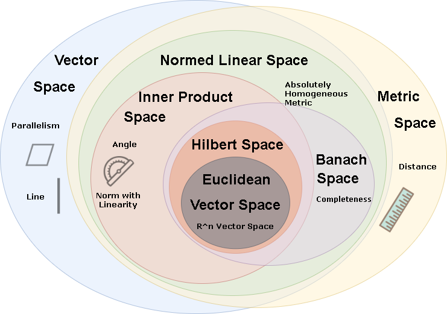

 

1.	向量空间

向量空间，向量及标量的集合，支持向量加法、标量乘法，运算满足封闭性。

比方，表型数据，每列表示一个特征，每条记录对应一个特征向量。

2.	张量空间

张量空间(Tensor Space)，标记着索引(Labelled By Indices)、存在着变换定律(Transformation Laws)的数的集合；基于向量空间的张量积(Tensor Product)创立，是标量、向量、矩阵的广义化。

注，张量积，A = u ⊗ v， A，m*n 张量；u, m维向量； v， n维向量。Aij = Ui * Vj 。

比方，在图像识别模型中 ，单批次图像集对应形状 b *c* h*w的张量。

b, 批次中图像数量。

c, 图象通道，比方，RGB三通道。

h, 图像分辨率高度。

w, 图像分辨率宽度。

3.	拓扑空间

拓扑(Topology)或拓扑学，又称橡皮几何，基于几何学及集合论发展形成。研究的是在连续可逆变形的情况下，几何对象或空间的不变的特性。

拓扑学，可分一般拓扑学或点集拓扑学、代数拓扑学、微分拓扑学、几何拓扑学等。

比方，拓扑学来说，咖啡杯与多纳圈是一样的。O与P是一样的。

拓扑空间,是具有结构的集合, (X, T) , X是集合，T是弹性结构或拓扑。

基于集合X定义的拓扑T，是集合X的开子集(Open Subset)的聚集(Collection)。同时，空集与集合X都在T中；T中任何子聚集(Subcollection)的元素的并运算(Union)结果在T中；T中有限子聚集元素的交运算(Intersection)结果在T中。

比方，集合 X = {a, b, c}。

基于集合X的拓扑(Topologies)示例。

 

非拓扑示例。

 

拓扑空间类型，基于拓扑可分离公理(Seperation Axioms)，可分科莫戈洛夫(Kolmogorov)T0空间、T1空间、豪斯道夫(Hausdorff)T2空间、正则(Regular)豪斯道夫T3空间、正规(Normal)豪斯道夫T4空间、完全(Completely)正规豪斯道夫空间、完美(Perfectly)正规豪斯道夫空间等。基于连通性可分连通、局部连通、完全不连通等。基于紧性可分紧性、仿紧、可数紧、列紧等。

注，豪斯多夫空间，任意两点可通过它们相应的领域分隔开来。假设X是拓扑空间。设x和y是X中的点，存在 x 的邻域 U 和 y 的邻域 V 使得 U 和 V不相交(U ∩ V = ∅)，则 x 和 y 可基于邻域分离；X 中的任意两个不同的点都存在邻域可分离，则 X 是豪斯多夫空间或T2空间、分离空间。可直观理解作千岛湖式的拓扑空间。

在深度学习中，可结合拓扑数据分析(TDA, Topological Data Analysis)等提炼数据的形状及结构信息，以提高神经网络模型的健壮性及可解释性。

基于数据拓扑的机器学习可称拓扑深度学习(TDL, Topological Deep Learning)。数据拓扑可以是单纯复形(Simplicial Complexes)、胞腔复形(Cell Complexes)及超图(Hypergraphs)等。

 

注，结构与功能作用存在着一定的对应关系。比方，蛋白质分子结构与功能，人类神经网络结构与思维等。

 

第三章 代数与微分

代数，关于变量的运算。变量代表数。

深度学习神经网络中主要用到线性代数进行矩阵乘加，优化求解时用到微分方程。

机器人位姿变换计算时用到群等抽象代数。

代数学类型，初等代数(Elementary Algebra)、线性代数(Linear Algebra)、抽象代数(Abstract Algebra)、交换代数(Commutative Algebra)/微分代数(Differential Algebra)、泛代数(Universal Algebra)、布尔代数等。

一、	线性代数

1.	向量与向量空间

向量 x  ,  $\text{n-vector: } \mathbf{x} = \begin{bmatrix} \mathbf{x}_{1} \\ \mathbf{x}_{2} \\ \vdots \\ \mathbf{x}_{n}\end{bmatrix}$

向量空间(vector space, linear space)， 向量的集合V与标量场F，集合元素满足加法及标量乘法封闭性。

向量空间基(basis)，向量空间任意向量可表示为一系列唯一标量 $c_1,\dots,c_n$ 与一系列向量 ${\mathbf{v}_1,\dots, \mathbf{v}_n}$ 的线性组合，$\mathbf{x} = c_1\mathbf{v}_1+ c_2\mathbf{v}_2 + \dots + c_n\mathbf{v}_n$  ， 则 ${\mathbf{v}_1,\dots, \mathbf{v}_n}$ 称作向量空间V的基。基的数量称作向量空间的维度。

2.	内积

内积是函数， $\langle\cdot, \cdot \rangle: V \times V \rightarrow \mathbb{R}$ ， 满足非负、正定、对称及线性计算。

内积的线性特性， $\langle \alpha \mathbf{u} + \beta \mathbf{v}, \mathbf{w} \rangle = \alpha \langle \mathbf{u}, w \rangle + \beta \langle \mathbf{v}, \mathbf{w} \rangle$。

内积表示两个向量之间的相似性。$\langle \mathbf{u}, \mathbf{v} \rangle = 0$ 则向量正交。

注，哈达玛积(Hadamard)，逐元素乘积，两个矩阵行列相同。

克罗内克积(Kronecker)，第一个矩阵的所有元素分别乘以第二个矩阵，并依照第一个矩阵的元素布局再展开乘积结果；不要求两个矩阵相同或行列数相等。

3.	线性变换与矩阵

线性变换，实现n维向量空间V映射到m维向量空间W的线性函数f。

函数f满足加法律及标量乘法。

$\langle \mathbf{u}, \mathbf{v} \rangle = 0$

$f(c\mathbf{v}) = cf(\mathbf{v})$

函数f可表示为m*n维矩阵形式。

$\mathbf{A} = \begin{bmatrix} a_{11} & a_{12} & \dots & a_{1n} \\ a_{21} & a_{22} & \dots & a_{2n} \\ \vdots & \vdots & \ddots & \vdots \\ a_{m1} & a_{m2} & \dots & a_{mn} \end{bmatrix}.$

特殊的矩阵，零矩阵、单位矩阵、对角矩阵、三角矩阵、置换矩阵(permutation matrix)。

置换矩阵乘向量可对向量元素重新排序。

比方，置换矩阵P

${\bf P} = \begin{bmatrix} 0 & 1 & 0 & 0 \\ 0 & 0 & 0 & 1 \\ 1 & 0 & 0 & 0 \\ 0 & 0 & 1 & 0 \end{bmatrix}.$

向量x

$x = [1, 2, 3, 4]^T$

则

${\bf Px} = [2, 4, 1, 3]^T$

即置换矩阵哪个位置元素等于1，则该位置行坐标对应向量元素换成该位置列坐标对应元素向量。

数学定义，

$P_{ij} = 1$ 则 $({\bf Px})_i = x_j$

置换矩阵的逆是其转置(transpose)，即 ${\bf PP}^T = {\bf P}^T{\bf P} = {\bf I}$ 。

矩阵的秩(Rank)，矩阵中线性独立的列数或行数。

满秩，m*n的矩阵A满足 $\text{rank}(\mathbf{A}) = \text{min}(m,n)$ ， 否则称不满秩(Rank Deficient)。

4.	矩阵算子(Matrices as Operators)

旋转算子

${y_1 \choose y_2} = \begin{bmatrix} {\bf \cos(\theta)} & {\bf -\sin(\theta)} \\ {\bf \sin(\theta)} & {\bf \cos(\theta)} \end{bmatrix} {x_1 \choose x_2}$

缩放算子

${y_1 \choose y_2} = \begin{bmatrix} a & { 0} \\ { 0} & { b} \end{bmatrix} {x_1 \choose x_2}$

映像算子

${y_1 \choose y_2} = \begin{bmatrix} { -1} & { 0} \\ { 0} & { -1} \end{bmatrix} {x_1 \choose x_2}$

变换算子

${y_1 \choose y_2} = \begin{bmatrix} { 1} & { 0} \\ { 0} & { 1} \end{bmatrix} {x_1 \choose x_2} + {a \choose b}$

5.	Vector Norm

Vector norm 是向量空间向量转成非负实数的函数， $\| \mathbf{u} \|: V \rightarrow \mathbb{R}^+_0$ 。

P-norm ， $\|\mathbf{w}\|_p = (\sum_{i=1}^N \vert w_i \vert^p)^{\frac{1}{p}}$ ， p 大于等于1。P=2时，称欧几里德Euclidean norm，对应向量长度。

比方， $\mathbf{w} = [-3, 5, 0, 1]$

1-norm ， $\|\mathbf{w}\|_1 = \sum_{i=1}^N |w_i|$

$\|\mathbf{w}\|_1 = |-3| + |5| + |0| + |1|$

$\|\mathbf{w}\|_1 = 3 + 5 + 0 + 1$

$\|\mathbf{w}\|_1 = 9$

2-norm ， $\|\mathbf{w}\|_2 = (\sum_{i=1}^N |w_i|^2)^{\frac{1}{2}}$

$\|\mathbf{w}\|_2 = \sqrt{\sum_{i=1}^N w_i^2}$

$\|\mathbf{w}\|_2 = \sqrt{(-3)^2 + (5)^2 + (0)^2 + (1)^2}$

$\|\mathbf{w}\|_2 = \sqrt{9 + 25 + 0 + 1}$

$\|\mathbf{w}\|_2 = \sqrt{35} \approx 5.92$

$\infty$-norm ， $\|\mathbf{w}\|_\infty = \lim_{p\to\infty}(\sum_{i=1}^N |w_i|^p)^{\frac{1}{p}}$

$\|\mathbf{w}\|_\infty = \max_{i=1,\dots,N} |w_i|$

$\|\mathbf{w}\|_\infty = \max(|-3|, |5|, |0|, |1|)$

$\|\mathbf{w}\|_\infty = \max(3, 5, 0, 1)$

$\|\mathbf{w}\|_\infty = 5$

6.	Matrix Norm

General matrix norm ， $\| {\bf A} \|$

Induced matrix norms ， $\|{\bf A}\| := \max_{\|\mathbf{x}\|=1} \|{\bf A}\mathbf{x}\|.$

Frobenius norm(Hilbert-Schmidt norm , Schur norm) ， $\|{\bf A}\|_F = \sqrt{\sum_{i,j} a_{ij}^2}.$

Matrix p-norm ， $\|{\bf A}\|_p := \max_{\|\mathbf{x}\|_p=1} \|{\bf A}\mathbf{x}\|_p.$

比方，

1-norm ， $\|{\bf A}\|_1 = \max_j \sum_{i=1}^n \vert a_{ij} \vert.$

2-norm ， $\|{\bf A}\|_{2} = \max_k \sigma_k$

$infty$-norm ， $\|{\bf A}\|_{\infty} = \max_i \sum_{j=1}^n \vert a_{ij} \vert.$

7.	特征值与特征向量

$\mathbf{A} {\bf x} = \lambda {\bf x}$ ，称特征值等式。 $\lambda$ 称特征值，可以是实数或复数。x 称矩阵A对应于$\lambda$ 的特征向量。

8.	矩阵迹(Trace)运算 

迹 =  矩阵对角元素和。

9.	矩阵分解

特征值与特征向量法，适用于正方矩阵 $A = V diag(λ)V^{−1}$。

奇异值分解(singular value decomposition)法，适用于任何矩阵，更通用。

$ A = UDV^T$。

A, m*n。

U, m*m , 正交矩阵(orthogonal matrice) , 列称为A矩阵的左奇异向量(left-singular vectors)。

D, m*n ,对角矩阵 ,对角元素称A矩阵的奇异值。

V, n*n , 正交矩阵(orthogonal matrice) , 列称为A矩阵的右奇异向量(right-singular vectors)。

10.	伪逆计算

伪逆计算，线性方程(Linear Equations)中矩阵不可逆时进行逆运算，以计算方程解的方法。在人工智能、深度学习中常用。

实质在于，对于不可逆的矩阵，利用该矩阵转置相乘形成方形矩阵计算逆，或者对该矩阵的奇异分解矩阵计算逆。

比方，在传统机械臂运动控制中，通过逆向运动学的雅可比逆方法计算对应于终端执行器速度的关节速度。当雅可比矩阵非方形或者是行列式(Determinants)等于零的奇异矩阵(Singular Matrix)时，不可直接逆运算，要通过伪逆(Moore-Penrose Pseudoinverse)方法来计算方程解。

假定，$Ax = b ，A ∈ R^{m×n}$。通过计算伪逆A†解x。

若A是满秩，当 m < n 时，$ A^† = A^T(AA^T)^{-1}$ ； 当 m > n 时，$ A^† = (A^TA)^{-1} A^T $。

A非满秩，基于奇异值分解(SVD, Singular Value Decomposition)方法计算。

$ A = U Σ V^T$，Σ是m × n对角矩阵。

$ A^† = V Σ^†U^T $，$Σ^†$等于Σ倒数(对角非零元算倒数)。

11.	四元数

四元数(Quaternions)，三维空间中旋转的表示法，一个实部，三个虚部的复数形式, $q=q_0+q_1i+q_2j+q_3k , i^2=j^2=k^2=ijk (-1 for Hamilton), ij = k = −ji, jk = i = −kj, ki = j = −ik$。传统方法需要3*3的矩阵表示旋转，但是9个元素中只有4个是独立不相关的；并且旋转矩阵相乘要涉及27次乘，18次加，用四元数表示则简化为16次乘，12次加；同时形式上可以用两个四元数的向量(虚部,$p_v, q_v$)的内积(inner product)、叉积(cross product)来表示。

$pq = p_0q_0 − p_v • q_v + p_0q_v + q_0p_v + p_v × q_v$

四元数形式分为 Hamilton(ijk=-1)与JPL表示法(ijk=1,多用于航空航天领域，在自动驾驶中也可能应用，比方LIC-Fusion)。

1、四元数共轭复数(complex conjugate)、模(norm)、逆(inverse)

$q^∗ = q_0 − q_v$

$q^{-1} = \frac{q^*}{|q|^2}$

2、单位四元数

$cos^2θ = q_0^2$

$sin^2θ = |q|^2$

$q = q_0 + q = cos\frac{θ}{2} + u sin\frac{θ}{2}$

3、定理一、单位四元数对三维空间向量$v$的$L_q()$运算，又称点旋转或向量旋转。

$L_q(v) = qvq^∗$

运算结果，向量$v$的长度不变、沿着单位四元数向量方向(虚部定义的向量方向)。

$L_q()$运算满足线性关系。

几何意义，向量$v$绕$u$轴旋转了$θ$度角。

4、定理二、单位四元数对三维空间向量$v$的$L_q^*()$运算，又称坐标系旋转。

$Lq^∗ (v) = q^∗v(q^∗)^∗ = q^∗vq$

几何意义，坐标系绕$u$轴旋转了$θ$度角，向量$v$不旋转。或者说向量$v$所在的坐标系绕单位四元数(虚部定义的)向量坐标系旋转了$-θ$度。

5、四元数运算可用于三维形状配准(3d shape registration)，即对一系列源点进行旋转并平移，然后与一系列目标点进行比较，使两者误差最小时的正交矩阵R及平移b。

$\underset{R,b}min\overset{n}{\underset{i=1}\sum}||Rp_i + b − q_i||^2$

假定，$p^`_i$表示任一源点到一系列源点中心的距离

$q^`_i$表示任一目标点到一系列目标点中心的距离。

最终，经过转换，实际是计算

$max\overset{n}{\underset{i=1}\sum}(qp_i^`q^*).q_i^`$

将四元数看作四维空间向量，将$p^`_i$看作第一项为0的四元组

同样，将$q^`_i$看作第一项为0的四元组

运用四元数乘积定义，上式$max\overset{n}{\underset{i=1}\sum}$内元素可变换为四元数乘积

$(qp^′_iq^∗) • q′_i = (qp′_i) • (q′_iq)$

四元数乘积等于矩阵乘积 $P_iq , Q_iq$

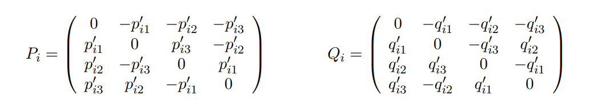
 

最后，转换为

$q^T (\overset{n}{\underset{i=1}\sum} P^T_i Q_i)q$

括号中是4*4对称矩阵M，具有4个特征值$λ1, λ2, λ3, λ4$

特征向量$v1, v2, v3, v4$

四元数是特征向量的线性组合

$q = α_1v_1 + α_2v_2 + α_3v_3 + α_4v_4$

则

$q^T (\overset{n}{\underset{i=1}\sum} P^T_i Q_i)q$

=

$(α_1v_1 + α_2v_2 + α_3v_3 + α_4v_4)^TM(α_1v_1 + α_2v_2 + α_3v_3 + α_4v_4)$

=

$(α_1v_1 + α_2v_2 + α_3v_3 + α_4v_4).(λ_1α_1v_1 + λ_2α_2v_2 + λ_3α_3v_3 + λ_4α_4v_4)$

=

$λ_1α_1^2 + λ_2α_2^2 + λ_3α_3^2 + λ_4α_4^2$

要使 $q^T (\overset{n}{\underset{i=1}\sum} P^T_i Q_i)q$ 最大

则

$α_1 = 1 , α_2=α_3=α_4=0$

因此，单位四元数q等于一个对应矩阵M最大特征值的特征向量。

注，欧拉角(Euler Angles)、轴角、旋转矩阵及四元数都可用于三维旋转计算。

欧拉角(Euler Angles)，一组旋转角，旋转角以旋转物当前坐标轴的某个轴为中心轴进行旋转，开始与结束的中心轴是旋转物的同一轴。比方 中心轴序列 (z,x,z)，对应旋转角度 $\alpha, \beta, \gamma$

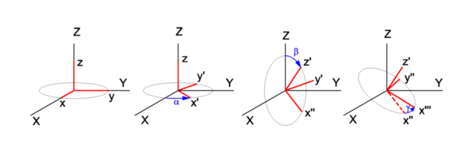
 

对应的旋转变换矩阵

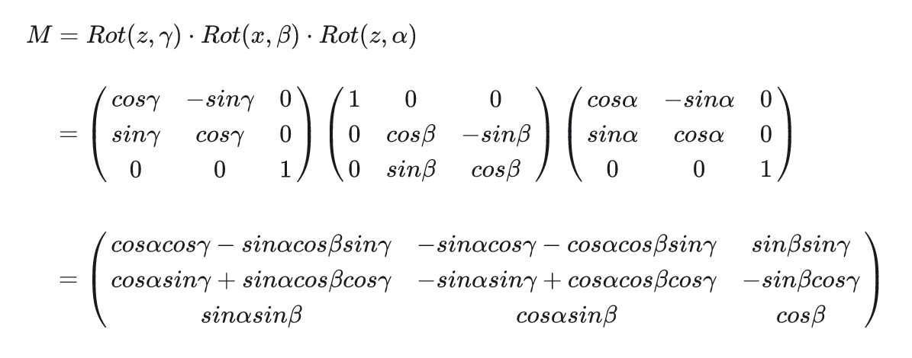
 

用欧拉角表示方向（或者说，方向变换）只需要用到3个参数，即三个旋转角度。由于坐标轴是旋转轴，所以不用增加特别的参数描述旋转轴。

但是，通过欧拉角可确定方向，却无法通过坐标轴方向逆向推理得到明确的欧拉角，因为存在很多情况都可能满足要求，同时还可能出现奇异问题(比方$\beta$角等于0，存在无数旋转方法)。

轴角表示(Axis-Angle-Representation)，绕一个轴旋转，这个轴是原坐标系原点及三个轴形成的立方体的过原点的对角线。

旋转轴 axis=[x,y,z] 旋转角度 $\theta$，轴角表示 (axis, $\theta$)，共4个参数。如果旋转轴向量为单位向量，$x^2 + y^2 + z^2 = 1 $，则可以用两个参数表示旋转轴，轴角表示简化为3个参数。此时旋转轴称欧拉轴，单位向量称欧拉向量。

二、	微分方程

微分方程实质在于描述，因果/映射变量及其无限小变化时的关系。

1.	常微分方程

常微分方程定义，一元函数的变化速率与该函数当前状态的关系。常用于物理学、工程学等科学领域及逆行能够各类动力系统建模.

常微分方程类型 , Homogeneous Differential Equations(同次方程中各项的次数(degree)相同) , Non-linear , Autonomous Differential Equations(不显式存在独立变量) , 等.

常微分方程的解就是满足该方程的函数.

基于常微分方程的复杂度，可以通过解析或数值方法计算方程解。

常微分方程, $$F(x, y, y′, y′′,...)=0$$

常微分方程可应用于物理运动、热传导、波传播、量子力学，工程方面的电子电路、控制系统、力振动、流体动力的分析及设计，经济系统建模、增长模型、供需变化、金融衍生。

2.	偏微分方程

偏微分方程(PDEs, Partial Differential Equations) , $$F(x, y, ∂y/∂x, ∂^2y/∂x^2,...)=0$$.

比方，纳维-斯托克斯方程(Navier-Stokes Equation)，描述粘性流体(Viscous Fluid)运动的偏微分方程。本质是，牛顿第二定律对无限小流体团(Fluid Parcel)的应用。遵循动量、质量守恒，可用于模拟天气、洋流、气流及分析湍流(Turbulent Flow)等。

$ \rho \left( \frac{\partial \vec{u}}{\partial t} + (\vec{u}\cdot\nabla)\vec{u} \right)
= -\nabla p + \mu \nabla^2 \vec{u} + \rho \vec{g}
$

 

方程左侧，动量变化速率；右侧，压力(Pressure Forces)，粘性应力(Viscous Stresses)，主体力(Body Forces)。

注，主体力，作用于物体整体，比方，重力、电磁力、惯性力等，区别于作用于物体表面的力(Surface Forces)。

注，伯努利方程(Bernoulli Equation，1726年)，基于牛顿第二定律应用于不可压缩、无粘性的理想流体，利用动量方程(Momentum Equation)，可知流体的动能、重力势能及压力势能的和是常量。

比方，在微观领域，薛定谔波函数方程(Schrodinger Equation)，用于描述量子力学中物理系统或粒子在不同时空域的量子状态，可预测量子位置、动量及能级(Energy Levels)。在物理层面，基于典型的波方程，结合量子力学及相对论对粒子进行波建模；在数学层面，基于麦克斯韦方程及平面波(Plane Waves)进行推导。

空域的方程形式。

$-\frac{\hbar^2}{2m} \frac{d^2 \psi}{dx^2} + V(x)\psi = E\psi
$

 

h, 普朗克常数。

m, 粒子质量。

V(x), 粒子势能(Potential Energy)。

E, 粒子总能量。

ψ, 波函数，表示粒子状态。

|ψ|2, 粒子出现在特定位置的概率。

方程可基于，

德布罗意方程(De Broglie Equation)，粒子动量与波长$\lambda$、波数$k$关系，$ p = \frac{h}{ \lambda } = \overline{h}k $， $ \overline{h} = \frac{h}{2\pi} $，$ k = \frac{2 \pi }{ \lambda } $; 

粒子能量方程，$ E = \frac{p^2}{2m} + V(x) $; 

普朗克定律，能量与角频率(Angular Frequency)关系，$ E = hf = \overline{h}\omega $， $ \omega = 2 \pi f$; 

麦克斯韦方程，

高斯电定律(Electric Gauss’s Law)。

 

高斯磁定律(Magnetic Gauss’s Law)。

 

法拉第定律(Faraday’s Law)。

 

安培定律(Maxwell-Ampere’s Law)。

 

对法拉第定律应用旋度(Curl)计算可得典型的波方程。

 

 

整理推得。

注，波数k，波的单位长度对应的弧度数。

时空域的方程形式。

 

方程描述的是，表示粒子(Particle)状态的波函数(Wave Function) ψ(x, t)在时空域中怎样变化(Evolves)。

3.	随机微分方程(Stochastic Differential Equations)

方程形式。

 

 

 

W, n维布朗运动(Brownian motion)。

偏微分方程形式可基于常微分方程推得。

 

随机参数a(t), 

 

ξ(t), 白噪声过程。

可得，

 

 

三、	抽象代数

1.	群

群，集合+运算(变换)，同时满足封闭性、结合(associativity)律，存在单位元及逆元。标记 <G,.>，. 表示群二元(binary operation)运算，具体对应于群元素，可能是加法、乘法或别的运算等。.表示的运算一般不可交换，可交换时，称交换群或阿贝尔群。

群的元素，不一定是数字，可以是操作或变换(比方洛仑兹变换矩阵；一个正三角形的旋转、镜面翻转，对应群乘法：相邻两次连续操作)等。

比方，整数集与加法形成一个群 <Z,+>，单位元是0。

整数集与乘法形成一个群 <Z,*>，单位元是1。

在晶体学中，可利用晶体的局部点形成一个群，通过旋转、平移运算，推理得到的全部形状。

2.	环

满足加法及乘法运算封闭性、满足加法的阿贝尔群、支持乘法结合律(Associativity)、支持乘法加法分配律(Distributive)的集合。

3.	域

满足加法及乘法运算封闭性、满足加法的阿贝尔群、去掉零元素后满足乘法的阿贝尔群的集合。

4.	李群、李代数

19世纪末，挪威数学家索菲斯.李(Sophus Lie)在研究微分方程解的对称性时发现了连续群，李群。

李群，具有平滑流形结构(Smooth Manifold Structure)的群(Group)G。乘法映射G×G→G、逆映射G→G是平滑的。满足封闭性、结合律、单位元素、逆元素特性。比方，元素连续可微的三维旋转矩阵的集合，特定正交群(Special Orthogonal Group - SO(3))，元素连续可微的三维变换矩阵的集合，特定欧几里德群(Special Euclidean Group - SE(3))。

李代数是李群单位元素位置的切空间(Tangent Space)，也是对群的无限小结构进行编码的向量空间，研究的是群的局部特性。

指数映射(Exponential Map)，exp:g→G。表示李代数到李群的映射。具有平滑性(Smoothness)及单(内)射性(Injectivity)，意味着流形之间是平滑映射，单位元素周边满足一一映射。

李群，平滑的三维旋转群或变换群。群的元素，矩阵可形成n维向量，对应n维空间，该空间内嵌一个降维的流形。李群的求导可转换成李代数求导，这便对应于流形空间的求导可转换成流形切空间(tangent space)的求导，切空间到李群的映射称指数映射(exponential map)。

李群、李代数关系示例。

世界坐标系下，机器人通过连续旋转、旋转平移动作(代数上可通过旋转矩阵及变换矩阵表示)移动到观测位置，然后通过观测位置与旋转平移计算得到的位置的误差作为损失函数，进行优化计算，更新机器人位姿。

基于损失函数对旋转矩阵/变换矩阵求导，但是基于导数定义 $lim\frac{\triangle{y}}{x}$，旋转矩阵/变换矩阵对应的微分形式 $\triangle{y}$ 不再是旋转矩阵/变换矩阵。

旋转矩阵组成的群是旋转群，变换矩阵组成的群是欧几里德群，因此，也就是说群不满足加法/减法律，无法进行迭代优化。

因此，需要别的方法来实现迭代更新中的加法封闭性。

由于，李群空间的旋转矩阵R/变换矩阵T与其转置相乘等于单位矩阵，因此对这样的等式进行求导计算，通过变换后，可以得到旋转矩阵/变换矩阵等于李群的正切空间-李代数空间的一个反对称矩阵的指数形式。

这样旋转矩阵/变换矩阵的导数形式，基于导数定义，$lim\frac{\triangle{y}}{x}$，可以等价为该反对称矩阵指数的求导，因为反对称矩阵指数的微分是可微的。

然后，利用反对称矩阵指数乘法运算的一些技巧，可以对反对称矩阵指数的微分进行化简，得到旋转矩阵/变换矩阵的导数的计算结果。

在李代数空间进行增量更新后，再用指数形式映射回李群空间。

这样便可以基于导数计算结果更新机器人位姿。

基于导数定义进行李代数求导的推理过程

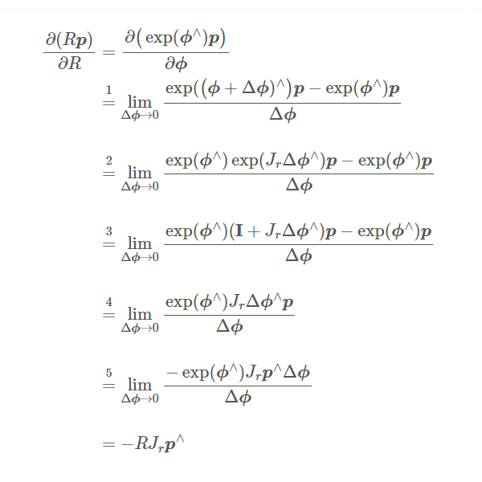
 

基于扰动形式进行李代数求导的推理过程

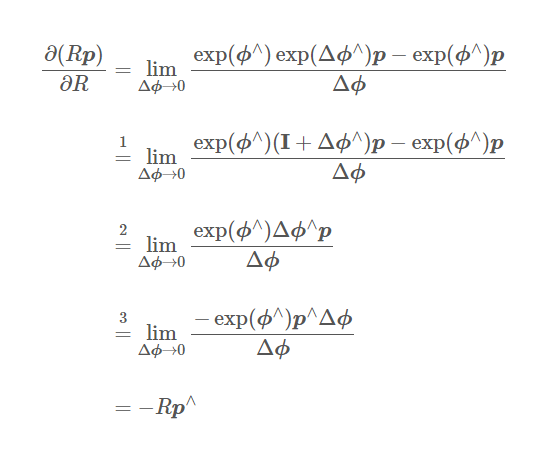

 

四、向量微积分

梯度、散度、旋度，用于表示标量值(Scalar-Valued)或向量值(Vector-Valued)函数变化率的方法。

计算形式分别在于利用 $\nabla $算子对不同函数执行算子运算、点积运算、叉乘运算。

 

1.	梯度

基于算子运算，将标量值函数转换到向量场向量。

比方，f(x, y, z)。

$ \text{grad}\,f=\vecs{ \nabla} f = \frac{\partial f}{\partial x}\hat{\pmb{\imath}} +\frac{\partial f}{\partial y}\hat{\pmb{\jmath}} +\frac{\partial f}{\partial z} \hat{\mathbf{k}} \nonumber
$

 

逻辑意义，计算函数的变化方向。

机器学习中，目标函数常基于梯度下降优化计算参数变量。

2.	散度

基于向量点积运算，将向量值函数转换成标量值函数。

$ \text{div}\,\vecs{F} =\vecs{ \nabla} \cdot\vecs{F} = \frac{\partial F_1}{\partial x} +\frac{\partial F_2}{\partial y} +\frac{\partial F_3}{\partial z} \nonumber
$

 
逻辑意义，在向量场中，计算任意点作发散点(Source)或汇入点(Sink)的通量(Flux)。

注，向量场散度不同于概率分布测量的KL散度。

3.	旋度

基于向量叉乘运算，将向量值函数转换成另一向量值函数。

curl(F)=∇×F

$ \text{curl}\,\vecs{F} = \vecs{ \nabla} \times\vecs{F} = \Big(\frac{\partial F_3}{\partial y} -\frac{\partial F_2}{\partial z}\Big)\hat{\pmb{\imath}} -\Big(\frac{\partial F_3}{\partial x} -\frac{\partial F_1}{\partial z}\Big)\hat{\pmb{\jmath}} +\Big(\frac{\partial F_2}{\partial x} -\frac{\partial F_1}{\partial y}\Big)\hat{\mathbf{k}} \nonumber
$

逻辑意义，向量场的绕旋(Spinning)轴方向及速度。可基于右手定则(Right Hand Rule)判断旋转轴方向。

注，拉普拉斯算子是对函数进行$\nabla$算子运算，再进行点积运算。

比方，标量值函数的拉普拉斯算子运算。

$ \Delta f= \vecs{ \nabla} ^2 f =\vecs{ \nabla} \cdot\vecs{ \nabla} f = \frac{\partial^2 f}{\partial x^2} +\frac{\partial^2 f}{\partial y^2} +\frac{\partial^2 f}{\partial z^2} \nonumber
$

比方，向量值函数的拉普拉斯算子运算。

$ \Delta\vecs{F} = \vecs{ \nabla} ^2\vecs{F} =\vecs{ \nabla} \cdot\vecs{ \nabla} \vecs{F} = \frac{\partial^2 \vecs{F} }{\partial x^2} +\frac{\partial^2 \vecs{F} }{\partial y^2} +\frac{\partial^2 \vecs{F} }{\partial z^2} \nonumber
$

 

第四章 微分几何

微分几何(Differential Geometry)，基于微积分研究空间几何，主要是欧几里德空间中的子流形(Submanifolds)等。

深度学习模型可拟合非线性函数，进行流形学习以压缩特征、降维等。比方，模型输入数据集{x1, x2, ..., xi, …, xn}且xi ∈ R^D，对应R^D向量空间中的元素；目标真实数据基于概率分布P采样，对应嵌于R^D向量空间中的d维流形的元素。流形学习算法，或者说，要拟合的模型函数f, xi -> yi ∈ R^m，应使得输出数据的嵌量维度(Embedding Dimension)m远小于输入数据向量空间维度D，大于等于目标真实数据流形的本征维度(Intrinsic Dimension)d；可恢复 (Recover)目标数据对应的流形。

在机器人位姿变换计算时可利用流形求解。比方，机器人移动过程，基于起始位姿，通过一系列旋转SO(3)或变换矩阵SE(3)估算目标位姿，与观测的真实位姿进行对齐优化。旋转矩阵SO(3)对应三维流形，导数不再合于旋转特性，无法用于更新矩阵元素，因此，可利用流形的切空间进行代数优化计算，再回到流形空间进行元素更新，以获得最优的矩阵估算。

一、流形

1.	定义

流形常用定义，是一类拓扑空间( Topology Space)，该空间中每个点都有一个邻域，同胚(Homeomorphic )于欧几里德几何空间(Euclidean Space)的开放子集(Open Subset)。

更完备的流形定义。

1、集合每个元素有一个同胚于欧几里德空间开子集的邻域(Neibourhood)。

2、是豪斯多夫空间(Hausdorff Space), 任意两个不相邻点都存在开邻域，使得两个点可分隔(well-seperated)，避免不同点粘在一起的异常空间(pathlogical space)。

3、具备第二可数性(Second Countable), 即流形的拓扑有一个可数基(Countable Base), 或可数的开集合的聚集(Collection)，使得任何开集都可表示成聚集(Collection)内的集合的并集。

历史上，流形早于集合创立、发展于欧几里德几何，集合是不同数学分支的基石抽象、意义更广泛，因此，基于欧几里德几何理解流形更直接、更聚焦，基于集合定义流形更严谨、抽象。

豪斯多夫空间在于使拓扑空间具备延展性，以便形成流形，否则粘在一起的空间很难流变。

可数基使得流形是可拆解、可分析的。

注, 对流形的定性认识方法。拓扑法，基于集合元素局部特性、比对欧几里德空间定义，对集合整体特性不作约束，使空间更具流变性；几何直观法，基于物理三维空间分析数学低维空间，比方，圆环(Circle)、球面(Sphere)等一维、二维流形；局部推想法，基于物理三维空间推理数学高维空间，比方，基于实心球(Solid Ball)推想三维流形；向量空间法，基于向量空间对象降维比对。

综合直观、广义性，流形基本可视作高维向量空间的低维子空间在高维的弯曲。

特定流形的定义，可基于代数方程形式。比方，基于高维(n+1)向量定义低维流形(n-Sphere)。

 

当n=1 时，S表示圆环；当n=2 时，S表示球面；当 n=3 时，S 表示无法想象的超球面。

注，子流形(Submanifold)，流形的子集，且本身是流形。比方，三维流形的一维、二维流形。

2.	特性

流形每个点有一个切空间(Tangent Space)。

同胚，指不用分离，通过拉伸等便可相互变形，比方，线段与曲线。

连通，指流形中两点之间的路径在流形内部。

流形，可连通(Connected)或不可连通(Disconnected)。不可连通时，不同部分应同维，比方两个分离的圆。不一定闭合，比方线段。不一定有限，比方抛物线。

直线、圆、椭圆、正方形是一维流形，流形的每个点的领域或极小区域对应一维欧几里德空间的线段。球面、环面是二维流形，流形的每个点的领域或极小区域对应二维欧几里德空间的圆面(Disk)。两个相切的圆或球面不是流形，因为，切点领域不同胚于欧式空间的任何开集或者说无法拉伸、平展为线段。

坐标图(Coordinate Chart)，流形中点的邻域(U)到同胚欧几里德空间集的映射(φ)，(U, φ)称坐标图。涵盖整个流形的一系列坐标图，称图册(Atlas)。

比方，一维流形，圆环。点的邻域弧段映射到线段。四对映射形成圆的图册。

 

基于元素邻域重合，说明相应的多个同胚欧几里德空间集之间存在双射(Bijective)，该映射关系称坐标变换映射(Transition Map)。比方，黄线段与蓝线段点a之间的映射变换，$T(a) = \phi_{blue}(\phi_{yellow}^{-1}(a))$。

 

3.	类型

流形类型，比方，拓扑流形、可微或平滑流形(Differentiable / Smooth Manifold)、黎曼流形、复合流形(Complex Manifold)、紧凑流形(Compact Manifold)、非紧凑流形、有向流形(Orientable Manifold)、非有向流形。 

光滑流形(Smooth Manifold)，或无限可导C∞-微分流形(Differential Manifold)、C∞-可微流形(Differentiable Manifold)，是指一个被赋予了光滑结构的拓扑流形。一般的，微分流形、或可微流形指的是 C∞ 类的微分流形。可微流形上的微积分研究称作微分几何。

特殊的可微流形构成了经典力学、广义相对论和杨-米尔斯理论等物理理论的基石。

黎曼流形(Riemannian Manifold)，是一个微分流形，每点P的切空间都定义了点积，其数值随P可平滑改变的微分流形。可定义弧线长度、角度、面积、体积、曲率、函数梯度及向量域的散度。

李群(Lie Group)是光滑流形，任意点都存在切平面(Tangent Plane)。特定正交群SO(3)或旋转群，是3维流形。直观来说，3维流形局部可对应实心球；SO(3)集合的矩阵元素，可视作3个正交向量，可确定实心球的空间点，因此SO(3)是3维流形。

二、流形分析

空间是集合，存在集合，就可能存在集合之间的映射函数；存在函数，就可能存在函数的微分、积分。流形是空间，因此可利用微积分分析相应的特性。

高维向量空间可等价定义低维流形，比方，二维向量空间圆环 {(x, y) | x^2 + y^2 =1} 是一维流形，因此，可基于向量空间分析流形。

向量空间V的子空间W，同维、加法封闭性、标量乘法封闭性、存在零向量。比方，二维实数向量空间中，{(x, 0) | x∈R}是子空间；三维实数向量空间中，{(x, y, z) | x + y + z = 0}是子空间。

可以看到，向量子空间是基于规则的集合，可函数形式表示。比方，{(x, y, z) | f(x, y, z) = c, c∈R }。

切空间(Tangent Space)TpM，流形中过点p的导数或切向量的集合。

切映射(Tangent Map)，Tf: TR^n -> TR^m，函数f的输入集合Sx的切空间到输出集合Sy的切空间的映射。

机器学习中，切空间可用于计算损失函数的梯度。

流形分析常涉及，流形积(Products of Manifolds)、子流形，辛流形(Simplectic Manifolds)、达步定理(Darboux Theorem)等概念。

 

第五章 数学分析

深度学习模型可看作类似异构基函数定义的函数。带参数的模型函数可看作泛函。

一、函数

函数，非空集合之间的映射或变换关系。

1.	映射关系

 

函数映射，单射(Injective, Into Function)、满射(Surjective, Onto Function)、双射(Bijective)。

注，一对多、多对多关系不是函数映射。

深度学习模型中，常通过一系列函数以链式形式对高维量进行映射计算。比方，图像分类，图像宽高6*6像素，权重卷积核宽高3*3，忽略偏置，提取特征 $ y_1 = w_1 * x_1 + w_2 * x_2 + … + w_9 * x_9 $, $ y_2 = … , y_3 = … , $ ； 特征进行激活计算， $ a_1 = s(y_1) $ ；通过类似多层神经网络及全连接网络等计算分类。

 

2.	实解析函数(Real Analytic Function)

实解析函数(Real Analytic Function)，所有阶可导，等价于每点邻域的泰勒级数。比方，多层感知器的激活函数是实解析函数。

二、函数级数

深度学习模型，相当于利用高维的基函数级数来近似真实的目标函数。

1.	泰勒级数

泰勒级数，实质用加权的无限次多项式曲线g(x)来拟合目标函数曲线f(x)。

 

参数计算方法。

基于假设，多项式曲线与目标曲线在零点相等时，两者在该点的任意阶导数或变化应相等。

可联立无限个方程，得到加权参数的计算公式。

推广可得目标函数在任意点的近似定义。

 

基于无限次多项式曲线拟合目标曲线的直观逻辑。

在坐标纵轴方向，两者的函数、一阶导函数、二阶导函数等在相等点都应该分别相等，f(x) = g(x), f(x)’ = g(x)’, …。

在坐标横轴方向，函数的阶导相当于提炼函数的高层级特征，阶次越高对应的感知域(Perceptive Field)越大，在相等点邻域越能反映更广的曲线信息。

多项式函数可看作不同次幂函数或成份、信号的加权，阶导计算相当于过滤，基于不同级过滤后的信息成分相等，则多项式函数与目标函数应相等。

当然，可基于微积分形式计算函数的近似定义。

 

函数一阶导展开成二阶导积分。

 

依次展开。

 

误差余项，逆序积分，整理后可得。

 

多变量函数的泰勒级数。

 

两变量函数泰勒级数示例。

 

注，泰勒级数源于牛顿插值多项式 (Newton Interpolation Polynomial)，相当于多项式在单点的极限形式。

牛顿插值多项式，基于曲线的一系列测量点拟合曲线函数，或者定义测量点自变量区间任意点的函数。

直观的方法，从第一个测量点开始，假定第一对相邻测量点斜率确定的直线是函数曲线，预测未知点的函数值。

当未知点落在第一对相邻测量点的自变量区间时，预测值不变。比方，$P(x) = f(x_0) + \frac{\delta y_1}{delta x_1}(x – x_0)$。

当未知点落在第二对相邻测量点的自变量区间时，基于两个相邻测量点对的斜率变化来修正开始的预测。$P(x) = f(x_0) + \frac{\delta y_1}{delta x_1}(x – x_0) + \frac{\frac{\delta y_2}{\delta x_2} - \frac{\delta y_1}{\delta x_2}}{x_2 – x_0}(x – x_0)(x – x_1)$。

依此逻辑，当未知点落在第三对相邻测量点自变量区间时，基于第三对测量点的斜率与之前斜率变化的变化，进一步修正预测值。

注，斜率部分称差商(Divided Difference)，变量部分称基函数。

当只具备一个测量点，在该点的无限小邻域预测x或x->x_0时，牛顿多项式插值方程就变成泰勒级数。

注，牛顿多项式的插商计算基于递归形式，计算量大。对于均匀测量点，可用拉格朗日插值或车氏(Chebyshev)多项式。

2.	傅立叶级数

	历史背景

傅立叶级数及变换源于18世纪线振动时波传导偏微分方程及19世纪固体材料中热传导偏微分方程的解计算。

波传导方程。

 

热传导方程。

 

方程起始及约束条件。

 

基于条件定义，可知计算方程全部解意味着，定义周期函数f(x)、计算u(t,x)。

傅立叶计算的解。

 

基于函数$F_N(x)$拟合周期函数f(x)。

 

当n趋向无限时，拟合函数$F_N(x)$的定义。

 

注，傅立叶变换适用于稳态系统，拉普拉斯变换适用于稳态及非稳态系统。稳态系统，对于输入信号，响应确定；非稳态系统，对于输入信号，响应不确定。

	连续函数

傅立叶级数，一系列相互正交的正弦、余弦函数(Sines、Cosines)的无限加权和形式。可用来表示周期函数f(x)。

 

级数中加权参数等于周期函数与弦函数的乘积或滤波在周期区间的积分的均值。

 

 

直观逻辑，周期函数曲线相当于无限对不同正弦、余弦函数曲线的加权合成。权重的计算，等价于合成的逆向过程，相应弦函数对周期函数曲线进行过滤、提取特征，形成的特征曲线进行积分再平均。

注，弦函数提取特征过程，一定意义类似卷积神经网络利用卷积核提取图像特征。

正弦、余弦函数基于欧拉方程可分别表示成指数形式，代到傅立叶级数中，整理可得傅立叶级数的指数方程。

 

当周期区间扩展到无限以表示非周期函数的同时，基于级数中的弦函数定义，可知弦函数集趋向稠密、连续。此时，可得非周期函数的连续加权形式。

 

权重计算方程，指数形式的傅立叶变换。

 

	离散函数

a, 离散傅立叶变换(DFT, Discrete Fourier Transform)

当f(x)是离散函数时，可基于傅立叶变换整理离散傅立叶变换的形式。

傅立叶变换方程。

 

假定，存在N个样本，f[0], f[1], … f[N-1]，样本间隔时间T，可知离散傅立叶变换定义。

 

基于样本基频率(Fundamental Frequency)定义频率w。

 

注，基频率，N个样本对应的周期频率，$\frac{1}{NT}$或$\frac{2\pi}{NT}$弧度/秒。

离散傅立叶变换。

 

直观逻辑，第n对弦函数的权重等于该弦函数在每个样本时刻提取样本特征后的和。

b, 快速傅里叶变换(FFT, Fast Fourier Transform)

快速傅里叶变换，基于分治算法(Divide-Conqure Algorithm)，样本集依样本序号递归拆作偶(Even)、奇(Odd)序列，分别进行离散傅立叶变换；同时，利用离散傅立叶变换的周期性及对称性，偶、奇序列的变换计算可对半简化。

比方，N个样本中第k个样本时刻的离散傅立叶变换，拆作基于偶、奇序列的离散傅立叶变换。

 

方程右侧，左部，基于偶数序列的变换，G[n]；右部，基于奇数序列的变换，$W^k_N$H[n]。左、右部k的取值区间都是0: N-1，不过，样本序列长度或周期是N/2，这意味着G[n]、H[n]是基于两个周期的变换计算，可基于离散傅立叶变换的周期特性，X[k] = X[k+Period.Int]，只用计算G[0], G[1], G[2], G[3]及H[0], H[1], H[2], H[3]。

权重$W^k_N$，基于对称性，$W^k_N = - W^{k + \frac{N}{2}}_N$，只用计算$ W^0_N, W^1_N, W^2_N, W^3_N $。

快速傅里叶变换计算，基于递归形式，逆拆分顺序计算原离散傅立叶变换值。

图示。

 

框架图，S0, S1, … , S7的样本序列，拆作{S0, S2, S4, S6}及{S1, S3, S5, S7}序列；再分别拆作，{S0, S4} , {S2, S6} , {S1, S5}, {S3 , S7}序列。计算时，从{S0, S4}等序列开始，逐级向拆分前合并。

c, 离散余弦变换(DCT, Discrete Cosine Transform)

离散余弦变换，离散傅立叶变换的指数形式只取实部，利用主要弦函数特征进行离散傅立叶变换的近似计算。

注，傅立叶变换与傅立叶级数互逆，可进行信号的时(空)域、频域互换。相应的改进应用于信号滤波、降噪、调制解调、压缩等。比方，音频编码时，基于快速傅立叶变换计算语谱图，再利用神经网络模型编码。图像压缩中，基于离散余弦变换转换图像空域信息到频域，量化移去视觉不易感的高频信号，再进行压缩。视觉语言动作模型中，基于离散余弦变换对动作进行标记化以进行灵活高频任务训练。

3.	高斯级数

	应用场景

传统GMM-HMM语音识别中，基于隐马尔可夫模型(HMM)定义声学模型(Acoustic Model)，利用高斯混合模型(GMM)计算音素(Phoneme)隐状态到声学特征向量帧的发射概率(Emission Probability)。

注，声学特征向量计算图示。

 

语音识别，基于观测的声学特征向量序列(Sequence Of Acoustic Feature Vectors)X及词序列(Word Sequence)W，计算最可能的词序列W*。

$\displaystyle W^∗ = \argmax_W P(W|X)$

基于贝叶斯定理进行转换。

$\displaystyle W^∗ = \argmax_W P(X|W) P(W)$

P(X|W)，声学模型定义。

P(W)，语言模型(Language Model)定义。

基于GMM-HMM定义的声学模型，使P(X|W)最大的词序列，意味着找到词序列相应的隐状态序列路径，使得可以观测到声学特征向量序列，或者说，使词隐状态序列与观测向量时序 序列对齐。

	声学模型

 

框架图，横轴，观测的声学特征向量序列$(x_1, x_2, x_3, … , x_k, x_{k+1}, …, x_n)$；纵轴，词序列相应的隐状态；红色线，隐状态序列概率路径示例；隐马尔可夫模型的隐状态之间的迁移概率(T.P., Transition Probability)基于状态迁移统计定义，隐状态到观测之间的发射概率(E.P., Emission Probability)基于高斯混合模型(GMM)定义。

局部状态迁移及发射示例，假定特征向量($x_k$)对应的是隐状态($s_i$)，特征向量($x_{k+1}$)对应的是隐状态($s_i$)或($s_{i+1}$)，则局部特征向量序列($x_k, x_{k+1}$)对应的隐状态序列是($s_i, s_i$)或($s_i, s_{i+1}$)。

因此，基于隐状态之间的排列组合，特征向量序列$(x_1, x_2, x_3, … , x_k, x_{k+1}, …, x_n)$可对应多条隐状态序列路径。

在孤立词场景，词可分成多个单音素，每个单音素可对应起始、平稳、结束三个隐状态。比方，音素/t/基于声腔动作，可对应$s_1, s_2, s_3$隐状态。

孤立词隐状态序列路径示例。

 

注，红线，观测向量序列概率最大对应的隐状态序列路径。

孤立词序列的隐状态序列路径。

 

	识别过程

已知，隐马尔可夫声学模型的隐状态迁移概率及发射概率集合，$λ = {{a_{jk} }, {b_j()}}$；观测的声学特征向量序列，$ X = (x_1, . . . , x_t , . . . , x_T )$。

目标，找到向量序列相应的隐状态序列或词序列。

方法，基于前向算法(Forward Algorithm)计算所有隐状态序列路径对应的向量序列概率的和，或者基于动态规划的维特比算法(Viterbi Algorithm)计算隐状态序列路径对应的最大向量序列概率。之后，基于向量序列概率逆向追踪(Backtrace)解码(Decoding)找到相应的隐状态序列。

声学特征向量序列概率计算方程。

 

前向算法、维特比算法都是递归形式，区别在于前向递归时计算前一时刻所有状态到当前时刻向量帧的概率的和，维特比递归时计算前一时刻状态到当前时刻向量帧的最大概率。

前向算法递归方程。

 

注，$\alpha_t(j)$，t时刻或第t个向量帧，对应状态是j时，观测到特征向量序列x1 . . . xt的概率。

维特比算法递归方程。

 

	训练过程

状态、向量序列对齐(Hard State-Time Alignment)状况未知，基于在HMM中称作前向-后向算法(Forward-Backward Algorithm)或Baum-Welch算法的期望最大(EM, Expectation Maximum)算法，估计状态占据概率(State Occupation Probability)或期望；更新隐马尔可夫模型中的发射概率密度函数参数及迁移概率。

期望计算步骤，估算状态占据概率。

 

 

最大步骤，重新估算HMM模型中发射概率密度分布函数参数及迁移概率。

 

 

当状态发射概率密度分布函数是高斯混合分布时。

 

混合成分(Mixture Component)的均值及混合权重参数(Mixture Coefficients)等的重新估算方程。

 

$γ_t(j , m)$，t时刻，状态j对应的混合成分m的成分状态占据概率(Component-State Occupation Probability)。

	高斯混合模型

基于多个高斯概率密度函数分布曲线的概率加权，以拟合概率分布。

 

不确定高斯混合函数成分与数据的关系时，可基于成分占据概率$P(m|x_t)$及相应的特征向量数计算(Soft Counts)，估算不同成分的均值、方差及先验概率(Prior Probability)。

 

相应的特征向量数及成分占据概率方程。

 

4.	B-Spline

传统机械臂运动运动可基于B-样条曲线(Basis Spline Curve)进行轨迹规划，利用样条曲线的一系列控制点调控局域曲线，进行轨迹平滑优化。

B-样条曲线可看作广义化的Bezier曲线，Bezier曲线又与二项式定理(Binomial Theorem)存在着联系。

	二项式定理

 

加和项的系数，n选k组合。二项式不同幂次的和展开式的系数之间形成帕斯卡三角或杨辉三角。

比方，a + b 的0次，1次，… 展开。

 

展开式系数表。

 

	Bezier曲线

 

r(t), Bezier曲线函数。

$b_i$，基函数权重参数。可作控制点。

$B_{i, n}(t)$, Bernstein多项式或基函数。

 

	B-Spline曲线

基于样条基函数(B-Spline Basis Functions)加权定义。基函数曲线段基于变量不同区间的曲线段拼接或联合(Joint)形成，权重参数可调控基函数曲线段。

k幂次B-样条曲线函数定义。

 

r(t), B-Spline 曲线函数。

t, B-Spline 曲线函数的自变量。变量值域可划分作不同的区间。划分时的取值点可称作结点(Knots)，结点以非递减顺序排列形成结序列(Knots Sequence)或向量。

 

结点之间的区域，称作结区间(Knot Spans)。

$p_i$, 第i个基函数的权重，可作样条曲线的控制点(Control Points)，以调控基函数曲线段。

$N_{i, k}(t)$, 基于k次(Degree)多项式的第i个基函数。k次多项式只在自变量部分相邻区间存在非零值，因此定义的是曲线段。k次多项式在这些相邻区间的每个区间对应着不同的曲线段，称作区间曲线段。

基函数基于低幂次基函数的递推形式定义。

不同的0幂次基函数定义。

 

不同的k幂次基函数定义。

 

比方，$N_{0, 2}$基函数基于$N_{0, 1}$ 及 $N_{1, 1}$基函数的加权；$N_{0, 1}基于$N_{0, 0}$及$N_{1, 0}$基函数的加权；$N_{1, 1}$基于$N_{1,0}$及$N_{2, 0}$基函数的加权。

推广可知，不同幂次基函数之间的三角递推关系。

 

递推方程中的系数，直观意义是t在不同结区间时，对结区间的比例划分。

 

基于基函数的三角图，可知B-Spline函数特性。同一幂次的基函数可跨不同的相邻结区间，此时，不同的结区间可对应不同曲线段。结点数 = 控制点数或基函数数量 + 曲线阶次(Order) + 1，比方，$N_{0, 3} , N_{1, 3}$基于$[u_0, u_1, u_2, u_3, u_4, u_5]$结序列计算，结点数(6) = 基函数数量(2) + 幂次(3) + 1。这意味着结点数确定时，基函数阶次越高，基函数数量越少，基函数曲线总体越平滑。

三、泛函分析

在机器学习中，泛函分析是一些算法的基础或者说算法的明确解释需要通过泛函分析说明，比方 希尔伯特空间 (Reproducible Kernel System Space) 是开发SVM算法的基础。

核心概念， 函数空间(Function Spaces)、范数(Norms)、内积(Inner Products)、希尔伯特空间(Hilbert Spaces)、算子(Operators)。

1.	函数空间

集合X到集合Y的所有映射函数的集合，具有连续、可微、可积分特性。比方，X是n个元素的集合，{x1,…,xn}；X到集合Y的映射函数集合是，{f1(x),…}；函数集合的第一个元素,f1(x)对应的向量是，(f1(x1),…f1(xn))；因此，函数空间又是向量空间。X是连续区间域时，{f1(x),…}等于无限维向量的集合或空间。

既然函数等价于向量，函数空间中，可基于向量内积计算函数之间的距离。比方，基于域X的函数f(x)与g(x)之间的均匀距离(Uniform Distance)，ρ(f, g) = sup{d(f(x), g(x)) | x ∈ X}，选最大(supreme)距离。

函数空间具备收敛性(Convergence)等函数的本质特性，因此，又是拓扑空间(Topological Space)。

函数空间示例，比方，闭区间上的连续函数空间，平方可积函数空间(square-integrable)，所有多项式空间。

函数空间作用，微分方程解是函数空间；概率论中，随机变量是函数空间元素；物理中，标量场、向量场、波函数(Wave Functions)、几何表面、几何曲线等都是函数空间；同时，函数可用于表示高维数据。

2.	范数

用于给函数空间的每个函数分配一个非负长度或大小的函数，以便测量函数之间的距离，确定一系列函数是否可以收敛到一个有限函数。

3.	内积

欧几里德几何空间点积的广义形式。用于定义函数空间的角度和正交性。

4.	希尔伯特空间

完备内积空间，意味着每个柯西序列函数(Every Cauchy Sequence Of Functions)收敛于该空间的一个有限函数(Limit Function Within The Space)。对于很多机器学习算法起着基础性的作用。

5.	算子

函数空间之间的映射，同时保留特定特性。比方，微分、积分及卷积。

注，这是说，一个函数空间(向量空间)映射到另一个函数空间(向量空间)，这一特点在SVM中比较有用。比方, SVM及高斯过程等核方法, 数据可映射到便于线性分隔的高维特征空间。

在机器学习中的应用形式，可以是核方法、正则化、神经网络、降维及优化。

泛函分析的高级概念，复制核希尔伯特空间(RKHS , Reproducing Kernel Hilbert Spaces )、函数积分(Functional Calculus)、变分积分(Variational Calculus)。

 

6.	连续可微分析

对带参函数进行连续性及可微性分析，一般无法直接分析；用n个无限维度的向量分析，也太多不方便，因此最好是找到这n个向量所组成的空间的子空间或者基，对向量子空间或者基空间进行连续性及可微性分析，相对会方便些。这样，对函数向量子空间或基空间的分析，等同于对这n个无限维度向量的连续性、可微性的分析。

 

第六章 概率统计

深度学习模型是要拟合的函数，该函数看作预测器时，数学意义上可以对应着条件概率；看作猜测器时，可以对应后验概率。

这里有两个关键点，条件概率及后验概率的定义及意义！怎样区分拟合函数是预测器或猜测器！

要明确条件概率及后验概率，需要基于条件概率定义、全概率定律(Law of Total Probability)、贝叶斯定理(Bayes’ Theorem)及相关的概率概念进行区分。

一、	概率

1.	概率及概率分布

离散，概率质量函数。

离散分布，均匀分布、伯努利分布(Bernoulli)、二项分布(Binomial)、多项分布(Multinomial)、泊松分布(Poisson)等。

连续，概率密度函数。

连续分布，均匀分布、正态或高斯分布、Gamma分布、Beta分布、指数分布、柯西分布等。

2.	条件概率

逻辑意义，给定B事件，A事件的条件概率。

定义，

$$
\textrm{P}(A|B) = \frac{\textrm{P}(A\cap B)}{\textrm{P}(B)}
$$

3.	全概率定律

逻辑意义，事件A可以基于k个独立的事件Ci进行划分，这样事件A的边缘概率(Marginal Probability)可以看作是k个事件Ci的概率的加权和。

这个边缘概率的概念来自表格统计时，事件A对应k行事件，在表格边缘计算k个事件的加权和。

全概率定律定义，

$$
\begin{align*}
\textrm{P}(A) & = \sum_{i=1}^k \textrm{P}(A \cap C_i)\\
& = \sum_{i=1}^k \textrm{P}(A|C_i) \textrm{P}(C_i)
\end{align*}
$$

$$
C_1\cup \cdots \cup C_k=\Omega
$$

4.	似然率

似然率，基于概率分布图来说，一个数值可能对应多个不同的分布函数，似然率就是该数值对应分布函数的取值。一般正比于概率，但不是概率，不遵循概率规则，比方，不需要和为一(Sum to 1)。

基于模型应用来说，似然率常用于使带参模型预测的概率分布尽可能合于样本统计频率的分布。

似然率示例，同一数值点0.5对应不同正态分布函数的取值。

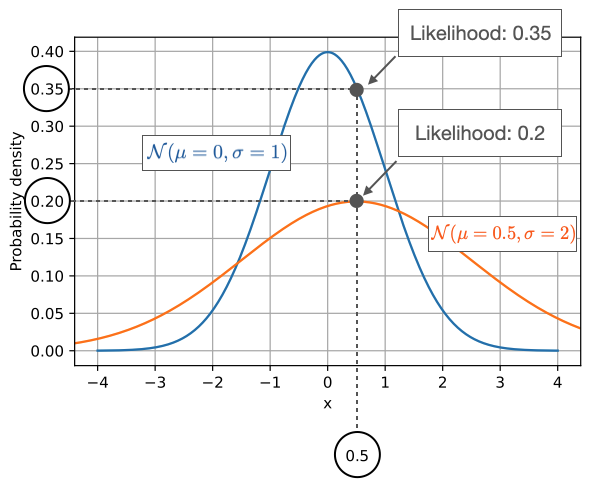
 

贝叶斯定理中，似然率可以认为是基于统计意义的概率。有条件称条件似然(Conditional Likelihood)，无条件称无条件似然(Unconditional Likelihood)或边缘似然(Marginal Likelihood)。

机器学习中，估计参数的似然率在形式上等同于概率，逻辑意义不同。比方 L(w|x) = p(x|w) ，w表示正态分布的参数(μ,σ)，x表示样本数据。似然率L(w|x)表示已知样本或者观测数据x，当取不同正态分布参数w时，或者说，在w定义的分布中，x对应的概率；概率p(x|w)表示已知参数w，当取不同样本x时，x对应的概率。

注，相对来说，条件概率形式表示条件似然逻辑意义更直观。同时，便于区分于后验概率。

在机器学习中，模型拟合常表示作最大条件似然估计(MLE, Maximum Likelihood Expectation)，或者说通过找到最优的模型参数以使模型预测到的样本概率最大，p( x | w) 或 $ p(x | \theta)$。

当然，要使所有预测的样本概率最大，则应预测的期望或均值最大，$ E p( x | \theta ) $。

注，模型条件似然定义中，模型参数只是相应的条件。不是说，带参数的条件概率才是似然率。

机器学习中，对不完备数据集(Incomplete Data Set)最大似然估计问题，常基于期望最大(EM, Expectation Maximum)数值优化(Numerical Optimization)方法，以确定模型参数。

注，完备数据集(Complete Data Set)，Z = (X, Y)。不完备数据集，只观测到数据 X，不知Y。

在完备数据集情况下，容易基于统计计算不同Y值对应的最大似然估计。

比方，存在两个质心不同的骰子，每个骰子具备不同的点数概率。

测试n次，每次随机选一个骰子(Y = {Dice1, Dice2})，投m次。

对应的完备样本数据集， { (x1, y1), (x2, y2), …, (xn, yn)}。

xi = (xi1, xi2, … , xim)。xij, 表示点数。

yi , 表示Dice1 或 Dice2 。

计算Dice1的点数6的最大似然估计，等于统计yi = Dice1的所有测试中xij = 6 的比例。余者概率分布计算方法相似。

不完备数据集，{x1, x2, …, xn}，yi未知。

此时，计算Dice1的点数6的最大似然估计，则可用期望最大(EM)算法。

EM算法实质，起始先猜测X的分布的参数，然后利用X推测Y以完备数据集；基于猜测的完备数据集，计算参数的最大似然估计；之后，基于估计的参数，利用X再推测Y更新数据集；依此循环，直到参数基本不变。

EM算法在完备数据集Y的过程中，实际是在对样本X进行聚类。因此，EM算法是不完备数据集最大似然估计时的数值优化方法，同时，也是聚类方法。推广到HMM场景中，隐状态作未完备数据(Missing Data)，EM又称Baum-Welch算法。

5.	联合概率(Joint Probability)

联合概率表示多个事件同时发生的似然率。

独立事件的联合概率， P(A, B) 或 P(A∩B) = P(A) * P(B)

依赖事件的联合概率， P(A, B) 或P(A∩B) = P(A) * P(B|A)

6.	边缘概率

边缘概率，派生于联合概率分布的无条件概率，表示单一事件发生的概率。

离散随机变量方程，$$P(X=x) = \sum_yP(X=x, Y=y)$$

连续随机变量方程，$$f_X(x) = \int^{\inf}_{-\inf}f_{X,Y}(x,y)dy$$

7.	贝叶斯定理

贝叶斯定理，是通过对具体事情的分析，利用数学公式推导得到的。

比方，一个基于统计学意义得知发生概率是P(H)的事件H，判断事件H是否发生作为事件E。

已知，事件E的判断存在误差，基于统计学意义得知正确判断的概率是P(E)。同时，基于统计学意义得知事件H发生时事件E正确判断的概率是P(E|H)。

则在事件E判断事件H发生的情况下，事件H发生的概率是多少？

注意，判断事件H是否发生是事件E，通过事件E判断事件H是否发生是贝叶斯定理目的。

为解决该问题，贝叶斯通过联立条件概率P(A|B)与P(B|A)定义公式得到贝叶斯定理公式。

$$
P(H|E) = \frac{P(E|H)P(H)}{P(E)}
$$

该公式的逻辑意义，在观测到证据(Evidence)事件E后，计算事件H的后验概率，可以通过事件H的先验概率、在事件H发生情况下证据事件E的似然率、事件E的边缘概率这三类概率计算得到。

P(H|E) , 观测到事件E后，事件H的后验概率(Posterior)。

P(E|H) , 事件H为真(True)，则事件E的似然率(Likelihood)。

P(H) , 观测到事件E之前，事件H本身便存在的先验概率(Prior)。

P(E) , 不管事件H是否发生，观测到事件E的证据概率或边缘似然率(Marginal Likelihood)。

注，这里的后验概率、似然率都是条件概率；证据概率是边缘似然率。

因此，对于分类等预测问题，拟合的模型函数数学形式是条件概率p(y|x)，因为已知的输入x是先发生的事件，计算预测的类型y的概率。对于变分自编码器，编码器是基于输入x计算隐变量z的概率分布，因此数学形式是后验概率q(z|x)；解码器是基于隐变量生成x，因此数学形式是条件概率p(x|z)。

注, 当存在多个独立的假设事件$$H_1,\ldots, H_k$$时，相应的后验概率定义。

$$
\begin{align*}
P(H_j |E) & = \frac{P(E|H_j)P(H_j)}{P(E)}
\end{align*}
$$

二、	描述性统计(Descriptive Statistics)

描述性统计，基于数据样本，直接通过测量数据的中心倾向(Central Tendancy)、变化度(Variability)、分布等概括及显示数据的主要特征。

Descriptive Statistics
Measures of Central Tendency	Measures of Variability	Distribution	Measures of Relation	Visualization

Mean

Median

Mode
	
Range

IQR-Interquartile Range

Variance

Standard Deviation
	
Central Limit Theorem

Skewness

Kurtosis
	
Covariance

Correlation
	
Chart

Graph

Table

三、	推理统计

1.	证据下边界(ELBO, Evidence Lower Bound)

证据下边界或变分下边界，是变分贝叶斯方法(Variational Bayesian Methods)中的重要概念，可将无法解决的推理问题转换成可基于梯度计算的优化问题。

可通过变分自编码器的损失函数的计算来理解。

变分自编码器框架。

 

目标函数是使编码器q的观测样本x对应的隐变量z的后验分布q(z|x)与解码器p的隐变量z的后验分布p(z|x)最接近。

即计算两者的KL散度最小。

 

上式通过推导可转换成

 

这意味着，不等式右侧最大时，样本对应的真实分布也最大。因此，右侧称观测样本$$x_i$$的证据概率$$p(x_i)$$的证据下边界(ELBO)。即目标函数KL散度的计算转换为对ELBO的计算。

推导过程，

上述KL散度的$$p(z|x_i)$$项基于贝叶斯定理展开，同时，似然概率用$$p_{\phi}(x_i|z)$$近似。

 

再基于对数定律展开，

 

再分项展开，

 

$$logp(x_i)$$是常数项，因此，

 

$$q_{\theta}(z|x_i)$$的积分等于1，因此，

 

左右移项，

 

右侧展开，

 

即KL散度及期望项，

 

不等式，左侧，可对应解码器(生成器)生成量的边缘似然率(Marginal Likelihood)；右侧，编码器隐变量后验分布与解码器隐变量先验分布散度，解码器条件概率期望或重建误差(Reconstruction Error)。

整个过程说明的是，要使编码器后验分布与解码器(生成器)后验分布近似，可转换成使解码器(生成器)生成量的似然最大，进一步转换成使编码器隐变量后验分布与解码器隐变量先验分布的散度+解码器的条件概率期望最大。

下列暂不用。

 

变分自编码器的损失函数或目标函数定义为最大似然函数，$$logp_{\theta}(x^{(1)}, ... , x^{(N)}$$。

因为，$$logp_{\theta}(x^{(i)})=D_{KL}(q_ϕ(z∣x^{(i)})∣∣p_{\theta}(z∣x^{(i)}))+L(\theta,ϕ;x^{(i)})$$ ，因此，对最大似然函数的计算，可以转换为对方程右侧 $$L(\theta,ϕ;x^{(i)})$$最大的计算

这个概念在期望推理(Expectation-Maximization)或变分自编码器模型的变分推理(Variational Inference)中，基于KL散度函数的最优化，得到可近似后验分布p(Z|X)的分布q(Z)。

2.	均值期望

概率统计中，随机变量所有可能值的相应概率加权平均。

当测试(Trials)越多，观测结果的均值越趋近或收敛于期望值。

$ EX=E[X]=E(X)=\mu_X \\ 
= \sum_{x_k \in R_X} x_k P(X=x_k)=\sum_{x_k \in R_X} x_k P_X(x_k)$

$ Average =\frac{N_1 x_1+N_2 x_2+N_3 x_3+...}{N} \\ \approx \frac{x_1 N P_X(x_1)+x_2N P_X(x_2)+x_3N P_X(x_3)+...}{N} \\ =x_1 P_X(x_1)+x_2 P_X(x_2)+x_3 P_X(x_3)+... \\ =EX $

3.	方差

概率统计中，随机变量的每个值与均值期望的距离的平方的均值。

$Var(X) = E(g(X)) = E\left[(X-\mu)^2\right]$

标准差(Standard Deviation)，$SD(X) = \sqrt{Var(X)}$

4.	协方差

协方差在于衡量两个变量(向量)同时变化的情况,conv>0，表示正相关，conv<0，表示反相关，conv=0，表示无关。

协方差与方差的区别在于，方差的 $$(x_i - \overline{x})^2$$ 变成 $$((x_i - \overline{x})(y_i - \overline{y}))$$

5.	协方差矩阵

两个高维度向量的协方差，即协方差矩阵，矩阵每个元素是两个向量的元素之间的协方差。

四、	熵与测量

1．信息熵

基于信息发生的概率与验证信息的信息量判断信息的不确定程度。

$\sum_{x=1}^n{(信息x发生的概率  * 验证信息x需要的信息量)}$

信息发生概率越大，更平常，则验证需要的信息越少。

1.1 数学形式

H(X)=$-\sum_x{p(x)log(p(x))}=-\sum_{x=1}^n{p(x_i)log(p(x_i))}$

n, x事件的所有可能性。

1.2 推理

由于信息概率与验证需要的信息量反比，即随着概率增加，验证信息量单调降低。因此，可以用对数来定义信息量与概率的关系。

$I(x)=-log(p(x))$

信息论中，信息单位bit,log基数选择2；机器学习中，log基数自然常数。

$\bold{信息熵等于信息量的期望。}$

2．交叉熵

$H(p,q) = -\sum_{i=1}^n{p(x_i)log(q(x_i))}$

机器学习中，p(x)表示真实分布，q(x)表示预测分布。

计算交叉熵最小，注意存在负号，因此实际是H(p,q)绝对值最大来优化更新模型参数。

逻辑意义便是p与q的概率乘积和越大，预测的目标分布与真实目标分布越匹配。

p(x)表示真实分布，q(x)表示预测的分布。注意不是模型输入数据的分布，是目标结果的概率分布，是模型输出预测数据的分布。

比方，图像分类，一个batch=10，表示一次iteration训练的样本是10个图片，对应10个one-hot标签向量标明分类，softmax计算后得到10个真实分类结果,p(x)；10个图片基于分类模型通过softmax后分别预测得到10个预测分类结果，q(x);

则，对于这个批次(batch)的样本来说，p(x) 与 q(x) 的相似度通过 10个样本的交叉熵来计算衡量。

相对于均方差，交叉熵对数形式可以放大误差变化，便于反向传播计算。

3．散度

KL散度(Kullback-Leibler (KL) Divergence)或相对熵(Relative Entropy), 用于衡量两个概率分布的距离或相似度。

相对熵 = 交叉熵 - 信息熵

$D_{KL}(p||q) = H(p,q) - H(X)$

$D_{KL}(p||q) = \sum_{i=1}^n{p(x_i)log(\frac{p(x_i)}{q(x_i)}) }$

在相同事件空间里，概率分布P (x)对应的每个事件，若用概率分布 Q (x)编码时，平均每个基本事件（符号）编码长度增加了多少比特。 信息论中将由Q (x)得到的平均编码长度比由P (x)得到的平均编码长度多出的bit数称为“ 相对熵 ”。 用D（P||Q）表示KL距离，当两个概率分布完全相同时，即P (X)=Q (X)，其相对熵为0。

准确来说，KL散度不是一个真正的测度量(true metric),因为不符合三角不等式。

度量(Metric)是遵循对称原则的，散度不遵循对称，比方 $$D_{KL}(q(x)||p(x)) \nq D_{KL}(p(x)||q(x)) $$ .

从编码压缩的角度直观理解, g(x) 与 f(x)分布的信息，都基于g(x)编码，压缩效果的差异。

p(x)确定的情况下,H(X)确定，因此机器学习中优化减少相对熵，可化简为优化交叉熵。

机器学习中,groundtruth目标样本分布是确定的，因此信息熵常量。只需调整预测的分布，使该分部与groundtruth目标样本分布尽量匹配。

反之，目标样本分布变化时，可用相对熵(散度)来衡量不同样本分布的匹配度。

 
机器学习篇

机器学习，可分传统机器学习、深度学习、强化学习、模仿学习等。

一、机器学习的核心，在于用带参函数拟合真实函数。

拟合的关键在于确定合适的参数。

参数的确定主要在于定义目标函数或损失函数。

二、损失函数的定义形式很大程度在于任务类型及样本数据集的完备性(Complete)。

比方，分类任务，要求数据集是完备的(X,Y)，X集的每个元素输入带参函数，输出与真值集Y的相应元素比对。

聚类或编码任务，数据集是(X)或(Y)，X或Y集的每个元素输入带参函数，通过编解码后再与X或Y集相应元素比对。

三、同时，损失函数的定义也与看待带参函数及样本数据集的方式相关。

比方，带参函数看作预测工具，数据集(X, Y)的X看作预测对象，Y看作真实结果，带参函数对X集的每个元素预测，再与Y的相应元素比对。

带参函数看作概率分布函数，数据集(X)看作真实分布的采样，X的每个元素输入带参函数得到的概率，应与基于X集频率统计得到的元素概率相似。

四、损失函数的解算方法多与带参函数易解度相关。

带参函数易解时，可直接利用导数等解析方法计算损失函数极值。

带参函数不易解时，大部分时候利用优化方法计算损失函数近似极值解。

优化算法一般要综合准确度及计算难易度。

比方，牛顿相关方法准确度高，当涉及高阶矩阵计算时，不易计算。

随机梯度下降方法，相对容易，通过一些方法可提高准确度。

深度学习是当前强化学习的基石，强化学习中的策略函数、奖励函数常基于神经网络模型。

深度学习、强化学习与模仿学习相关度很高，模仿学习的行为克隆(Behavior Clone)、逆强化学习(IRL)等方法常用到深度及强化学习。

 

第一章 模型表征

在深度学习中，数据的表征与任务的计算常统一在模型框架中。

表征(Representation)，使原始数据转换成紧凑的(Compact)、结构化的编码(Structured Encoding)，具备重要信息的同时，去掉无关或冗余细节。

衡量表征优劣的指标(Bengio 2013)。

紧凑性(Compact)，尽可能(Minimal)去掉噪声及冗余，降低数据维度(Reduce Dimensions)。

能解释性(Explanatory)，具备充分(Sufficient)的信息可重建原始数据或进行推理。

区分度(Disentangled)，不同维度对应数据的不同特性。

可解释性(Interpretable)，每个维度意义明确。

可迁移性(Transferable)，可用于下游任务的解决。

注，紧凑性利于模型泛化，可能损失数据有效信息；能解释性(Explanatory)，与之相反。因此，常要折中两者。

表征与嵌量，神经网络中，每个网络层计算的激活向量(Vector of Activations)，可称作嵌量(Embedding)，或高维空间点。对应于输入数据在该网络层的表征。数据语义相似，对应嵌量相近。

表征学习(Representation Learning)，基于带参网络等自动发现、提取原始数据中有意义的特征，在几何空间，通过方向、距离等，度量数据集元素之间的语义关系。

表征学习方法，基本可分作监督、自监督、无监督、半监督等类型。

监督，基于人工标签训练模型，进行表征学习。比方，基于CNN进行图像分类，在全连接层分类前，卷积核层计算的特征。

自监督，基于数据自身，通过设计遮饰任务(Pretext Tasks)自动形成监督训练模型的标签。比方，遮挡预测(Masked Prediction)，遮挡输入的文本或图像数据元素，训练模型预测遮挡部分的单词或像素；上下文预测(Context Prediction)，输入图像数据的分片(Patch)，预测相邻的分片是哪个；色彩预测(Colorization)，基于灰度图，预测彩色图。通过上下文学习，在相似上下文中出现(Co-Occurance)的元素具备相似表征。比方，Word2Vec，基于目标单词预测周边上下文单词(Skip-Gram Architecture)，或基于上下文单词预测中央单词(Continuous Bag of Words)，训练模型的隐嵌量对应单词表征。通过比对学习(Contrastive Learning)进行表征学习。比方，CLIP，图像文本多模态学习不同模态之间的共同表征。

无监督，重建整个输入。自监督的特例，比方，AutoEncoder，通过编解码学习数据的隐嵌量表征。

半监督，监督与无监督结合。比方，基于数据集无监督预训练学习表征，再通过少量标签数据进行下游任务训练。

自训练(Self-Training), 先用标签数据集训练模型；再用训练的模型对无标签数据进行预测，得到伪标签(Pseudo-Labels)；然后设置一定的置信度区间，选置信区间的伪标签及相应的数据，添加到标签数据集；用扩展的标签数据集重新训练模型，依此循环。

协同训练(Co-Training), 基于同一对象集的不同视角的数据集，比方，网页对象的单词集与网页链接中的Achor词集，训练不同的模型；先基于不同视角的标签数据集训练不同的模型；再用训练的两个模型对数据的预测结果，进行相互更新。对同一个数据，选模型置信度高的伪标签来替代另一个模型置信度低的伪标签。

一般情况，监督学习效果比半监督好；对于标签数据少，大量非标签数据情况，可以用半监督法，不过标签数据的分布应反映数据实际分布，才可能有好的效果。

注，置信度(置信水平 , Confidence Level),统计估计落在真值区间的概率;或者说,真值区间占整个真值区域的比例. 置信度即似然率(Likelihood, How Likely),多大可能为真(True)，衡量置信区间的可靠性. 发生在置信区间的事件的似然率或置信度。置信区间(Confidence Interval) , 估计值加/减方差(Variation)得到的区域。

一、归一化(Normalization)

标准化、归一化 及 内在协变量偏移(internal covariate shift)

归一化(normalization)，数据区间转换到[0,1]区域

标准化，将归一化的数据转成(0,1)参数的标准正态分布，这个过程也称为normalization，不过不是归一化；

进行Normalization的原因在于，1、如果不同输入特征的取值范围相差很大，则导致梯度计算时耗时很长才可能收敛；2、高的数值导致大的误差梯度通过反向传播计算时累积，形成梯度爆炸( exploding gradients)，使训练过程不稳定；

比方，一个线性回归的拟合函数，误差函数对拟合函数的斜率参数的梯度的计算等式, (ŷ− y)x , 包括了预测值ŷ、观测真值(ground truth)y及输入特征值x

特征值x大，则误差函数对参数的梯度值变大，如果存在多个网络层，通过导数链式法则反向传播计算，误差对参数的梯度值会越来越大

内在协变量偏移(internal covariate shift), 是说第k层的特征输入对于不同的batchs，分布变化很大。这会引起激活爆炸与分布波动 (exploding activations and fluctuating distributions)。

批归一化(Batch Normalization)，便是用于解决这些问题的。不过，对normalization后的特征通过可学习的参数进行了线性变化，以便使特征量可适用于神经网络需要输入的特征分布是波动的情况。

y_i = BN(x_i )=γ.\hat{x_i} +βyi=BN(xi)=γ.xi^+β

批归一化，适用于卷积神经网络，因为BN依赖于batch大小，当batch很小时，给予batch样本计算的分布是不足以表示实际分布，神经网络很难通过训练学习有意义的信息。同时，BN不适合序列化模型(sequence model)，因为，序列化模型可能有着不同长度的序列，越小的batch sizes可能对应着越长的序列。

训练时，BN层需要计算；测试时，则不需要计算，可通过训练时的偏差及方差的均值(moving average of the mean and variance at training time)替代。

层归一化(Layer Normalization)，适用于序列化模型(比方自然语言处理, RNN或Transformer框架). 这些情况下Batch size 可变或很小; Normaliztion 跨特征(Normalizing across all features)计算，不是跨batch计算。用于activation function 之后.

比方，输入特征向量的维度是n，则normaliztion是基于特征向量的n个特征元素进行计算，与batch size 无关。

层归一化具体计算方法与BN相似， 在训练及测试时都需要计算。

组归一化(Group Normalization)。

 

第二章 模型框架

机器学习模型基本可分作判别模型(Discriminative Models)及生成模型(Generative Models)。

判别模型，基于训练数据集(X, Y)，学习条件概率分布p(y | x)。比方，线性回归、逻辑回归、KNN、支持向量机(SVM)、决策树、随机森林、条件随机场、卷积神经网络等。

生成模型，基于训练数据集(X, Y)或(X, X)，学习联合概率分布p(x, y)。比方，朴素贝叶斯模型、高斯混合模型(GMM)、隐马尔可夫模型(HMM)、生成对抗网络(GAN)、变分自编码器(VAE)等。

基于条件概率方程，p(y | x) = p(x , y) / p(x) ，通过联合概率分布p(x , y)及边缘概率分布p(x)，生成模型也可用于分类任务。

多分类、多标签

多分类(multiclass)、多标签(multilabel)的不同

多分类(单选项)，一个输入量对应一个类型，神经网络的输出用softmax激活函数进行类型概率计算; 比方，图像分类

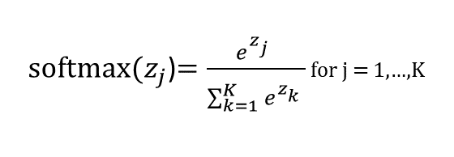
 

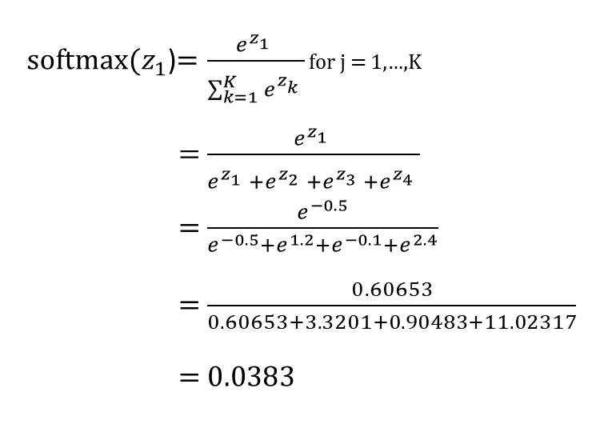

示例。

 

多标签(多选项),一个输入量对应多个类型，神经网络的输出用逐元素sigmoid激活函数( element-wise sigmoid function )来计算概率; 比方, 一个x照图片可能表示了多个不同的症状;

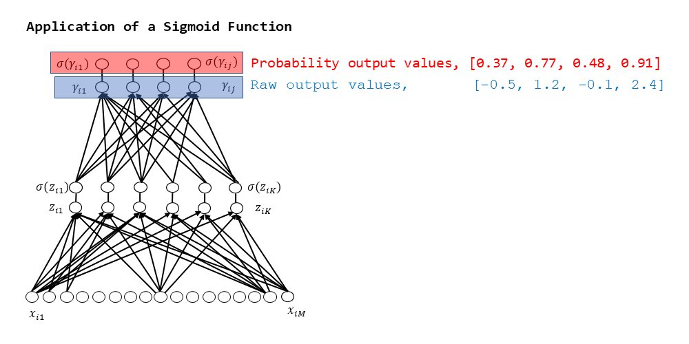
 

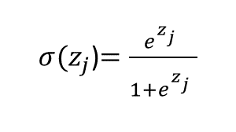
 

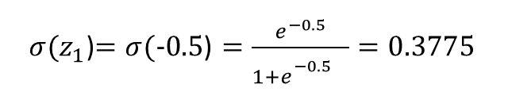
 

第三章 参数估计

深度学习拟合的函数可以看作测量器、猜测器、信息编码器。

当视作测量器时，拟合函数的输出相当于测量结果，可以利用高斯最小误差定义目标函数，找到最优拟合函数。

当视作猜测器时，拟合函数相当于黑箱，输出结果相当于观测结果，则可以基于最大似然函数定义目标函数，找到最优拟合函数；最大似然函数无法计算时，目标函数可以转换为证据下边界函数(ELBO，Evidence Lower Bound)进行计算。

当视作信息编码器时，拟合函数的输出相当于编码，则可以基于交叉熵定义目标函数。

基于数据样本拟合函数的原理，相当于用拟合函数进行测量，然后与样本真值进行比对。

不同类型的拟合函数有着不同的比对思路。

一、经验风险最小(ERM, Empirical Risk Maxinimum)

经验风险最小，是基于最小方差法的推广(Generalization)。或称观测误差最小更直观。

模型预测的结果与真值进行比对。

比方，线性回归模型，基于最小方差。

 

分类模型，可基于交叉熵。

 

支持向量机，可基于合页或折线损失(Hinge Loss)。

 

一般，经验风险损失，要加结构损失风险函数或正则项防止模型过拟合。

 

1.	目标函数

目标函数 =  经验风险函数(基于训练集的代价函数(基于单样本的损失函数))最小  + 结构风险函数(正则化项，J(f))最小

2.	损失函数

回归任务的损失函数一般用基于最小误差的最小绝对误差函数、最小平方差函数，分类任务的损失函数一般用基于最大似然函数原理的交叉熵损失函数等。具体任务的损失函数需具体分析。

拟合连续函数。回归任务(Regression)的损失函数，比方，MSE、MAE、Huber loss、Log-Cosh、Quantile loss及Poisson loss等。

拟合离散函数。分类任务(Classification)的损失函数，比方，二元分类(Binary Classification)的BCE、Hinge loss及Focal loss等；多分类(Multi-Class Classification)的CCE、Sarse CCE、Focal loss、PolyLoss及Hinge loss等。

基于不同任务的损失函数类型

1、回归任务，MSE均方差、MAE均绝对值差;
2、分类(概率)任务, 交叉熵(CE);
图像分割任务，DICE、Jaccard Loss;
序列预测任务, CTC;
3、生成对抗任务，Adversarial Loss(GAN Loss)、Least Squares GAN Loss;
4、排序(ranking)
5、基于能量建模(Energy based modelling)

基于数学概念形式分类损失函数
1、基于误差(Error based)
2、基于概率(Probabilistic)
3、基于边缘(Margin based)

对于分类问题，为什么不能用均方差/均绝对值差作代价函数。原因在于，预测结果与实际结果相差很大，比方，实际结果或观测值是0，预测是0.9，用均方差等代价函数将导致代价函数值过小，不能反映实际误差。即是说，均方差代价函数适用于预测与观测值相近的情况。

损失函数的偏导，$\frac{\partial{L}}{\partial{w}}$

对于均方差损失函数，损失函数的偏导包含对激活函数的导数，但是由于s形的激活函数在x在较小或较大时变化趋缓，使得偏导趋0，因此导致梯度下降参数更新不再变化。

对于交叉熵损失函数，损失函数的偏导包含的是激活函数，因此不存在偏导趋0问题，也就是误差反向传播时相对于参数变量的微分变化不趋于零，梯度不消失。

因此交叉熵损失函数更适合梯度下降方法。

3.	正则项(Regularization)

目标函数中调控目标拟合程度的项，用于防止目标函数训练过拟合。可以是参数的绝对值形式(1-Norm)、平方形式(2-Norm)等。也可通过拟合函数与期望函数的散度(KL, Kullback-Leibler Divergence)或相对熵对目标函数的优化进行约束。

4.	度量(Metrics)

评估模型训练性能的度量方法。

5.	基于最小误差原理。

勒让德与高斯发现，测量数量充分多的情况下，误差呈高斯分布，即不管误差正负，极大误差概率都很小，大部分误差趋近于零。因此，要找到合适的拟合函数，便是使所有样本对应的预测误差最小，误差函数可以基于所有样本的最小平方差或最小绝对值差定义。

因此，该原理适用于可输出确定值的拟合函数。

6.	基于信息熵-交叉熵原理

分类交叉熵函数(CCE，Categorical Cross-entropy)定义。

$$CE = H(g, f) = \sum_xg(x)log\frac{1}{f(x)} = -\sum_xg(x)logf(x) = -\sum_{i=1}^{n}y_ilog\hat{y_i}$$

逻辑意义，信息编码应是g(x)，实际通过f(x)进行编码传递的信息熵。

从最大似然函数角度，对于多分类概率模型，假定真实ground truth用经验分布(即非1即0，用one hot 向量表示)，参照伯努利的联合概率质量函数形式，则联合概率质量函数，可以定义为 $\prod_{i=1}^n\hat{y_i}^{y_i}$ ， y 是ground truth , 值为1或0 ; $\hat{y_i}$ 是模型预测或估计的似然概率。
对该公式去对数，以便进行加计算；则要使最大似然估计函数最大，使该对数式的负值形式最小。得到NLL函数。

从信息熵角度来说，要传递一系列样本信息X，则基于信息熵形式  $H(X) = -\sum_x{f(x)logf(x)}$ 作为对X的编码方案。但现实是传递这些样本信息，尽管真实的概率分布是g(x)，但概率模型认为每个样本发生的概率是f(x)，这样的情况，则通过交叉熵 $H(g,f) = -\sum_x{g(x)logf(x)}$ 来定义作为对X的编码方案。

这样，形式上交叉熵与NLL一致。

二、最大似然估计(MLE, Maximum Likelihood Estimation)

1.	定义

最大似然估计[Fisher, 1922]，使所有样本的似然率的乘积最大。

逻辑意义，基于带参模型估测样本概率，找到使估测概率最大的模型；同时，使该模型对全部样本的估测概率的乘积最大。或者说，假定存在概率分布函数模型，可使得对全部样本概率的综合估计最大。

注，该假定在很多情况下成立，不过不总是成立。

最大似然估计，应该说是为估计模型参数、基于直觉拼凑的可计算最优点的函数，在数学方面缺乏完备的证明。

全部样本的似然率。

 

f(Xi|θ)是概率密度函数或概率质量函数。比方，伯努利分布函数、均匀分布函数、泊松分布函数、高斯分布函数等。

注，在函数中，x一般表示自变量、输入量。在最大似然估计中，X表示，样本取值，对应于模型函数的输出结果。

全部样本似然率对数。

 

基于导数或偏导零值点，计算令LL(θ)最大的θ。

比方，计算伯努利分布的似然函数关于参数θ的导数的零值点，以确定最优参数值θ*。

 

2.	实质

最大似然估计的核心问题在于，样本似然率乘积最大为何可估计模型参数？

在经验风险方法中，模型预测值与真值对齐，使误差最小以确定模型参数。

在最大似然估计方法中，基于全部样本似然率乘积与真实概率分布的采样乘积进行隐式对齐。

比方，假定样本集反映真实分布，值v1的样本似然率是pv1，数量n1；值v2的样本似然率pv2，数量n2等。pv1、pv2等都是参数θ的函数，n1 > n2 > n3 …。

似然率乘积，

 

基于概率与统计对应原则，概率分布函数不同数值点的概率关系应与样本统计频率关系一致。相同数值，样本频率高、对应概率大，样本频率低、对应概率小。

样本值v1、v2等的次数n1 > n2 > n3 …，意味着要拟合的概率分布函数在值v1、v2等数值点的概率应使得pv1 > pv2 > pv3 ...。

同时，n1 > n2 > n3 …，pv1 > pv2 > pv3 ... 使得似然率乘积更可能最大。

因此，最大似然估计定义在要求似然率乘积最大的同时，也隐式的包括对样本频率分布对齐的要求。

 

基于两个正态分布的似然率乘积最大示例。

全部样本中，0值样本数量1000，1值样本数量600，2值样本数量400。

这意味着，0值应是分布的均值点，概率最大；1值、2值概率依次降低。分布是N(0, 1)。 

在N(0.5, 2)分布中，0值、1值、2值概率排序与样本统计频率对应的排序不同。

假定存在着，N(0, 2)分布，0值、1值、2值概率排序与统计频率排序相同，似然率乘积不是最大。

注，最大似然估计式可利用导数、偏导数计算极值点，不便计算解时，可用数值优化方法计算近似解。

在基于最大似然估计建立模型时，也可通过下边界等方法转换计算。比方，变分自编码器(VAE)对最大似然估计的计算转换成证据下边界中的KL散度及生成重建。

似然函数，基于联合概率密度函数或联合概率质量函数形式定义。似然函数通常定义为得分函数形式，即似然函数的对数形式。最大似然函数便是对该得分函数计算最大值。

3.	交叉熵

机器学习深度学习神经网络确定参数时，交叉熵的原理与最大似然是等价的。

分类神经网络的似然函数可基于伯努利分布函数的似然函数推导。

伯努利分布函数定义。

$$f(X_i|p) = \begin{cases} p, & \text {if X_i = 1}  \\\\ 1-p, & \text {if X_i = 0} \end{cases}$$

即

$$f(X_i|p) = p^{X_i}(1-p)^{1-X_i}

相应的，伯努利n个样本分布的对数形式的似然函数定义。

$$L(\theta) = \sum_{i=1}^{n}logf(X_i|p) = \sum_{i=1}^{n}(X_ilogp + (1-X_i)log(1-p)) = \sum_{i=1}^{n}X_ilogp$$

分类神经网络，实际是条件概率分布函数。

Pr(Y = 1|X = x) = p(x;θ)

因此，伯努利对数形式似然函数定义中，令分类神经网络对应的观测的标签真值(Ground Truth) $y_i$ 表示 $X_i$，神经网络的预测值$\hat{y_i}$表示p。

转成负对数似然函数计算最小值。

$$-\sum_{i=1}^{n}y_ilog\hat{y_i}$$

逻辑意义，观测n个样本使模型似然概率最大。

对数似然函数与交叉熵关系(log likelihood and cross entropy)

多分类神经网络，是一个条件概率，对非观测量y(airplane, train, cat)与观测量x(image)之间的关系进行建模。

观测数据的似然函数( likelihood of the observed data )， $\displaystyle\prod^M_{j=1}\hat{y_j}^{y_j}$

**注意，用预测值的指数形式的乘积来表示对观测量x的似然函数，指数是预测值对标的真值(基于y的one-hot定义, y_j是0或1，等于0%概率或100%概率)。**

**注意, 乘积的数量M是类型数量，不是样本数量，要基于样本数量计算，还需对各样本的类型乘积结果进行累加和计算。即单个样本的类型的交叉熵对应损失函数，所有样本的类型交叉熵的和对应代价函数。同样，对于多标签任务, M是标签数量，不是样本数量**

比方，三类水果真值y是[0, 0, 1]，预测概率是[0.1, 0.3, 0.6] ，则观测的似然率。

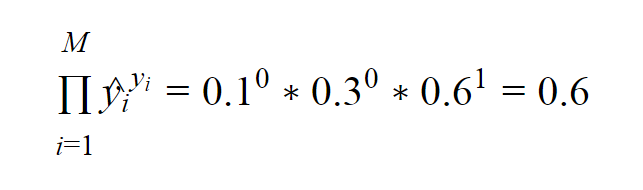

 

注意，似然函数取对数后，由于 $y_j$ 是 one-hot编码，只选 $y_j = 1$ 的情况计算。

负的对数形式的似然函数(Negative Log Likelihood)

$-\displaystyle\sum_{j=1}^My_jlog\hat{y_j}$

在该情况下，负的对数形式的似然函数 等同于 交叉熵。最大似然估计 等于 最小负的对数形式的似然估计。

4.	基于似然率下边界

在变自编码器等生成模型中，更多基于似然率下边界定义损失函数。

该方法基于样本似然率或样本联合分布似然率，寻找似然率下边界，通过使下边界最大，以便似然率尽可能大。

三、贝叶斯估计(Bayesian Estimation)

基于贝叶斯定理推理估计后验概率。不同于最大似然估计中参数看作是固定的未知量，基于统计估算一个最近似值；贝叶斯估计中，参数是具备概率分布的随机变量，或者说存在多个可能。

后验预测(Posterior Predictive)，基于观测数据计算参数后验分布，以更新参数先验分布(Prior Belief)，进行数据的后验预测。

 

逻辑意义，基于观测数据集D计算不同参数值后验概率p( θ | D )，基于不同参数值计算新数据y概率p( y | θ )，两者加权积分等于新数据y后验概率p( y | D )。

对于大数据集，后验预测要分析参数的所有可能值，计算过于庞大；同时，不易确定合适的先验分布。

相对于最大似然估计、后验预测，最大后验(MAP, Maximum A Posteriori)方法既用到先验知识，又只计算最大后验。

 

贝叶斯估计或推理，可用于贝叶斯线性回归、朴素贝叶斯分类、贝叶斯网络等。

注，当贝叶斯推理的后验分布不易计算时，可用MCMC(Markov Chain Monte Carlo)估计。

当参数先验分布基于均匀分布1时，贝叶斯推理的最大后验估计(MAP)便退化成最大似然估计；当经验风险最小(ERM)损失函数中正则项基于高斯等先验分布时，ERM等价于最大后验估计(MAP)。

四、矩估计方法(Method of Moment)

基于样本统计及参数定义，联立方程组，估计参数。

 

比方，基于高斯分布 N(μ, σ2)的样本集{ x1, x2, …, xn}。

基于第一个方程，可计算均值参数估计。

 

基于第二个方程整理，可计算方差参数估计。

 

 

 

第四章 优化计算

一、	数值分析

数值分析可基于不同视角分为无约束优化、约束优化；凸问题、对偶问题等。

最优化的方法，梯度下降简单、效率高，不过可能局部；牛顿法及相关改进方法，基于泰勒级数，利用了目标函数的二阶导可知梯度变化，搜索更全面，不过限制要求多，计算复杂。

1.	牛顿法

1、牛顿法

将误差函数(即最小二乘，均方差形式)展开成二阶的泰勒级数来近似，对该二阶泰勒级数计算极值，通过推导变化，**可得到变量(即模型参数)的迭代表达式(该表达式与梯度下降法很像，只是学习率变成海森矩阵的逆 $-H_k^{-1}-1$)。基于该迭代表达式，不断趋近极值点(多元变量情况，称驻点)。** 不过，牛顿法得到的迭代式没有步长控制，直接是$x_k - H_k^{-1}.g_k$，可能导致结果发散，不趋近于极值点。牛顿法是梯度下降法的进一步发展，利用了目标函数的二阶导(即梯度的变化)，能更全面确定搜索方向加快收敛；不过，限制要求较多，要求目标函数二阶可导、海森矩阵正定，同时，随着参数变量越多，计算越复杂。

牛顿法，对于存在截距(根)的情况，选参数临近点，基于斜率定义及观测量可知对应的观测参数，用选定的参数临近点，减去观测参数得到新的临近点参数，以此类推；对于存在极值的情况，函数展开为二阶泰勒级数，利用极值定义(一阶导等于0)，泰勒级数对参数求导后可得到迭代计算参数的公式，只不过需要知道雅可比矩阵及海塞矩阵，并且海塞矩阵不一定可逆、计算量大。

Newton-Raphson 更新规则。

单变量函数基于一阶泰勒级数展开，令展开的近似函数等于0，推得变量更新方程,$ x_{n+1} = x_n - \frac{f(x_n)}{f’(x_n)}$。

多变量(Multivariates)函数基于二阶泰勒级数展开，令展开的近似函数等于0，推得变量向量的更新方程，$ x_{n+1} = x_n - \frac{\nabla f(x_n)}{H(x_n)}$。

多变量方程组函数f(x)解计算。

 

f(x)基于一阶泰勒级数展开，令展开的近似函数等于0，推得变量更新方程，

$ x_{n+1} = x_n – J^{-1}_n f_n $。

J, 函数f(x)关于变量的雅可比矩阵。

2、拟牛顿法(Quasi-Newton)或近似牛顿法

不计算二次偏导、构造近似海塞矩阵，基于构造方法可分为DFP(Davidson-Fletcher-Powell)，BFGS (Broyden-Fletcher-Goldfarb-Shanno)，及适合高维优化任务的L-BFGS (Limited-memory BFGS)等。

3、阻尼牛顿法

更新方程的更新项加权。在得到牛顿方向($d_k = - H_k^{-1}.g_k$)后，基于 $argminf_{\lambda\inR}(x_k + \lambda.d_k)$计算得到 控制步长 $\lambda$，然后再更新参数($x_{k+1}=x_k + \lambda.d_k$)。

4、高斯牛顿法

将误差函数进行一阶泰勒级数展开，然后对该展开式的最小二乘进行求导，使最小。

5、列文伯格-马夸特法

高斯牛顿法的改进，通过增加可信步长区域控制迭代，避免步长过大导致迭代次数过多。这与强化学习TRPO算法相似。与梯度下降优化算法中的Adam等算法也似有相似-控制学习率(注,梯度下降优化算法包括 AdaGrad-基于参数历史梯度平方和自适应学习率, RMSprop-基于基于参数历史梯度平方和的均值自适应学习率, Adam-基于参数历史梯度均值和及方差和自适应学习方向及学习率)。

牛顿法

拟牛顿法

高斯牛顿法

列文伯格-马尔夸特法

2.	随机梯度下降法

梯度下降法，则是基于样本数量逐批次迭代更新计算得到参数，即以所有样本的一个小集合进行参数计算，然后不断更新参数得到最优参数解。

具体是随机选参数初始值，然后对目标函数(或代价函数，各参数的因变量)，比方，误差平方和函数、似然概率函数的各参数求偏导，得到下山方向，下山方向乘以学习率，初始值减去该乘积，得到更新参数；以此类推，不断更新得到最优的参数值。

随机梯度下降法，则是梯度下降法中，每个批次是从所有样本中随机选一个小集合作一个批次。

梯度下降法

AdaGrad(Adaptive Gradient Algorithm), 自适应梯度算法，对每个参数的历史梯度的平方进行加和计算，基于该和的开方，反比调整学习率。参数的历史梯度平方和的开方越大，则学习率越小；反之，学习率越大。

直观来说，一个U型的代价函数，边缘越陡近于垂直，则意味着梯度倾向于无穷大，权重参数-无穷大学习率*梯度 = 无穷小权重参数 ，这显然越过了权重参数可能的真值。因此，要通过使学习率部分降低来缓解这个更新步骤，即，通过反比形式，使梯度变大时，学习率部分变小，则 权重参数  - 小的学习率 * 大的梯度 。

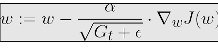

可以有效处理具有稀疏特征及不同规模的数据。使手动调整学习率变得简单。不过，随着参数累积梯度平方和变大，学习率可能消失。直观来说，一个U型的代价函数，边缘很陡时，基于AdaGrad优化算法，导致学习率部分确实会趋于0。

RMSProp(Root Mean Square Propagation), 均方根传播，是AdaGrad的改进，用于解决学习率消失问题。用历史梯度平方的均值调整每个参数的学习率。

直观来说，AdaGrad用的是参数过去每次迭代更新时的梯度的平方和的开方，RMSprop则是对这些和进行均值，即计算期望，以便尽量避免学习率的反比因子趋向于无穷大。

AdaDelta，对AdaGrad算法的改进,利用历史更新的参数的均方根与历史参数梯度的均方根的比来更新参数。直观来说，基于RMSprop算法，用参数历史梯度的均方根作反比因子，用参数本身的历史均方根作学习率。不要求初始学习率设置，易于适应不同问题；解决学习率消失；不过，复杂，同时，有时收敛速度低。

Adam(Adaptive Moment Estimation) , 自适应动量估计，结合AdaGrad与RMSprop特点。

两个动量向量，第一个动量向量(m)，基于参数的历史梯度的均值和，来确定参数更新方向；第二个动量向量(v)，基于参数的历史梯度的方差和，来确定参数更新的步长。动量向量的大小等于模型参数大小。

直观来说, 用参数的历史梯度的和的均值乘学习率来左右参数更新时是加还是减梯度，用参数的历史梯度的方差和作反比例因子。 学习率自适应；偏置纠正；效率高，适应于大数据集或大参数量的问题。一般常用该优化器。

3.	最小二乘法

最小二乘法，一般来说是误差函数的定义形式。不过也可称作是一类算法，即对误差平方和函数(各样本误差平方的和)各参数求偏导，列方程组，求极值。由于是一次对所有样本的误差平方和函数求偏导，计算量大。

在最小二乘法之前，一般通过联立方程组计算曲线或直线方程(连续函数，对应机器学习回归问题)的参数。

比方  y = ax + b , 通过测量两组(x, y)计算 a, b

$y_1 = ax_1 + b$
$y_2 = ax_2 + b$

最小二乘法，则是

$Min(\displaystyle\sum^n_{i=1}(ax_i + b - y_i)^2)$

最小二乘法, 是通过计算(测量值与真值差的)平方的和最小，来计算函数或方程参数。并没有分析误差具有什么特性。

误差的分布特性由高斯发布，发现呈正态分布，即正/负大误差的概率都很小，小误差的概率很大，超过一定范围的误差的概率等于零.

注: 最小二乘法，计算的是曲直线方程或者说连续函数的参数问题，对应于深度学习的回归类问题。

对于离散函数或分类等问题，则需要用交叉熵来计算函数参数。 原理是，计算最大似然函数或联合分布最大，即(x值对应的真值与预测值的概率的)乘积最大。

当然，最小二乘法(均方差方法)不是不可以用于离散，只是在分类情况下，预测的值是小于1的概率，基于最小二乘法计算误差时，误差值小，不利于反向传播计算。

4.	黑盒法

进化策略法，源于进化算法(Evolutionary Algorithms). 

## 简单高斯进化策略 Simple Gaussian Evolution Strategies

想要优化 f(x)， 不过无法计算 f(x) 的梯度; 因此用 $p_\theta(x)$ 来近似 f(x)

因此，目标是找到使 $p_\theta(x)$ 最优的 $\theta $

比方 $p_\theta(x)$ 是一个高斯分布

$ \theta = (\mu, \sigma),\;p_\theta(x) \sim \mathcal{N}(\mathbf{\mu}, \sigma^2 I) = \mu + \sigma \mathcal{N}(0, I) $

从高斯分布(注意不是标准高斯分布)采样 $\Lambda$ 个样本作为群族的后代(offspring);

$D^{(t+1)}=\{ x^{(t+1)}_i \mid x^{(t+1)}_i = \mu^{(t)} + \sigma^{(t)} y^{(t+1)}_i \text{ where } y^{(t+1)}_i \sim \mathcal{N}(x \vert 0, \mathbf{I}),;i = 1, \dots, \Lambda\}$

从 $D^{(t+1)}$集合中选 $k$ 个使函数 $f(x_i)$最优的样本作精英集合;

基于精英集合中的样本计算均值与方差，作为下一代高斯分布的参数;

从新的高斯分布采样 $\Lambda$ 个样本作为群族的后代(offspring);

依此循环，直到找到最优的 $\theta = (\mu, \sigma)$

模拟退火法，名称是利用了“缓慢降温”的做法和“温度”参数， 这种算法利用随机性进行全局优化， 用类似于Metropolis-Hasting的MCMC算法那样的方法在目标函数定义域进行随机游动， 试图找到全局最小值点。

模拟退火算法是利用随机移动来寻找全局最优点。 遗传算法是另一类算法的典型代表， 它产生多个搜索点， 利用这些搜索点以及搜索点之间的交互去接近全局最优点。

爬山法

下山单纯形法

二、	启发式算法(Heuristic Algorithms)

对于解析计算量大、或不可解析、难以最优化方法找到的最优解的问题，基于经验、直觉寻找实用解。

1.	启发式(Heuristic)

每次迭代基于局部最优。

构造算法(Constructive Algorithms)

比方，贪婪算法

局部搜索算法(Local Search Algorithms)

比方，爬山法(Hill-Climbing)

5.	元启发式(Meta-Heuristic)

相对于启发式方法，更像是模板，设计者选定具体方法。每次迭代时基于全局最优。

元启发方法基于不同视角有着不同的分类。

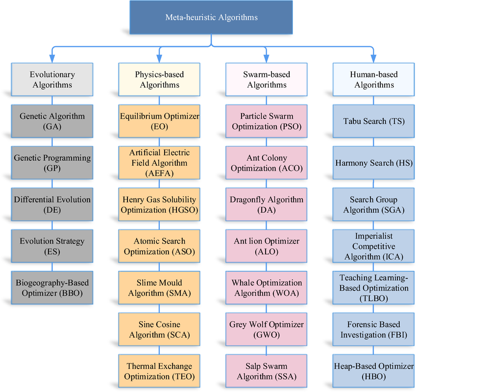

 

遗传算法(Genetic Algorithm)

利用生物学中择优配对、交叉遗传、遗传突变的思想使得整个种群不断进化，或者说，使搜索点集合接近全局最优点。

差分进化(Differential Evolution)

蚁群优化(Ant Colony Optimization)

蜂群算法(Bee Algorithms)

粒子群优化(Particle Swarm Optimization)

灰狼优化(Grey Wolf Optimizer)

禁忌搜索(Tabu Search)

模拟退火(Simulated Annealing)

名称是利用了“缓慢降温”的做法和“温度”参数， 这种算法利用随机性进行全局优化， 用类似于Metropolis-Hasting的MCMC算法那样的方法在目标函数定义域进行随机游动， 试图找到全局最小值点。

模拟退火算法是利用随机移动来寻找全局最优点。 遗传算法是另一类算法的典型代表， 它产生多个搜索点， 利用这些搜索点以及搜索点之间的交互去接近全局最优点。

注，马氏链蒙特卡洛(MCMC)是一类对高维随机向量抽样的方法， 此方法模拟一个马氏链， 使马氏链的平稳分布为目标分布， 由此产生大量的近似服从目标分布的样本， 但样本不是相互独立的。 MCMC的目标分布密度函数或概率函数可以只计算到差一个常数倍的值。

和声搜索(Harmony Search)

萤火虫算法(Firefly Algorithm)

布谷鸟搜索(Cuckoo Search)

6.	超启发式(Hyper-Heuristic)

相对于元启发式方法，自动选定启发式算法。

 

 

第五章 评估度量

一、回归模型的度量

mean square error (MSE)

mean absolute error (MAE)

Root Mean Squared Error (RMSE)

Mean Absolute Percentage Error (MAPE)

二、分类模型的度量(Evaluation Metric)

分类任务性能度量方法,混淆矩阵(直观判断预测情况)，(基于混淆矩阵可计算)准确率、精确率、召回率、F1得分。

多分类任务的准确率、精确率、召回率等是对二分类问题(TP,TN,FP,FN)的扩展，基于每个类型的预测(TP,TN,FP,FN)计算。

accuracy 准确率

confusion matrix  混淆矩阵 。是计算精确率、召回率的前提。预测的positive, negative 与 实际的 positive, negative的比对情况，对角线元素表示对实际值的预测正确，对角线元素颜色越重，别的区域颜色越轻，表示预测的精确度、召回率越高。

                        Actual
                p                       N

            P

Prediction 

            N

Precision 精度率 TP / (TP + FP) 与 Recall  召回率 TP/(TP + FN)，两者略不同  

基于 精确率与召回率计算F1得分。

F1-Score 得分 ,  2(Precision * Recall) / (Precision + Recall) , 得分越高，说明精确率与召回率都越高

基于每个类型的精确率计算平均精确率(AP), 比方 语义分割任务中, 是房屋类型的像素的精确率；

基于平均精确率计算mean平均精确率 (mAP), 比方 语义分割任务中， 类型包括房屋、道路等，则计算所有类型的AP的平均值。

三、自然语言处理模型的度量

$ Accuracy = \frac{Number of Correct Predictions}{Total Number of Predictions}$

Precision, Recall, and F1 Score

AUC-ROC

BLEU (Bilingual Evaluation Understudy)得分

ROUGE (Recall-Oriented Understudy for Gisting Evaluation) 得分

Perplexity

Exact Match (EM)

四、目标检测模型的度量

目标检测的度量，TP,FP,TN,FN等基于目标位置与预测位置匹配程度进行计算。基于TP,FP,TN,FN可计算多类型目标任务的平均精确率AP,平均召回率AR.

五、分割模型的度量

分割任务度量，均交并比mIoU, 像素准确率PA, 平均精确率AP, BF得分 Boundary F1 Score ，全质量Panoptic Quality.

接下来各章节是对深度学习模型的较详细说明。

 

传统机器学习篇

传统机器学习或浅度学习(Shallow Learning)需要基于特征工程，比方，数据的线性关系假设，选取能最有效表征数据的特征。相应的模型，比方决策树或逻辑回归模型，通常包括一到两个网络层；可解释度(Interpretable)高；适于CPU环境运行。

注，浅度学习(Shallow Learning)并没有标准化的定义。这里用浅度是为与深度学习概念相连贯及区别。浅度学习不同于深度学习，但可应用于深度学习，作深度神经网络的组成部分。

机器学习算法分类。

 

传统机器学习方法，基于任务类型可分作分类、回归、降维、聚类等类型。

对于分类任务，可分作基于距离的(Distance-Based)、经验风险最小(Empirical Risk Minimization)及基于后验概率估算方法的生成方式(Generative Methods)、判别方式(Discriminative Methods)。

基于距离，比方，最近邻。

基于经验风险最小，比方，支持向量机(SVM, Support Vector Machines)。

生成式，比方，朴素贝叶斯(Naïve Bayes)、多项式混合(Mixtures of Multinomials)、高斯混合(Mixtures of Gaussians)、专家混合(Mixtures of Experts)、隐马尔可夫(HMM, Hidden Markov Models)、贝叶斯网络(Bayesian Networks)、马尔可夫随机场(Markov Random Field)等。

判别式，比方，逻辑回归(Logistic Regression)、条件随机场(CRF, Conditional Random Field)等。

注，隐马尔可夫是朴素贝叶斯的序列化(Sequence)，条件随机场是隐马尔可夫的条件化；逻辑回归是朴素贝叶斯的条件化(Condition)，条件随机场是逻辑回归的序列化。

 

 

第一章	分类

AdaBoost、GBDT、随机森林决策树区别。

 

一、决策树

决策树，基于递归方法(Recursively)，利用数据特征及判别准则对数据集进行，形成树形结构的判别流程图。适合于表格(Tabular)数据。

比方，基于天气判别是否跑步的数据集。从根节点(Root)节点开始，先利用阴晴状况对数据集分割(Split)；再利用温度特征对分割的子数据集进行分割；分割后的数据集，利用湿度特征进行分割；叶子节点(Leaf)记录是否跑步的结果。

决策树，可用于分类，亦可用于回归任务。特性是判别逻辑直观，不过树过深时易过拟合。

传统方法，CART(Classification And Regression Tree)、ID3(Iterative Dichotomiser 3)、C4.5、C5等。

1.	CART

CART[Breiman. 1984]，二分类决策树，基于基尼系数(Gini Impurity)进行分类；基于方差计算进行回归。Bagging、XGBoost、随机森林等树算法的基石。

分类任务步骤。

1、遍历当前节点样本集中不同样本特征。

2、遍历当前特征的不同阈值(Thresholds)。

3、基于当前阈值对当前数据集进行左右分类。

基于当前划分方法，利用左右分类基尼系数加权计算当前数据集基尼系数作代价函数。

 

G(S)split, 当前节点数据集基尼系数。

G(SL), G(SR), 左分类、右分类节点数据集基尼系数。

|S|, |SL|, |SR|, 当前节点数据集、左分类节点数据集、右分类节点数据集大小。

基于样本统计频率分别计算左右分类数据集的基尼系数。

 

4、基于矩阵式的两次遍历，选择使当前数据集基尼系数最小的特征及阈值进行节点划分(Split)。

5、划分的左右子节点数据集，循环1-4步骤，直到达到决策树超参约束(Hyperparameter Constraints)。

超参约束定义。

最大深度。

每次划分的最小样本数。

每个叶节点最小样本数。

最大叶节点数。

回归任务步骤相似，区别在于用方差或均方差计算数据集代价函数。

当前节点数据集均方差或代价函数定义。

 

MSESPLIT(S), 当前节点数据集均方差。

MSE(SL), MSE(SR), 左右分类节点数据集均方差。

当前左右分类节点数据集方差或均方差定义。

 

2.	ID3

ID3[Quinlan. 1986]，多分支决策树。基于样本数据集不同特征分类子集的信息熵，计算样本集的增益；选择使增益最大的特征作节点划分。

分类任务步骤。

1、基于数据集计算目标熵(Entropy)。

 

Entropy(S), 数据集信息熵。

pi, 第i个分类的统计频率。

2、遍历每个特征，计算相应的信息增益(IG, Information Gain)。

 

IG(S, A), 数据集S中特征A(Attribute)对应的信息增益。

Values(A), 特征A的值集合。

|S|, |Sv|, 数据集S及特征A的特征值v对应的数据集Sv的大小。

Entropy(Sv), 数据集Sv的信息熵。

3、选增益最大的特征作当前节点，基于特征值分支；不同分支，循环1-2步骤，在余下特征中确定子节点。直到达到超参约束。

3.	C4.5

C4.5，基于ID3算法的扩展，可应对数据丢失、通过剪枝防过拟合。适于离散及连续特征。

基于特征的增益比例进行划分。

 

GainRatio(S, A), 数据集S特征A的增益比例。

IG(S, A), 数据集S特征A的信息增益。

SplitInformation(S, A), 数据集S特征A的划分信息。用于矫正信息增益可能带来的过拟合风险，比方，分支过多。

 

4.	C5

C5，基于C4.5改进。提高计算速度、内存使用效率。

基于决策树容易过拟合的问题，常通过组合方法(Combination)，利用多棵决策树并联聚合(Bagging, Bootstrap Aggregating)或串联提升(Boosting)等集成学习(Ensemble Learning)方法来降低单棵决策树的问题。

聚合方法，随机森林、聚合KNN等。

提升方法，AdaBoost、GBDT、XGBoost等。

注，集成学习，组合多个模型或学习器(Learners)以改进预测准确率的机器学习方法。

二、随机森林

随机森林，综合多个决策树的结果进行判别。实质是将特征过多时，单棵决策树容易过深的问题，通过对特征集进行划分、降维，来降低每个特征子集对应的决策树的深度。这一思路与矩阵分解本质存在着相似性。

比方，基于天气判别是否跑步的数据集。每个特征对应一棵决策树，选所有决策树中的一致多数作判别结果。

三、AdaBoost

AdaBoost(Adaptive Boosting)，实质基于多棵决策桩(Decision Stumps)的预测结果进行加权决策。每个决策桩基于投票权重修改样本权重，串行(Sequential)传递给下一个决策桩，下一个决策桩基于样本权重计算误预测率及投票权重。

直观逻辑，基于每个特征定义一棵决策树；每棵决策树具备相应的投票权重；基于投票权重加权决策树的预测，以进行决策。

每棵决策树基于正确预测率与误预测率的比例定义投票权重，正确预测越多，投票权重越高；利用投票权重修改样本权重，使得误预测样本权重放大，正确预测样本权重变小；基于修改后的样本权重，计算下一棵决策树的误预测率及正确预测率。

AdaBoost训练过程。

 

比方，N个样本，对应标签，$ y_i \in { -1 , +1 }$。

第一步，每个样本起始权重，$ w_i = \frac{1}{N} $。

第二步，基于加权误分类率(Weighted Classification Error Rate)拟合决策树(Weak Learner)。

 

$ \epsilon_t $, 第t棵决策树对应的加权误分类率。

$ w_i $, 样本i的当前权重。

$ 1(y_i \neq h_t(x_i)) $, 预测正确取0值，反之，取1值。

$ h_t(x_i) $, 第t棵决策树对样本$ x_i $的预测。

第三步，计算决策树的投票权重(Vote Weight)。

 

第四步，更新样本权重。

 

当前决策树预测正确的样本，权重变低；反之，权重变高。

第五步，循环第二、三、四步，合成预测。

 

损失函数定义。

 

四、GBDT

GBDT(Gradient Boosting Decision Tree)，实质基于串联的浅层决策树(Weak Learner)逐级校准预测，或者说基于梯度下降迭代算法，利用不同的决策树分别预测每次迭代的更新项。

1、串联校准逻辑，第一棵决策树先预测一个值作基准；第二棵树预测一个误差值，以校准基准值；第三棵树再预测一个误差值，以便对校准的基准值再次校准；依此类推，直到误差值基本不再变化。

2、基于梯度下降算法迭代更新预测值的逻辑。

比方，第一棵树模型预测的值是 y’，则基于梯度下降法更新y’的方程。

y’ = y’ – α . (∂ loss / ∂ y’)

α, 学习率。

loss, 损失函数。

∂ loss / ∂ y’ , 损失函数关于预测量y’的偏导。注，不同于神经网络模型中计算参数量的偏导。

这就是说，每次迭代，只需知道预测量的更新项，(– α . (∂ loss / ∂ y’))，便可对y’进行更新。

既然y’可通过决策树预测，则更新项同样可通过决策树预测。区别只是决策树的具体形式。

当更新项或者梯度基本不再变化时，可停止更新。

3、决策树的创立规则。

每个节点的选择，选对样本目标值影响或差异最大的特征作当前节点。

比方，样本特征向量x=(x1, x2, x3)；对应目标值, y。

x1特征不同的取值对应不同数量的样本。x1 = a 对应 n1个样本 ，x1 = b 对应 n2 个样本， x1 = c 对应 n3个样本。

则

全部样本对应的目标值 y 的标准差(Standard Deviation)是δ。

x1 = a 对应n1个样本的目标值 y 的标准差是δ1。

x1 = b对应n2个样本的目标值 y 的标准差是δ2。

x1 = c对应n3个样本的目标值 y 的标准差是δ3。

基于加权计算x1的标准差， $ \frac{n1}{n}δ1 + \frac{n2}{n}δ2 + \frac{n3}{n}δ3 $。

相似方法，计算 x2, x3的标准差，分别与全样本标准差δ比较。

选相差最大的特征作当前节点。

假定，x1标准差落差最大，选x1作决策树第一个节点。

当 x1 = a 时，对应的样本集，基于相似方法选子节点。当样本集中样本数量小于阈值时，计算样本集目标值的均值作叶子节点值(Leaf Node Value)。

4、创立GBDT示例。

比方，样本数据集{(x, y)}。

第一步，基于标准差落差(SDR, Standard Deviation Reduction)最大规则创立决策树, f(x)。

第二步，基于创立的决策树预测值f(x) = y’ 与样本实例目标值比对，计算误差。

第三步，基于损失函数定义，比方，均方差(MSE)损失loss = (1/2) x (y – y’)^2 ，计算loss关于预测量y’的偏导，可知等于误差。基于更新方程，计算更新项。

第四步，创立新的样本数据集，样本实例目标值对应更新项值。

第五步，基于新的样本数据集创立误差决策树。计算决策树的误差及更新项。

第六步，循环第四、第五步，直到更新项值基本不变。

五、XGBoost

XGBoost(Extreme Gradient Boosting)，实质基于GBDT框架，决策树损失函数进行二阶泰勒级数展开，利用梯度及海森矩阵定义预测值的更新规则、决策树创立规则、叶子节点值计算。可用于分类、回归、排名(Ranking)任务。

基于损失落差(Loss Reduction)最大创立决策树。

 

gi, 梯度。

hi, 海森矩阵。

 

$ \hat { Psi } $ , 决策树模型预测值。

创立的决策树的叶子节点值计算方程。

 

 

Ij , 决策树q(.)中的第j个叶子节点对应的样本索引集合。

预测量更新方程。

 

$ \hat { Psi }^{(m)} $, m次迭代后的输出。

$ \hat{ \delta }^{(m)}$, 更新项。

$ \eta $, 学习率。

$ w^*_{j(i)}$, 当前决策树q(.)中观测量xi所对应的第j个叶子的权重。

可不用，{基于决策树的梯度上升算法，是一类整体学习(ensemble learning)算法，利用多个弱模型学习，逐步训练更强的模型。 有时也指相应的XGBoost框架库。

基于预测的 $\hat{y}$ 值与ground truth y的均方误差，最小化，来得到 $F_0(x)$ 模型函数;

利用 $F_0(x)$ 对每个输入量x进行预测， 计算 $y_i - F_0(x)$ , 得到残差h1(x)回归树，用于尝试及减少残差，即h1(x)作为回归树，对$y_i - F_0(x)$得到的所有残差项进行分类，比方，大于threshold的计算一个均值，作为对应项的残差;小于threshold的计算一个均值,作为对应项的残差;

用 $F_0(x) + h1(x)$ 作 $F_1(x)$

依照上述方法，不断迭代更新，可以发现 用最后的 $F_n(x)$ 函数预测的值将趋近于样本中的y值。

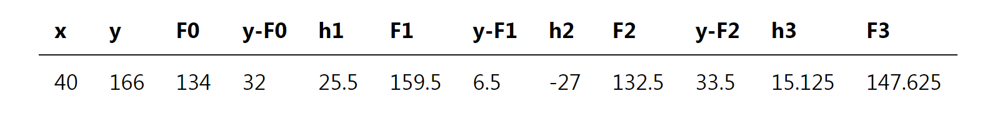
 

六、K近邻

KNN属于监督学习，类别是已知的，通过对已知分类的数据进行训练和学习，找到这些不同类的特征，再对未分类的数据进行分类。

预测点与所有点距离进行计算，然后保存并排序，选出前面K个值看看哪些类别比较多，则预测的点属于哪类。

七、SVM

支持向量机(SVM，Support Vector Machine)，利用核函数(技巧)定义特征空间的空白区( margin in feature space) ,也就是说核函数不直接作分类器，是对 **核函数** **再作一个函数变换**得到分类。

$\hat{y}(x^∗) = sign( \hat{w_0} + \displaystyle\sum^n_{i=1}α_iκ(x_i, x^∗))$

核函数 κ : X × X → R  ，目的用于量化(quantify)两个变量之间的相似度。核函数的两个特性，k(x',x) = k(x, x') ; k >= 0 。

同一空间的**低维变量**通过基函数**映射到**另一个空间X得到新的**高维度变量x**，不同高维度变量x之间的不同内积形式的结果等于y，x -> y, 该映射 称核函数。

线性内积形式，称线性核(Linear kernel) ,  $K(\mathbf{x}_1, \mathbf{x}_2) = \mathbf{x}_1^\top \mathbf{x}_2$ ;

多项式内积形式，称多项式核(polynomial kernel) , $K(\mathbf{x}_1, \mathbf{x}_2) = (\gamma \cdot \
    \mathbf{x}_1^\top\mathbf{x}_2 + r)^d$

内积的方差指数形式，称高斯核或辐射基函数核(radial base function kernel) , $K(\mathbf{x}_1, \mathbf{x}_2) = \exp\left(-\gamma \cdot
    {\|\mathbf{x}_1 - \mathbf{x}_2\|^2}\right)$

内积的tanh形式， 称 sigmoid kernel , $K(\mathbf{x}_1, \mathbf{x}_2) = \tanh(\gamma \cdot
    \mathbf{x}_1^\top\mathbf{x}_2 + r)$

还有 Fisher Kernels 等

比方，一维的一系列数字$x_i$ ， 定义一个基函数，$φ(x_i) = [x_i , x_i^2]$ 将这些数字映射或投影到二维空间；

然后，基于核函数定义，对映射到二维空间的不同变量进行内积计算

$κ(x_i , x_j ) = x_ix_j + x^2_i x^2_j$

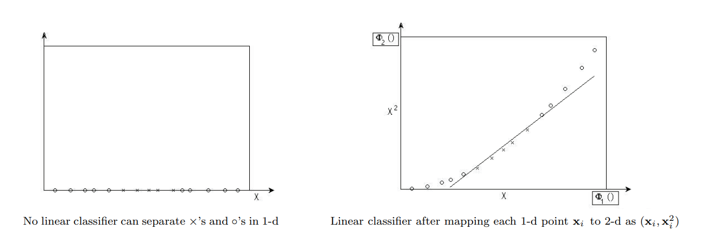
 

通过核函数计算基函数很困难也不必要，通过基函数构造核函数却很直接。就像是以乘数因子计算乘积容易，以乘积结果推算乘数因子则困难。

所以，说核函数必说基函数，先定义基函数，再利用核函数作分类器。

八、朴素贝叶斯

朴素贝叶斯(Naïve Bayes)，基于贝叶斯定理进行后验预测。朴素指，假定数据集特征彼此独立，分别作用于预测。

贝叶斯定理方程。

 

基于单词频率、血压等特征的分布，可定义不同的朴素贝叶斯算法，比方，高斯(Gaussian)、多项式(Multinomial)、伯努利(Bernoulli)朴素贝叶斯等。

基于特征预测分类。

$p( 类型 | 特征 ) = \frac{ p( 特征 | 类型 ) p( 类型 ) }{ p(特征)} $
 

比方，基于天气、温度特征预测是否要进行运动.

数据集，{(Sunny, Hot, No), (Sunny, Hot, No), (Sunny, Cool, Yes), (Rainy, Mild, Yes), (Overcast, Hot, Yes), … }。

预测天气(Sunny)、温度(Mild)情况是否进行运动？

第一步，基于数据集分别计算运动、不运动对应的先验概率，P(Play = Yes)、P(Play = No)。

第二步，基于数据集分别计算运动、不运动时对应的天气(Sunny)、温度(Mild)的似然概率，P(Sunny | Play = Yes)、P(Mild | Play = Yes)、P(Sunny | Play = No)、P(Mild | Play = No)。

第三步，基于数据集计算天气(Sunny)、温度(Mild)对应的边缘概率，P(Sunny, Mild)。

第四步，基于贝叶斯方程分别预测在观测到天气(Sunny)、温度(Mild)时运动、不运动的后验概率，P(Play = Yes | Sunny, Mild) 及 P(Play = No | Sunny, Mild)。

比较概率，选概率大的作判别结果。

注，不同类型的贝叶斯方程中边缘概率相等，因此，一般忽略第三步。

P( Class | Feature1 , Feature2, … , FeatureN) = P( Feature1 | Class ) * P( Feature2 | Class ) * … * P( FeatureN | Class ) * P( Class )

 

第二章	回归

一、线性回归

单自变量线性回归方程。

y = ax + b

 

多自变量线性回归方程。

$ y = a_1 x_1 + a_2 x_2 + a_3 x_3 + … $

基于样本集，预测的$\hat{y}$与真值对齐，利用均方差(Mean Squared Error)作损失函数，通过梯度下降法进行优化计算，更新参数。

二、Lasso回归

Lasso(Least Absolute Shrinkage and Selection Operator)，在线性回归代价函数中添加L1正则项-模型参数绝对值和加权，以防止模型过拟合。

 

当目标函数趋于最优点时，误差项趋于零，意味着预测值与样本真值趋同，无法过滤样本噪点，模型预测偏差小、方差大；同时，应使正则项最优，意味着参数(Coefficients)趋向零，使模型预测方差变小、偏差变大。

基于两权重参数的优化图示。

 

图示，误差项最优使参数趋向椭圆中心，正则项最优使参数趋向原点的菱形。交点使模型偏差、方差平衡(Trade-Off)。模型参数取零值时，使模型参数稀疏化。

三、Ridge回归

岭回归(Ridge Regression)，在线性回归代价函数中添加L2正则项-模型参数平方和加权，以防止模型过拟合。

 

当目标函数趋于最优点时，误差项趋于零，预测值与样本值趋同，偏差小、方差大；同时，应使正则项最优，意味着模型参数趋于零，使模型预测方差变小、偏差变大。

基于两权重参数的优化图示。

 

图示，误差项最优使参数趋向椭圆中心，正则项最优使参数趋向原点的圆形。交点使模型偏差、方差平衡(Trade-Off)。

 

四、逻辑回归

全名逻辑回归分类，实质是基于回归的分类。

原理是，基于输入的变量x1, x2, ..., xn, 拟合一个多项式(即线性回归); 该多项式的结果通过sigmoid即逻辑函数转换成s曲线;然后，再基于一个阈值，对该s曲线进行两分类。因此 logistic regression = linear regression + sigmoid 

从分类神经网络的一般结构来说，实际体现的就是逻辑回归分类过程。输入的X(x1, x2, ... , xn)通过加权计算(即得到一个多项式),加权的结果通过sigmoid(每个神经元独立进行sigmoid计算 binary logistic regression)或softmax(所有神经元进行softmax计算, multinominal logistic regression)进行分类。因此，逻辑回归是神经网络的一个特例，一层(一个神经元)神经网络。

实际，不只是binary logistic regression , multinominal logistic regression(多分类, 分类之间无等级顺序), 逻辑回归有很多类型 ordinal(多分类，分类之间存在等级顺序，不过等级程度不确定，比方， "strongly disagree," "disagree," "neutral," "agree," "strongly agree"), multi-level(hierachical, 比方预测科技领域的股票涨停), regularised(利用lasso(L1)或Ridge(L2)等进行正则化，防过拟合), mixed-effects(结合了不同的影响效果，比方(科技指标这样的)固定影响、(不同产业领域的)可变影响)等。

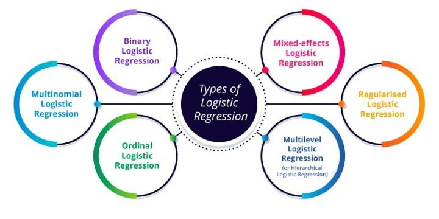
 

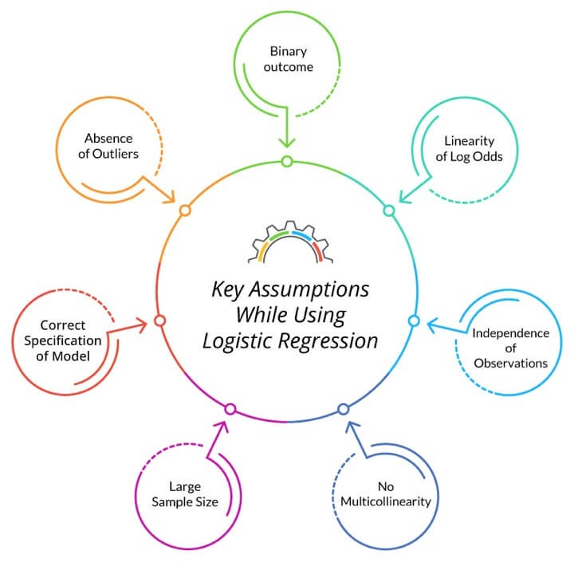

观测独立(Independence Of Observations)、二分类(Binary Outcome)、大样本(Large Sample Size)等。

注: 逻辑回归模型的训练基于BCM即可，因为输出利用sigmoid激活。

逻辑回归输出的概率，对于任务的解释不直观。可以用对数几率(log odds)来进行转换。

1. 从逻辑回归的计算中，已知事件成功的概率 $p = 1/(1+e^{-z})$ , 假定 z 是 输入变量 x 的一元一次加权 z = a0 + a1.x

2. 基于odds定义，要计算odds ratio，先计算该事件失败的概率  $1 - p = e^{-z} / (1+e{-z})$

3. 计算 odds , $ p / (1-p) = e^z$

4. 基于逻辑回归，将对概率取对数 改成 对 odds 取以e为底的对数 ，可得到 $lnp/(1-p) = z = a0 + a1.x$  这样逻辑回归的结果不再是二分类，而是可以线性表示的结果，便于直观解释 对于输入变量(指标)x, 可以得到什么样的数值结果。

注: odds, 几率(特指成功几率),或成功比, 即 odds ratio, 几率比， 成功概率/失败概率，比方今天下雨概率0.6, 则几率比 = 0.6 / 0.4 = 1.5

log-odds, 对数几率，对几率的对数化  ln(1.5) = 0.4054651

本质, 概率、几率、几率比、对数几率反映是同一个事情，形式不同。

从odds几率角度推导逻辑函数的方法(可以有别的方法)

逻辑回归等式说明,该等式实际基于最大似然估计(似然函数即未知参数的概率函数, 形式上, 似然函数与概率密度函数等同, L(θ |x) = f(x |θ) , 实际意义不同, 似然函数 , 对于训练集来说, θ 是未知参数作函数的变量， x是常量)。

线性回归与逻辑回归比对

1. 先从逻辑回归等式开始

线性回归，是用y做多项式的值; 逻辑回归，则是用 y的对数几率 作 多项式的值 , 即 多项式预测的是 y的对数几率(log odds)。 

注: 对于为什么用log(p/(1-p))形式来作输入量的加权拟合，卡耐基-梅隆大学的logistic regression 讲的较明确. 多项式的结果取值范围无限制，直接用p 或 log(p) 都无法对应这样的取值区间。

$\begin{equation}
\ln{\left( \frac{p}{1-p} \right)} =  \beta_0 + \beta_1 X_1 + \beta_2 X_2 + \ldots + \beta_K X_K \tag{6.1}
\end{equation}$

2. 令 $ z= \beta_0 + \beta_1 X_1 + \beta_2 X_2 + \ldots + \beta_K X_K$由该等式，可计算得到 $p = (1-p).e^z$, 得到 $p = e^z / (1 + e^z)$

3. 因此，在神经网络中，对输入变量x1, x2, ... , xn 加权后，要计算加权后的值y的概率形式，可以用 $p = e^z / (1 + e^z)$

注意,  logit function 是 log odds ，不是 sigmoid function , sigmoid function 是 $p = e^z / (1 + e^z)$

注: 逻辑回归的似然函数  $L(β0,β) =\prod^n_{i=1}p(x_i)^{y_i}(1 − p(xi))^{1−y_i}$

The likelihood function L(θ) is the joint PMF of PDF of data.

训练中，数据x作观测量，来拟合函数模型，计算参数。

第三章	降维

一、PCA
[I. T. J. 2002]

主成分分析(PCA, Principal Components Analysis)，实质在于通过找到变换矩阵W，将n个d维样本形成的张量X转换到低维空间张量Z，或者高维空间投影到低维空间。比方，三维空间线段投影到二维坐标平面。

PCA变换过程与Transformer框架中的输入嵌量利用参数矩阵计算Q、K、V是相似的。

单个样本向量x通过$W^Tx$编码到隐向量z; 隐向量z通过$Wz = x’$解码重建样本向量。变换矩阵列向量两两正交，$W^TW = I $。

基于全部重建向量x’与样本向量x的均方差的和作目标函数，通过梯度下降法优化计算变换矩阵W。

$\argmin_w \sum_{i}|| {w^T x_i \cdot w}  - x_{i} || \\  w^T w = 1 $

比方，64*64像素的图像展开(Flatten)成向量 $ x = (x_1, x_2, x_3, … )$; 变换矩阵 $ W = [w_1, w_2, w_3, …] $ ; 主成分向量 $w_i$ 对向量x进行加权或投影计算，可得相应隐特征$z_i$; $W^Tx = z$，可得隐特征向量z。

逻辑意义，每个主成分向量确定向量特征之间的一个特定关系，多个主成分向量则确定多个特定关系。确定的关系越多，解码时可还原的细节越多。

PCA亦可理解作样本向量协方差矩阵$X^TX$的特征值分解(Eigenvalue Decomposition)。

 

$v_i$, 特征向量或主成分。

$\lambda_i$, 特征值。

比方，N个D维样本, 即 N*D 维矩阵; 

对样本进行标准化，即正态归一化; 将每个D维样本视作D维向量, 进行 $D.D^T$计算 ，形成 D*D维的矩阵，也就是样本的各特征维度之间进行关联度计算(类似transformer中的 Q与K关联计算); 

对N个样本对应的D*D维矩阵进行和计算，再平均得到平均化后的D*D维的协方差矩阵(Covariance Matrix);

对 D*D维矩阵进行分解(Decomposition, 即提炼特征)，得到 特征向量与特征值; 依据特征值大小进行排序，选前P个特征值对应的特征向量(即选择影响权重大的特征),形成D*P维矩阵(即进行特征降维);

N*D维矩阵 * D*P维矩阵，得到 降维后的 N*P维矩阵;

PCA, 通过找到主成分对高维样本进行降维(可能是有损的), 类似线性回归.

比方，二维的样本集，找到使样本向量集方差最大的单位向量，再找到与该单位向量正交的单位向量，将样本集转换到这两个单位向量组成的坐标系下。

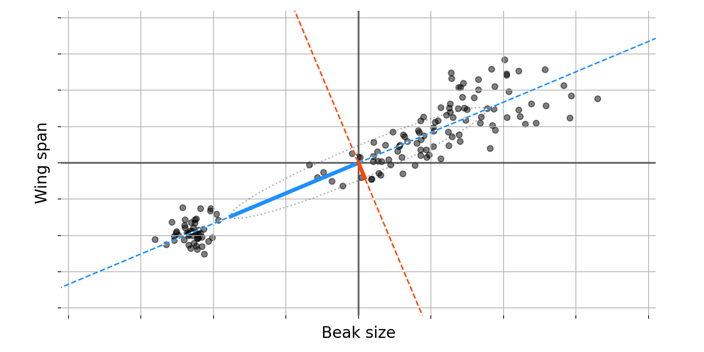
 

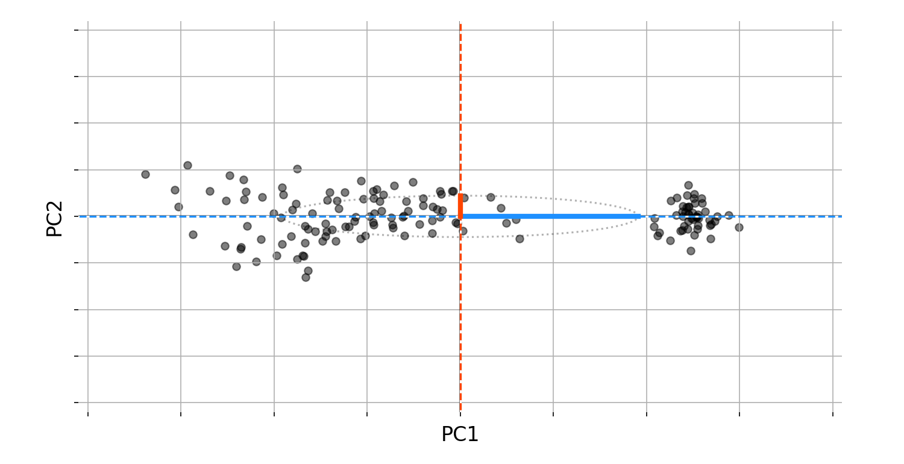
 

在两个单位向量组成的坐标系下，实际只需要横轴便可以区分样本集，即原二维空间的样本集降维成了一维。在一维空间表示的样本，称隐表示(latent representation).

即找到二维样本向量到一维隐变量的变换关系，同时找到一维变量变回到二维样本向量的变换关系。

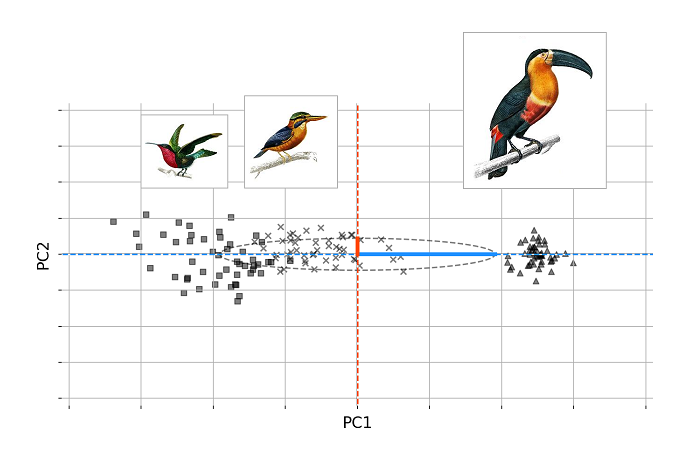
 

数学定义，即最优化

$u_1^⋆ = argmax_{u_1}\displaystyle\sum^N_{i=1}(u_1 ⋅x_i )^2 $ ,subject to $||u_1||_2 =1$

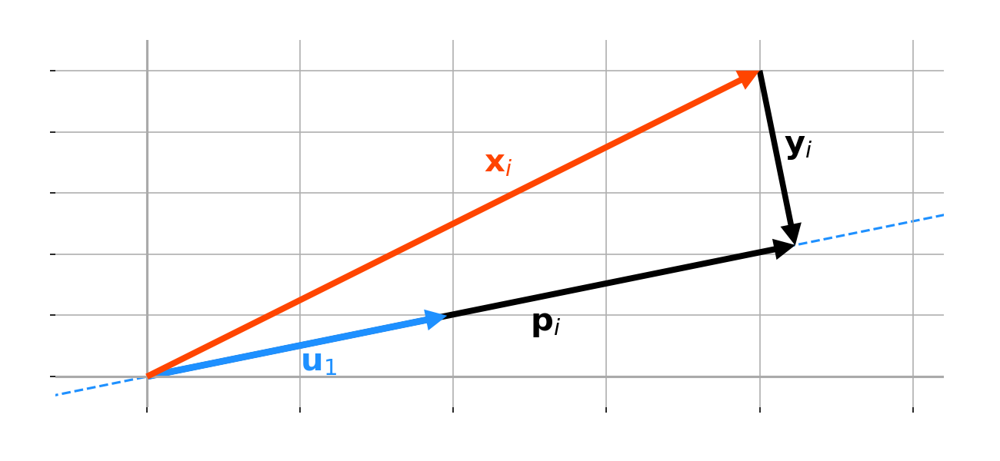
 

二、LDA

线性判别分析(LDA, Linear Discriminant Analysis)，基于监督学习方法，通过对样本向量特征进行线性组合以最大化区分数据集中不同类型的数据，同时，同类型内数据最相邻。可用于降维、降噪、分类。

实质在于找到变换矩阵W，使得不同类间方差(Between-Class Variance)或散布(Scatter)最大，同类内数据方差(Within-Class Variance)或散布最小，以便两者比例最大。

 

$S_B$, 类间散布矩阵(Scatter Matrix)或者说数据集的协方差矩阵。

$S_W$, 类内散布矩阵。

$S_B = Σ N_i(μ_i - μ)(μ_i - μ)^T$

$N_i$, 第i类的样本数。

$u_i$, 第i类的样本均值。

u, 所有样本的均值。

$S_w = Σ S_i$

$S_i = Σ(x – μ_i)(x – μ_i)^T$

$S_i$, 第i类的散布矩阵。

比方，d维的样本数据集，${x_1, x_2, x_3, … , x_n}$。存在两类标签$C_1, C_2$。

计算每类样本数据子集的均值$u_1, u_2$及数据集均值$u$。

计算每类的散布矩阵$S_1, S_2$，类内散布矩阵$S_w$。

计算类间散步矩阵$S_B$。

计算J(W)特征值，选最大特征值对应的特征向量以形成变换矩阵W。

基于变换矩阵对训练样本降维，训练随机森林分类器等。

测试时，利用变换矩阵W对测试样本降维; 再用训练的分类器进行分类预测。

三、ICA

独立成分析(ICA, Independent Component Analysis)，通过线性变换使混合信号或样本数据集分离为统计独立的、非高斯分布的成分。

S = WX

$ S = (s_1, s_2, … , s_n)^T $ , 隐成分向量。

目标，使隐成分独立性最大。

 

第四章	聚类

一、	K聚类

Kmeans属于非监督学习，事先不知道数据会分为几类，通过聚类分析将数据聚合成几个群体。聚类不需要对数据进行训练和学习。

K聚类(k-means Clustering), 先随机选k个点作中心(centroids)，每个数据点距离哪个中心点最近，便与该中心点划为一类；形成k个类簇后，计算每个类簇的均值中心点，得到新的k个中心点，计算每个数据点到新的k个中心点的距离，重新聚为k个类簇；依此循环计算，直到计算得到的k个中心点位置与前一次计算的k个中心点位置，相比不再变化。

二、	期望最大(EM)

在不完备数据集(Incomplete Data Set)中，只存在观测样本集X，缺失真值集Y或隐变量集Z，不知X中样本与Y或Z中元素的对应或归类关系。

假定观测样本集X对应很多不同的分布，要找到一个模型参数使得似然率 $ p( X | \hat{ \theta }) $估计最大。

比方，存在n个不同质心的骰子，每次测试，随机选一个骰子投m回，测试k次。计算第k+1次测试，投资数是6的概率。

此时，常用期望最大算法。

期望最大算法，实质利用完备数据集最大似然估计较之不完备数据集最大似然估计更易计算的特性，使不完备数据集似然率的对数logp(x|θ)的计算，转成对完备数据集似然率的期望E[log p (x, z |θ)]的计算。

证明过程，

已知，不完备数据集似然率的对数等于完备数据集似然率的边缘分布。

 

右侧项可基于当前参数估计对应的条件分布整理作加权和形式。

 

 ，逻辑意义，基于样本分布参数当前估计θt，观测样本x归于z类的概率。式中作权重。

基于琴生不等式，log是凹函数(Concave Function)，期望的log大于等于log的期望。

可推得方程下边界。

 

对数分式展开。

 

方程式右侧，只第一项与分布参数θ相关。

因此，要最大化似然率对数D，只用最大化E中的第一项。

在EM算法的期望步骤(E-Step)中，计算每个z对应的 ；在最大步骤(M-Step)中，计算令第一项最大的θ。

权重 用隐变量z的分布的通用形式q(z)替代。

可推得。

 

 

已知q(z)是观测样本x归类到z时的概率，可知。

 

代到不等式下边界，可推得。

 

基于参数θ及参数估计θt对应的似然率对数方程，联立可推得。

 

式中，

 

注， 是Dempster在论文中引入的函数。H，交叉熵、信息熵函数。

基于吉布斯不等式(Gibb’s Inequality)，交叉熵大于等于信息熵。

 

因此，要使似然率对数logp(x |θ)最大化，对应。

E步骤，计算 的权重项。

M步骤，计算 。

注，Q函数迭代过程中单调递增，可收敛于(局部)最优。

传统GMM-HMM语音识别中，用EM方法进行音频帧与音素状态的对齐。

 

第五章	序列模型(Sequential Models)

一、HMM

用于时间序列建模，广泛应用于语音识别和自然语言处理。

对于四维时空序列，基本都可以看作隐马尔可夫链。

对于隐马尔可夫链，存在状态迁移概率与观察发射概率。

隐马尔可夫链，可以基于不同的已知条件分为三类求解问题，比方 知道模型及输入求输出；知道模型及输出求输入；知道输入输出求模型参数。

迁移概率与发射概率，已知先验变量求后验概率，则看作条件概率；已知后验变量求先验概率，则看作贝叶斯定理。

贝叶斯滤波基于隐马尔可夫链及贝叶斯定理定义状态方程及观测方程。

卡尔曼滤波针对控制场景，基于贝叶斯定理推导(当然也可以是别的方法，比方 正交性原理 orthogonality principle)，并假设状态量、控制量、噪声量、观测量等都是高斯分布，利用线性方程形式定义状态与观测量递归方程组，通过对后验概率求极大值，计算高斯概率密度函数的偏导，推理得到状态后验变量与观测变量误差(Residual)的权重关系。

二、条件随机场(CRF, Conditional Random Field)

条件随机场(CRF)，基于隐马尔可夫链及条件概率的判别模型(Discriminative Model)。

基于观测序列X，标签序列Y。条件随机场学习条件概率分布，p(Y|X)，隐马尔可夫模型学习联合分布p(Y, X)。

相对于HMM(generative model)的假设，变量彼此独立、互不影响。条件随机场中变量相关，更合实际。

CRF与Bayes、LR、HMM等的关系。

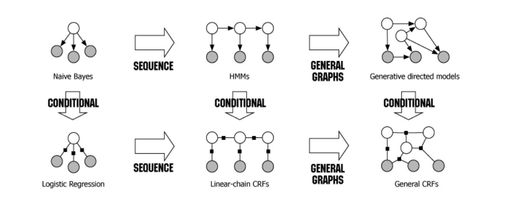

 

CRF的条件概率等式可以与无向图(马尔可夫随机场)的节点的概率分布函数对应。

CRF条件概率等式中关键成分，特征函数(feature function)。

无向图(马尔可夫随机场)概率分布函数关键成分，势函数(potential function)。

两函数对应。势函数对应无向图中的基于马尔可夫性定义的最大图圈(max clique，即图圈中的所有节点彼此相连并且无法再增加新节点仍然使得图圈中所有节点彼此相连)，是最大图圈的节点变量的函数。

训练过程，最大化基于样本的条件似然函数(即目标函数)。

选m对观测序列(x)与状态序列(z)，使m个观测序列(x)与状态序列(z)对应的条件概率的log的和最大。通过梯度计算得到特征函数的加权参数。

 

深度学习篇(Deep Learning)

深度神经网络框架一般由多个网络层组成，每个网络层由多个神经元组成。大概来说，不同的网络层、网络层之间的连接形式定义了不同的深度学习神经网络框架。比方，前馈神经网络、循环神经网络、卷积神经网络及生成对抗神经网络等。

深度学习模型的发展，基本可以2012 AlexNet 、2017 Transformer模型作分水岭。

 

第一章	前馈网络

前馈网络(Feedforward Neural Networks)，作为人工智能神经网络(ANN)，前馈神经网络(FFN)中数据只向前传递计算，不存在回路。

 

前馈神经网络包括多层感知器、卷积神经网络等。

多层感知器(MLP, Multiple Layers Perceptron or Neuron)是前馈神经网络类型之一，基于一个或多个全连接层(一般至少三个全连接层，input-hidden-output)与激活函数(Activation)的组合形式(fc_in -> fc_hid -> activation func -> fc_out)。

MLP中最早的activation是0值/1值的Heaviside function，不可微分，无法计算梯度。今天, activation function 用 ReLU等可微分函数，因此，几乎找不到原始意义的MLP。

 

第二章	卷积网络

 

卷积网络，是有卷积核(对输入图像逐patches的提取特征)与池化层(在卷积后的特征图与池化层之间可以有激活函数)的前馈神经网络，适合图像处理，不同于基本的前馈神经网络(将输入当作整体进行加权计算，容易过拟合)。比方，LeNet, AlexNet, VGGNet, GoogLeNet, ResNet, DenseNet, ZFNet等。

池化层与激活函数。当在激活函数之后应用时，可以强化特征。

泛函分析在CNN中的应用，比方基于泛函分析研究

是否对图像进行充份采样以捕获高频效果  Is the image sufficiently sampled to capture “high frequency” effects- Nyquist criteria

卷积函数离散化是否对输出妥协 • Does the discretization of the convolution function compromise the output

利用池化层压缩时，多少数据丢失  • How much data is lost when using max pool compression

训练数据是否充分真实 • Is fidelity of training data sufficient

备选方法，比方 离散余弦变换 , 是否提供充分压缩 ，并 维持真实  • Would alternate approaches (DCT, for example) provide sufficient compression and maintain fidelity

计算资源需求方面有什么不同  • What would be the difference in compute resource requirements

注: compact domain/compact set , 紧集，不仅是封闭的，还是有界的。

 

第三章	循环网络

循环神经网络(RNN)是早期处理序列化数据或时序数据的神经网络框架，通过记住之前的信息，结合当前的输入信息，预测输出，可以用于解决语言翻译、语音识别等问题。

循环神经网络框架及在时间轴展开的形式。

 

 

第四章	长短期记忆网络(LSTM)

[Sepp H. etc. 1997]

LSTM , 是RNN的特例. 应用于 语音识别、语言建模、翻译、图像标题等.

RNN只能依据最近的context预测下一标记, LSTM顾名思义，可以依据最近的及过去较长时间的context来预测下一标记.
理论上,RNN可以学习过去较长时间的context，但实际是很困难的.

Hochreiter 研发 LSTM 原型,  Bengio 研究 RNN, LSTM , VAE , GAN  

标准 LSTM , 通过三部分来遗忘、更新及筛选状态(cell state)作为输出. 主要部件就是通过 sigmoid激活后进行乘法计算来以一定概率进行遗忘或筛选; 用 tanh 激活进行数值变换.
输入, cell state : $C_{t-1}$ ;   上一次输出的隐状态与当前输入的拼接 ;

遗忘门, 拼接的标记进行 sigmoid 激活得到 [0,1]概率, 与 cell state 逐元素乘，通过乘法遗忘相应的值 $C_{t-1}'$;

(更新)输入门, 拼接的标记进行 sigmoid 激活, 同时进行 tanh 激活得到 [-1, 1] 值, 两者相乘表示对输入的标记进行遗忘选择; 然后再加到 $C_{t-1}'$ 得到 $C_t$;

(筛选)输出门, 对 $C_t$ 进行 tanh 激活后，再利用拼接的标记的sigmoid 进行逐元素乘 ,作为输出的隐藏状态.

GRU , 是 LSTM标准形式的变体.

 

第五章	自编码器(Autoencoder)

[D. E. Rumelhart, etc. 1986]   [Pierre B. 2012]

自编码器，基于编码器-解码器框架。输入通过编码器压缩成隐变量表征，再利用解码器进行重建。隐变量是一个n维的向量，每个向量的每个维度表示一个属性的概率。

框架示例。

 

基于神经网络的自编码器，可视作主成分分析(PCA)的广义化，以学习非线性流形(Non-Linear Manifold)。

 

第六章	深度置信网络

深度置信网络(DBN, Deep Belief Networks)，(Hinton, 2006)，基于多个限制玻尔兹曼机(RBM, Restricted Boltzmann Machine)浅网络及任务网络栈式(Stack)连接形成的神经网络。

 

注，限制玻尔兹曼机(Hinton)，是特殊的马尔可夫随机场(MRF, Markov Random Field)，可定义作对称二分图(Symmetrical Bipartite Graph)，基于可视及隐藏两个网络层定义，隐网络节点取值0或1。可用于降维、分类、回归、协同滤波、特征学习等。当前，基本可用对抗生成网络、变分自编码器等替代。

注，玻尔兹曼机，可达到玻尔兹曼分布(热平衡时系统状态分布)或稳态分布的神经网络。有限，指同层的节点之间无连接关系；对称，指全部可视节点信息传给全部隐藏节点；二分图，指可视层与隐藏层节点分别在两个独立的集合的图。

深度置信网络中，在训练阶段，每个有限玻尔兹曼机可基于输入数据重建，通过无监督方法独立训练；在优调阶段(Fine Tuning)，任务及整个网络可通过监督学习方法进行参数更新。

注，限制玻尔兹曼机，前向传递(Forward Pass)进行预测，反向传递(Backward Pass)以估计输入数据的分布/生成数据。基于KL散度定义重建损失，基于霍氏网络(Hopfield Net)定义状态向量能量函数(Energy Function)，基于玻尔兹曼分布定义状态向量概率密度。

 

深度置信网络不同于端到端的卷积神经网络，不过适用性更灵活。可用于图像识别、语音转文本、自然语言情感分析等。

 

第七章	变分自编码器

[D. P. Kingma, Max Welling, 2013]

1、原理框架

变分自编码器(VAE, Variational Autoencoders)，基于编码器(识别器)与解码器(生成器)框架。样本x输入编码器，输出高斯分布均值向量及标准差向量；基于不同均值及标准差对(Pair)定义的分布(Probability Distribution)，采样得到隐变量z；解码器基于隐变量z生成目标量，与输入量x对齐。

 

VAE可用于数据压缩、特征学习、图像合成、分类、聚类等。

VAE 是自编码器的扩展，主要区别在编码器计算的不再是确定的隐变量，是分布参数变量；基于分布参数采样计算隐变量，通过解码器生成数据。

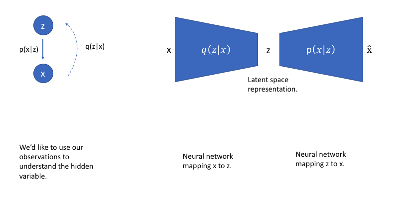

 

VAE的实质在于利用编码器样本量x的后验分布q(z|x)来近似解码器(生成器)的生成量的后验分布p(z|x)。

通过方程整理，该目标等价于计算生成量似然率logp(x) 的下边界损失函数最大。

${E_{q\left( {z|x} \right)}}\log p\left( {x|z} \right) - KL\left( {q\left( {z|x} \right)||p\left( z \right)} \right)$
 

逻辑意义，第一项，重建损失误差，使基于隐变量解码或生成得到的数据最可能近似原始数据；第二项，正则项，相似误差，使编码器的后验分布q(z|x)近似于解码器隐变量的先验分布p(z)。此时，第一项可视作关于p(z)的期望。

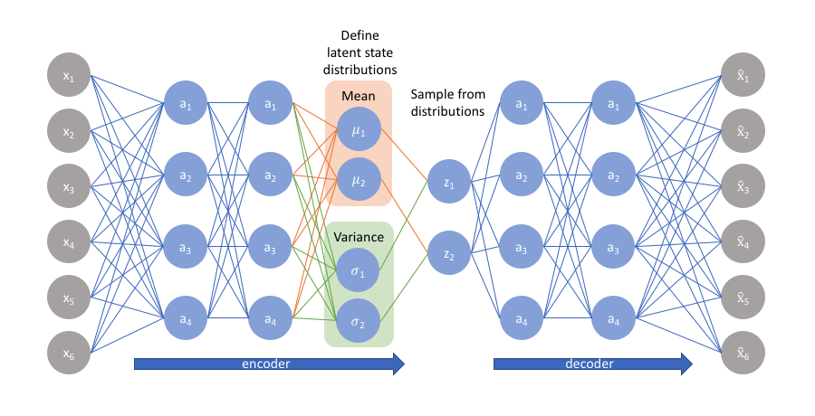

 

隐变量z基于高斯分布采样使得基于证据下边界损失函数无法对z进行梯度反向传播计算，因此通过重参法(Reparameterization Trick)，使z作分布参数的函数。

注，重参法，用带噪声变量ϵ ~ p(ϵ)的可微分变换函数g(ϵ, x)定义随机变量z，以替代z的采样过程。常用方法，可用随机变量z的分布的逆累积分布函数(Inverse CDF)作变换函数；拉普拉斯、椭圆、均匀、三角、高斯分布等位置-缩放(Location-Scale)类型的随机变量可用 g(.) = location + scale . ϵ 定义变换函数；噪声变量的不同变换(Different Transforms)的综合(Composition)定义随机变量。

变分自编码器中，基于高斯分布进行重参定义。单变量形式，z = μ + δϵ , ϵ ∼ N (0, 1)。

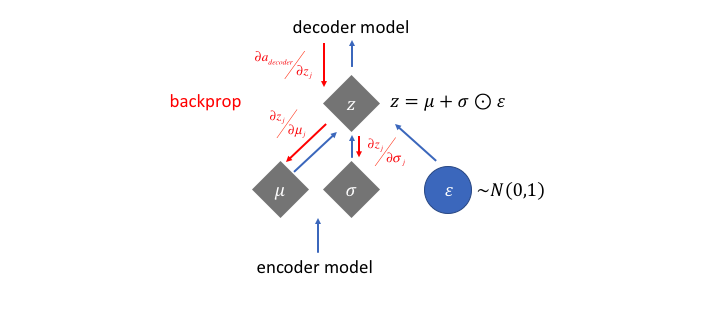

 

重参后，损失函数的反向传播计算。

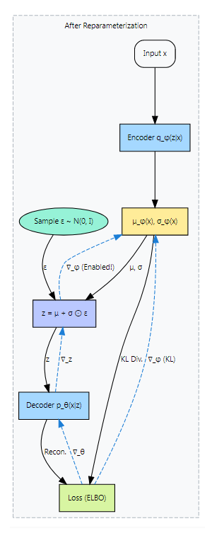

 

变分自编码器相对于自编码器的意义，在于隐变量空间很平滑，连续，这样生成的数据也容易是平滑连续的。也便于在观测数据之间插值。否则，生成的图像可能是锯齿块状效应，声音是不连续的等。

* sora, 基于变分自编码器框架(可以看作级联的加噪编码器序列与级联的去噪解码器序列)进行图像、视频生成；核心在于隐语义空间的加噪及去噪过程；去噪过程通过大语言模型增强的语义指令来调控对齐。

2、隐变量后验分布

在有向概率模型中，在连续隐变量的后验概率分布(p(z|x))不可解时，怎样执行有效的推理及学习?

通过变分下边界重参法生成可以用随机梯度优化的下边界估计器；

利用该估计器，使得近似推理模型可以拟合不可解的后验概率；

注: 有向概率模型（Directed Probabilistic Models）是一种通过有向无环图（DAG）表示随机变量之间因果关系的概率图模型，常被称为贝叶斯网络（Bayesian Networks）。它广泛应用于机器学习、自然语言处理和计算生物学等领域，用于建模复杂的概率分布和推断未知变量。可清晰表示因果关系，无法表示循环依赖关系。

注: 从编码理论(coding theory)视角来看，无法观测的z变量，可看作隐表征(latent representation)或编码(code)。

3、后验塌缩(Posterior Collapse)

后验塌缩，损失函数中散度项等于零，编码器隐变量z的后验分布q( z | x )与解码器隐变量z的先验分布p(z)相等，全部x的编码结果塌缩到相同分布；使得重建损失项无法获得有意义或有区别的隐变量信息，生成模型失效。

原因在于，非线性VAE基于编码器提取输入数据x的全局结构信息时，感知域(Perceptive Field)变大容易忽视纹理等局部结构信息。

解决的方法在于确保损失函数的散度项大于零。

深度隐变量模型的生成过程涉及从信息不足的先验信息中提取很多隐因子信息，以及用一个神经网络将这些因子转换成实际数据.

参数的最大似然估计要求计算隐因子的边缘分布，这对于深度隐变量模型来说不可解。后验概率 p(z/x) = p(x/z)p(z)/p(x) . 期待 p(z/x) 最大，则需计算z的边缘分布 p(z) . 不可知. 因此后验概率p(z/x)转换成ELBO进行最优近似计算.

VAE通过ELBO重参法实现了该似然率的最优下界计算。

问题在于，学习到的隐因子质量及数量由后验坍塌所控制。

大部分文献认为后验坍塌问题在于ELBO目标函数的KL散度项倾向于促使变分分布与先验分布匹配，因此采用启发方法来消除ELBO的KL项的影响，以缓解后验坍塌。

[Lucas. 2019]认为后验坍塌问题在于训练目标函数时的虚假局部最优。即使基于准确的边缘对数似然函数训练时，同样会发生局部最优问题。

 

第八章	生成对抗网络(GAN)

[Ian J. Goodfellow. etc. 2014.]

 

GAN，基于游戏理论(Game Theoretic)的纳什均衡(Nash Equilibria)或最小最大(Minimax)，先验分布采样的随机噪声变量基于生成器(Generator)生成尽可能近似样本的数据，以便误差最小；同时，生成的数据与真值基于判别器(Discriminator)进行区别，以最大可能区分。

 

相对于VAE，GAN的架构。

 

 

第九章	去噪扩散模型

[Jascha Sohl-Dickstein, etc. 2015]   [Jonathan Ho, etc. 2020]

去噪扩散模型(Denoising Diffusion Model)，基于标准高斯噪声逐步去噪生成目标数据。实质，利用数据逐步加噪可变标准噪声、标准噪声逐步去噪可生成数据的对称可逆特性，使得神经网络模型可基于噪声对齐、学习每步要移去的噪声。

基本步骤。

一、训练神经网络模型，以估算去噪过程中每步噪声的分布特征。

假定，加噪马尔可夫过程，起始数据X0 -> … Xt-1 -> Xt … XT标准高斯分布数据。去噪过程相反。

去噪过程、加噪过程，每对去噪、加噪步骤基本都可视作变分自编码器。

比方，第t-1步的数据加噪，获得第t步的数据，可视作编码，后验分布q( xt | xt-1 )，基于马尔可夫过程可定义作q( xt | xt-1 , x0)，q( xt | xt-1 , x0)贝叶斯定理展开的相应项q( xt-1| xt , x0)；第t步的数据去噪，获得第t-1步的数据，可视作解码，条件分布p( xt-1 | xt)。

训练主要在于用神经网络模型p( xt-1 | xt)拟合对齐q( xt-1| xt , x0)。

模型损失函数的推算。

1、对于数据生成，可基于似然率进行参数估计，使log p(x0)最大。

2、似然率对数log p(x0)，通过琴生不等式等可转换成对变分下边界的计算。

3、获得的变分下边界方程中，核心项在于第t步编码的后验概率贝叶斯展开项与解码的条件概率的散度，作模型损失函数。

4、基于高斯分布的位置-缩放特性，以及重参法，可算得相应的贝叶斯展开项与条件概率的定义，使得散度可转换、简化成标准高斯分布相关的损失函数。

二、基于噪声分布特征，采样计算每步去噪后的数据。

基于朗之万动力学方程，利用神经网络模型预测的噪声，从XT开始，迭代计算每步去噪后的数据，直到生成目标数据X0。

**扩散模型**，扩散模型涉及模拟的是随机微分方程(SEDs, stochastic differential equations)。

随机微分方程是通过布朗运动(Brownian motion)或维纳过程(Wiener process)添加随机动力来扩展常微分方程的确定动力(extend the deterministic dynamics of an ODE)。就是说,使得常微分方程(ODE)的确定轨迹变成随机微分方程的随机轨迹(stochastic trajectory)或随机过程(stochastic process)。随机即是概率。

1.	基本原理

 

扩散模型，基于前向过程(Forward Process)与逆向过程(Reverse Process)一定情况下可逆原理，利用标准高斯分布噪声数据逐步去噪的方法生成目标数据。

前向过程，任意分布的图像通过T个时刻，逐步添加不同级别的微量噪声，可变成标准高斯分布的噪声图像。

逆向过程，标准高斯分布的噪声图像通过T个时刻，逐步去掉前向过程添加的噪声，可得到原任意分布的图像。

前向与逆向过程都是马尔可夫链。逆向过程要去掉的噪声可通过神经网络进行训练学习。

训练时，以前向过程不同时刻添加的噪声作目标值(Ground Truth)，与逆向过程相应时刻预测的噪声的方差作损失函数进行优化计算。

1.	损失函数

 

基于逆向过程得到的图像分布最大似然损失函数原理，利用不等式将最大似然转换成逆向过程与前向过程的变分边界(Variational Bound)。

 

基于前向过程迁移概率的递推计算、贝叶斯定理及变分推理(Variational Inference)，变分边界解析成前向过程后验概率(Forward Process Posteriors)与逆向过程条件概率的散度等形式。

 

通过重参法(Reparameterization)等方法，损失函数可参数化散度部分变成类似基于噪声的去噪得分匹配(Denoising Score Matching)形式。

进一步化简，得到损失函数形式。

 

2.	生成原理

生成过程，基于逆向过程训练得到的噪声神经网络预测噪声，通过类似朗之万动力学的采样等式进行递推计算，生成目标语义。

3.	扩散算法(Training and Sampling)

 

训练算法，基于神经网络，利用任意分布数据集的样本、均匀时序样本、标准高斯分布样本及扩散速率累积量计算噪声。对标准高斯分布的噪声样本与计算的噪声的方差进行梯度优化。

采样算法，基于类朗之万动力学等式，从T时刻标准高斯分布样本开始，通过递推方法计算下一时刻数据，直到得到目标分布数据。

扩散模型，基于前向过程(Forward Process)与逆向过程(Reverse Process)一定情况下可逆原理，利用标准高斯分布噪声数据逐步去噪的方法生成目标数据。

前向与逆向过程都是马尔可夫链。逆向过程要去掉的噪声可通过神经网络进行训练学习。

* 训练时，以前向过程不同时刻添加的噪声作目标值(Ground Truth)，与逆向过程相应时刻预测的噪声的方差作损失函数进行优化计算。

* 损失函数

数学原理，目标是使逆向去噪过程(变分自编码器的解码过程)生成的最终图像的概率分布最大(最大似然)，该分布基于马尔可夫链，当然可以转换成所有每一步去噪的目标图的概率分布的乘积。

不过，由于最大似然直接不好计算，因此基于变分推理思想，通过不等式可以转换成逆向概率分布与前向概率分布的比例形式，逆向与前向概率分布分别基于马尔可夫链展开，实际形成KL散度定义形式。

注:(变分推理，实际便是利用KL散度的定义形式，用一个概率分布去近似另一个概率分布；因此，变分推理的目的，使KL散度最小；最小化KL散度，等价于最大化贝叶斯定理中的marginal probablisity, 即ELBO，evidence lower bound)。

* 解算损失函数

基于重参法(Reparameterization，比方，基于正态分布样本定义变分编码器的隐变量)等，散度定义形式可变成去噪得分匹配(Denoising Score Matching)形式。

最终，损失函数简化成标准高斯噪声与神经网络预测的噪声的方差的形式。

基于梯度上升算法使ELBO最大，然后基于梯度下降算法使目标函数最小。

生成过程，基于朗之万动力学等式，从标准高斯分布噪声开始，利用神经网络预测的噪声，逐步递推生成下一步的图像，直到目标图像。

噪声预测网络可基于3D UNet或DiT(Diffusion Transformer)框架。

视频扩散模型，基于多个视频扩散模型的级联(Cascade)实现文生视频。

注: PCA等价于线性自编码器。

琴生不等式，对于凸函数(convex)h,则E[h(X)] ≥ h(E[X]) ； 对于凹函数(concave)h，则 E[h(X)] ≤ h(E[X]) ；

 

第十章	流匹配

[Yaron L. etc. 2022]

流匹配，基于数据随时间的变化路径(Flow)，使得数据可从源分布传输到目标分布。实质，利用源数据与目标数据之间的映射关系，训练神经网络模型匹配对齐映射函数的速度导数，再通过速度积分以确定路径。

基本步骤。

一、训练神经网络模型以预测数据变化速度。

假定源分布数据点x0与目标分布数据点x1之间的数据变化路径是直线，可知数据点之间基于归一化时间的速度，x1 - x0 。

基于数据点x0与x1的线性插值确定t时刻数据点，xt = ( 1 - t )x0 + t x1 。

训练神经网络模型FM(xt , t)，以预测t时刻数据变化速度，与x1 - x0 进行对齐。

二、基于数据变化速度的积分计算近似的变化路径。

基于欧拉积分方程，利用神经网络模型估算的数据变化速度，从源分布采样点x0开始，迭代预测不同时刻的数据点，形成数据传输路径，直到目标数据点。

**流匹配**模拟的是常微分方程(ODEs, ordinary differential equations)。

每个常微分方程通过一个向量场定义。常微分方程的解是一条轨迹，即流函数(flow function)，该函数将归一化的时间t映射到d维空间的某个位置，函数形式 $X : [0, 1] → R^d , 即  t → X_t$.时间t和空间位置定义了向量场中的一个表示空间中某点的速度的向量，即 $\frac{dX_t}{dt} = u_t(X_t)$。
流函数(flow function)，可基于起始点$X_0$确定t时刻的位置$X_t$，即$$X_t = ψ_t(X_0)$$ 。

向量场定义了常微分方程，流(flows)定义了常微分方程的解。

当$u_t$不是线性函数时，则不可能直接计算流(flow)，因此需要用数值方法(numerical methods)来模拟常微分方程。
最简单直接的方法就是 欧拉方法。该方法方程 类似 卡尔曼滤波中的 状态方程。
$$X_{t+h} = X_t + hu_t(X_t) (t = 0, h, 2h, 3h, . . . , 1 − h)$$

基于常微分方程构建生成模型，就是通过模拟常微分方程来实现简单分布(p_init)到复杂分布(p_data)的转换(transformation)。

$$\frac{d}{d_t}X_t = u^θ_t(X_t)$$ ，可以看到，虽然称流模型(flow model)，但是 带参神经网络模拟的是向量场u，不是流(flow, 遵循目的分布 p_data)。因此，为了计算流(flow)，要模拟常微分方程。

 

第十一章	变换器

变换器(Transformer)核心在于利用注意力机制或者说向量两两点积提取的特征进行数据表征。

1.	Transformer框架

Transformer基于Encoders-Decoders框架实现。

Encoders，基于N个Encoder级联形成的Encoder栈。Encoders的输入为包括输入序列元素语义及位置信息的嵌向量，输出为表示输入序列高级语义及位置特征的Key及Value向量。

Decoders，基于N个Decoder级联形成的Decoder栈。Decoders的输入为预测输出序列嵌向量位置编码后的向量，输出为表示输出元素位置的向量，经过Linear及Softmax层转换为输出元素概率向量。

Encoder主要由自注意力层或多项注意力模块(Multi-Head Attention)与前馈模块(Feed Forward)组成。

Decoder相对于Encoder，主要增加了一个基于多项注意力模块的、综合Encoders的输出组成输入信息的编解码层。

 

2.	Encoders原理

Encoder的作用主要在于获取输入序列各元素之间语义与位置的关联信息。

 

1)、Encoder框架

Encoder框架。

 

自注意力层(Self-Attention Layer)，或多项注意力模块(Multi-Head Attention)，用于计算Encoder输入向量序列之间的相关性。前馈层(Feed Forward Layer)用于提取注意力信息中的特征。

2)、Encoder的输入与输出

Encoder之间的联系。

 

第一级Encoder的输入为基于语义及位置信息的嵌向量(Embedding Vector)。

 

嵌向量经过自注意力层生成的向量分别提供给不同的前馈神经网络生成语义及位置信息向量作为当前Encoder的输出及下一级Encoder的输入。

3)、自注意力层(Self-Attention Layer)

自注意力层，或多项注意力模块(Multi-Head Attention)，基于多个调整点积注意力模块(Scaled Dot-Product Attention)并联实现。

调整点积注意力模块(Scaled Dot-Product Attention)，对表示输入向量特征的Query、Key、Value向量进行点积等运算以获取输入向量之间的语义及位置关联信息。

 

4)、调整点积注意力(Scaled Dot-Product Attention)计算

基于Q、K、V的权重矩阵(W)计算Encoder输入向量对应的Query、Key、Value向量。

对于第一级Encoder，基于权重矩阵计算不同嵌向量的Query、Key、Value向量。

 

基于Query与Key向量点积计算单词之间的相关性，进行归一化。

 

归一化的权重信息与相应的Value向量进行乘加运算作为Encoder自注意力层(Self-Attention Layer)的输出(z)。

 

嵌向量的Q、K、V的并行化计算形式。

 

基于Q、K、V的自注意力计算。

 

5)、多项注意力(Multi-Head Attention)计算

基于不同的权重集W计算得到不同的Q、K、V信息，多个权重集对应多个Q、K、V信息集。

 

对多个注意力信息拼接后的信息进行降维，以提供给前馈层(Feed Forward Layer)。

 

6)、前馈层(Feed Forward Layer)

class PositionwiseFeedForward(nn.Module):
    "Implements FFN equation."
    def __init__(self, d_model, d_ff, dropout=0.1):
        super(PositionwiseFeedForward, self).__init__()
        self.w_1 = nn.Linear(d_model, d_ff)
        self.w_2 = nn.Linear(d_ff, d_model)
        self.dropout = nn.Dropout(dropout)

    def forward(self, x):
        return self.w_2(self.dropout(F.relu(self.w_1(x))))

3.	Decoder原理

Decoder框架与Encoder框架基本一致，主要增加了基于多项注意力模块(Multi-Head Attention)的编解码注意力层(Encoder-Decoder Attention Layer)。

 

编解码注意力层基于Encoders输出的Key、Value信息及Decoder中的自注意力层的Query信息计算对应于输入序列语义及位置信息的输出信息。

class DecoderLayer(nn.Module):
    "Decoder is made of self-attn, src-attn, and feed forward (defined below)"
    def __init__(self, size, self_attn, src_attn, feed_forward, dropout):
        super(DecoderLayer, self).__init__()
        self.size = size
        self.self_attn = self_attn
        self.src_attn = src_attn
        self.feed_forward = feed_forward
        self.sublayer = clones(SublayerConnection(size, dropout), 3)
 
    def forward(self, x, memory, src_mask, tgt_mask):
        m = memory
        x = self.sublayer[0](x, lambda x: self.self_attn(x, x, x, tgt_mask))
        x = self.sublayer[1](x, lambda x: self.src_attn(x, m, m, src_mask))
        return self.sublayer[2](x, self.feed_forward)

Decoders输出的向量基于Linear及Softmax层转换为词汇表概率向量。

基于输入嵌量、输出表、QKV自注意力与交叉注意力机制及遮挡码、自回归预测的Encoders-Decoders框架基本形成了Transformer的定义。

4.	大模型

基于Transformer及规模定律(Scaling Law)的大模型，利用多模态数据表征、高维张量注意力机制、专家混合路由模式、扩散或流匹配生成、梯度优化等算法，结合模仿学习、强化学习、GPU/NPU集群、分布训练拟合可与现实对齐(Ground)、同时具有泛化能力的函数模型。

Transformer Decoder-Only及Encoder-Only框架。

 

 

第十二章	扩散变换器

扩散变换器(DiT，Diffusion Transformer)，基于变换器实现扩散模型的噪声预测。扩散模型逆向过程的噪声神经网络传统方法基于U-Net框架，可改进成扩散变换器(Diffusion Transformer)等框架。

 

 

第十三章	视觉变换器

视觉变换器(ViT)，基于图像分片(Patches)计算注意力。

 

 

第十四章	语言监督视觉模型

语言图像对照预训练(CLIP, Contrastive Language-Image Pre-Training)，不需特定标签，基于广泛存在的文本监督实现计算机视觉分类。

利用图像及对应的标题预训练模型，然后用定义视觉概念的自然语言使得模型可零样本(zero-shot)迁移到下游任务，比方OCR,动作识别,地理定位，细粒度对象分类等。

目标是最大化正确的图像文本嵌量对的cosine相似度，同时最小化不正确的图像文本嵌量对的cosine相似度。

损失函数，基于相似度得分的对称交叉熵(symmetric cross entropy loss over these similarity scores)。

 

第十五章	混合专家模型

混合专家模型(MoE, Mixture Of Experts)，每个专家典型的是一个神经子网络。这些专家可通过前馈神经网络,多层感知器块,卷积层等实现. 对于大语言模型,每个专家通常是对Transformer块中的前馈神经网络组件的镜像。

Transformer的每个Decoder块中的前馈神经网络(FFNN)作为稠密层(dense layer)，参数太多，可以通过划分为多个小的前馈层(即,experts)进行替代。

实现时，用多个小的前馈神经网络来替代原来的大的前馈神经网络。实际算是矩阵分解。

注意，expert的本质不是生物专家等名词中的这样的专家概念，实际是对标记的特性归类，比方第一个小前馈层(expert)用于处理标点符号类的标记，第2个用于处理连词，第3个用于处理动词，第4个用于处理数字，等。

这些experts，通过一个基于前馈网络实现的路由器(router)来计算(softmax)选择，可以基于对router计算的选择不同的experts的概率进行大小排序，选前k个概率对应的experts来计算标记嵌量后，再加和(sum)计算。

每个decoder对应一个专家集合，Decoder-only Transformer的存在多个 Decoders，因此，Transformer 可存在多个专家集合(experts sets).

大语言模型混合专家的“专家”名词的逻辑意义一般指语法关系，不是指特定领域。(experts tend to focus on syntax rather than a specific domain.)

**对于MoE的负载不均衡问题**，即router的输出不是均匀分布，可能总是选某个expert或某几个experts前馈神经网络；或者，不同的tokens，通过router后总是集中于特定的expert前馈神经网络。为使这些tokens均匀的落在不同的experts进行计算。可以有这样几个方法。

1、通过router计算的概率的标准差与均值比(coefficient variation (CV) = standard deviation / mean )即协方差系数来控制均衡，系数越小表示experts对应的概率的均方差越小，概率较平均。因此，可用该系数作额外损失函数(auxilary loss , 加权的CV值)来训练，使得router选择尽量均匀。

2、同时，还可通过限制每个expert前馈神经网络可以计算多少个token，即专家容量(expert capacity)来均衡每个专家前馈神经网络处理tokens的情况。当前的expert已达到限定的token处理数，则当前的token可以发给下一个expert处理。当前层所有experts的容量都已满后，则当前tokens可以发给下一层的expert，该情况称 token overflow。

3、再进一步，可以用容量因子(capacity factor)来控制专家容量， 专家容量 =  (样本批次(batch)的标记数量 / experts 数量 ) * 容量因子.

不过，容量因子过大，每个expert可处理的token过多，则浪费；容量因子过小，则每个expert可处理的token过小，引发 token overflow，模型性能下降。

注: Switch Transformer 就是这样的解决负载均衡等MoE训练不稳定问题的基于transformer的MoE模型之一. 

4、改进的额外损失函数(Auxilary Loss)， Loss = 超参a * 专家数N * 专家概率比例向量P * 专家标记比例向量f。
使 P 及 f 趋向于 1/N , 可实现router均衡选择experts。

比方，6个tokens，3个experts, expert1 处理的tokens是4个，expert2 处理的是2个，expert3处理的是0个，则专家标记比例向量 [4/6, 2/6, 0/6];
router 预测六次，每次结果对应expert1,expert2,expert3的概率，相应6次experts的概率进行累加，得到专家概率比例向量。

**视觉模型中的MoE**
视觉模型也可应用混合专家模型(MoE). V-MoE ( Vision-MoE ) 是最早应用MoE的图像模型之一，基于ViT模型，利用稀疏MoE(Sparse MoE)替代稠密前馈层(dense FFN)。

视觉模型中解决MoE训练不均衡的方法
1、为减少对硬件资源的要求，每个expert预限定一个小的专家容量。不过，因为图像patches一般很多，容易 patches dropped 即 token overflow。

2、批优先级路由方法(Batch Priority Routing)。对图像patches进行优先级划分(Batch Priority Routing)，给patches分配重要性分数(importance scores)，优先处理高优先级patches。使得overflow的通常是不重要的patches。不过，未处理的图像patches的信息会损失。

3、Soft-MoE方法， 对所有图像patches进行加权混合，类似transformer的标记嵌量乘以一权重矩阵得到Q嵌量。 

比方，4个patches，形成 4 * 3 的 图像patch嵌量矩阵X ; 2 个 experts, 每个expert 的容量是 2 ，权重矩阵 Φ 是 3 * 2p , p是容量因子 ; 两个矩阵相乘 得到路由矩阵 R 是 4 * 2p 。

路由矩阵R在列方向进行 softmax 计算R'，然后 乘 图像patch嵌量矩阵X ，得到更新的 X' 。

即 softmax(R) * X = softmax( X * Φ) * X ，得到 3行 * 2p列 的混合矩阵 X'，每个expert对应p列，每列向量包括3个注意力元素。
X'通过路由器后均匀落在不同的experts，experts计算后得到的嵌量矩阵y再与 路由矩阵R乘得到最终嵌量矩阵y'。

**Mixtral 8-7B 的激活参数(active parameters)与稀疏参数(sparse parameters)**

Mixtral 8-7B 是 8 个 experts , 每个 expert 70参数。训练时，所有experts前馈神经网络都加载，以便进行训练；推理时，加载所有的experts，但是只用激活(activated)的专家前馈神经网络(subset of experts)进行计算。因此，稀疏参数 467亿需加载，不过只需 激活参数 128亿用于推理。

 

第十六章	图神经网络

图神经网络(GNN, Graph Neural Networks)，计算图结构(Graph-Structured)的深度学习模型。

## 图数据(graph data)

图像(image, 像素作节点，像素与周边相邻像素的连接作边)、文本(text, token作节点，相邻tokes之间连接作边)、分子结构(原子作节点，共价键(covalent bond)作边)、社交网络、机器学习模型、程序代码、数学方程(变量是节点，运算是边)都可以看作图结构(graph).

图数据的表示一般有三类视角，1、图像;  2、adjacency matrix 邻接矩阵; 3、图

基于图(graph)数据的预测任务可分三类，1、预测整个图(graph)的特性(property) graph-level, 比方，图(graph)中多少个闭环; 2、预测图(graph)中每个节点的特性 node-level, 比方，图(graph)中节点对应的标签; 3、预测图(graph)中每条边的特性 edge-level , 比方图(graph)中人或物节点之间的关系;

这三类任务都可以用图神经网络(GNN, Graph Neural Networks)解决.

可以用图(graph)的四类信息(nodes, edges, global-context and connectivity)进行预测.

邻接矩阵表示为邻接链表(adjacency list)来确保图(graph)邻接矩阵的置换不变性(permutation invariant), 否则邻接矩阵不同的置换经过图神经网络可能得到不同的结果.

## 图神经网络
定义，图神经网络是对具有置换不变性的图(graph)的所有属性(attributes)的最优变换.(A GNN is an optimizable transformation on all attributes of the graph (nodes, edges, global-context) that preserves graph symmetries (permutation invariances).)

意义，基于构造的图及图的已知信息，通过神经网络预测图中的未知信息.

### 最简单的GNN
最简单的图神经网络, 比方 多个多层感知器(MLP); 每个多层感知器分别应用于图、节点、边向量(V,E,U)以学习得到相应的图嵌量、节点嵌量、边嵌量，这些嵌量定义生成新的图(graph). 不对图的联系(connectivity of the graph)进行预测.

对于节点二分类(或多分类标签)任务，则基于节点的嵌量，应用线性分类器(Linear Classifier)即可。

对于节点中缺乏信息，信息存在于边中的情况，一般需通过池化技术(pooling operation)从边搜集信息，以提供给节点，再进行预测。即在分类器前先对边执行池化运算，得到节点信息，再进行分类预测。

类似的，知道节点信息，对边进行二分类预测；或对整个图(graph)进行二分类预测；则对节点信息进行池化计算(与CNN中的全局平均池化层相似, Global Average Pooling layers)，得到边信息或图信息，再进行分类预测。

池化运算过程从计算过程看，有点像路由开关.

### 可预测图联系(connectivity of the graph)的GNN

基于信息传递(Message Passing)过程，从节点相邻的所有节点搜集信息、聚合(aggregate，比方sum)后，再通过神经网络层(比方 MLP)计算嵌量，更新图(graph).

**边表征**, 对于知道边信息，但是要对节点进行预测的情况，先池化边信息，再用神经网络层进行变换(transform)计算嵌量.

**图表征**, 图小的时候，比方分子，所有节点之间可以传递信息，但是当图很大的时候，这显然是低效率的，因此，通过用主节点(master node)来连接到图中的所有节点及边,相当于在这些节点与边之间作桥梁.

## 实例
通过分子结构，预测分子气味(smell).

## 图的类型、采样(Sampling Graphs)、归纳偏置(inductive biases)、图卷积网络(GCN, Graph Convolutional Networks)、图对偶(Graph Dual)、图注意力网络(Graph Attention Networks)、生成模型(Generative modelling).
multigraphs(节点边大于2), hypergraphs, hypernodes, hierarchical graphs(层级化图)

 

扩展研究篇

后验塌缩

表征塌缩(Representation Collapse)

 

第一章	流形学习

流形学习(Manifold Learning)，又称非线性降维(Non-Linear Dimension Reduction)，找到数据低维度结构、特征的一系列方法。利用数据计算流形的维度等参数(Parametrization)。可类比于 机器学习，利用数据计算模型参数。

流形学习的实质，基于流形假设(Manifold Hypothesis)-高维向量空间的数据点集中(Cocentrated)分布在低维向量空间流形，因此，可通过模型函数或流形学习算法，学习数据点的结构关系，同时，使得高维数据点降维到低维空间进行表征。比方，三维向量空间存在着的数据点集合分布于一维流形圆环，因此，基于流形学习，数据点可从三维降到二维向量空间表征。

注，流形假设定义，高维数据虽然形式上位于高维空间$R^d$中，但实际上存在于一个维数远小于d的流形M上或其近邻。形式化地说，存在一个低维流形$M⊂R^d$，使得实际观测到的数据点$x∈R^d$要么位于M上，要么与M的距离很小。

基于流形假设，流形学习算法可分作，局部线性近似(Local Linear Approximations)、主曲线及曲面(Principal Curve And Surfaces)、嵌量算法(Embedding Algorithms)等。相关算法共同点在于利用半径法或KNN近邻法创立样本数据点的近邻图(Neighborhood Graph)，然后输入给非线性降维算法。

机器学习中，高维数据集可看作低维流形的数据。比方，小批量的RGB图像，维度H*W*C*B，存在着非线性结构信息，无法利用主成分分析(PCA, Principal Component Analysis)、独立成份分析(ICA, Independent Component Analysis)、线性判别分析(LDA, Linear Discriminant Analysis)等线性降维方法提取，需要等度量映射(ISOMAP, Isometric Mapping)、局部线性嵌量(LLE, Locally Linear Embedding)、分布式随机近邻嵌量(t-SNE, Distributed Stochastic Neighbor Embedding)及变分自编码器(VAE, Variational Autoencoders)等方法实现。

二维球面流形，可以通过球心的经度角与纬度角定义。

三维重建中的人脸可看作二维流形，可通过相机的横向位姿角度、纵向位姿角度及光照方向定义。

对三维空间的人脸的64*64=4096像素的图像，可以看作一个4096维的向量，该向量对应4096维空间的点。

因此，在4096维空间与二维人脸流形之间便存在一个映射关系(Chart)，使得两者可以进行互运算。

这样，可以将4096维空间的计算转换到流形空间的规则进行计算，或者将流形空间映射到4096维空间进行计算。

因此，相应的，流形引入到机器学习领域，便可以有两类用途：一是将原来在欧氏空间中适用的算法加以改造，使得它工作在流形上，直接或间接地对流形的结构和性质加以利用；二是直接分析流形的结构，并试图将其映射到一个欧氏空间中，再在得到的结果上运用以前适用于欧氏空间的算法来进行学习。

 

第二章	迁移学习

迁移学习与优调(Fine-Tuning)。

transfer learning 用预训练模型作backbone，用新任务数据训练一个新模型(downstream task model). 或者只更新模型最后一个网络层(可用新的网络层替换)权重参数以适应新任务，模型的别的部分冻结. 即特征提取层不变，改变的是(分类)任务层. 适应性有限. 需要数据量少，不容易过拟合.

fine tuning 用新任务数据更新整个预训练模型或者模型的子网络的权重参数. 即特征提取层及任务层都改变.  优调，适应性或灵活性高，不过要求更多的数据及算力. 数据量小时，易过拟合，需dropout等技术.

两者可以结合，即先transfer learning 再 fine tuning.

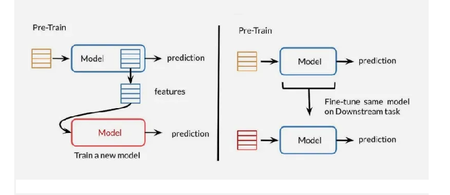
 

 

第三章	强化学习

强化学习，基于环境状态进行决策，选择可使奖励最大的动作。学习的是决策方法，利用奖励强化该学习过程。

同时，强化学习可定义作马尔可夫决策过程(MDP, Markov Decision Process)的优化控制问题。

大部分强化学习方法基于估计价值函数创建，不过这并不是解决强化学习问题的必然的方法。比方，基因算法，基因规划，模拟退火，别的优化方法都不会用价值函数。

强化学习要素，环境、策略、奖励(短期回报)、价值(长期回报)等。

基于马尔可夫决策的强化学习类型。

 

基于无模型价值方法示例。

* 真值与估计值的偏差,即估计值期望与真值(理论值)的差

对于 first-visit 计算的 V(s)估计值，是无偏差的(unbiased),因为 

观测的回报均值的期望 $E[\hat{V(s)}]$ 等于 V(s) ，因为 $V(s) = \mathbb{E}[ G_t \vert S_t=s]$ ，即 $ E[\hat{V(s)}] = V(s) $ , 因此该观测的回报均值是状态价值的无偏估计。

注: 为什么观测的回报均值的期望可等于状态价值，原因在于依据大数定律，实验次数越多，则观测的回报均值的期望将越趋于状态价值的定义。

大数定律又可分弱大数定律(样本很大时，依概率收敛于理论值区域，不过还是有可能不在理论值区域)与强大数定律(样本很大时，百分百概率收敛于理论值区域)，还有几个不同的版本，伯努利大数定律(频率与概率)，辛钦大数定律(算术平均值与数学期望)，切比雪夫大数定律(样本均值与真实期望)。

对于 every-visit 计算的 V(s)估计值，观测的回报均值则是偏差的(biased);

* 方差，即估计值与估计值期望的差的平方的期望

从观测的回报均值的计算等式可以看到，对于first-visit方法来说，状态估计值等于$G_t$，即轨迹t时刻之后所有奖励的折扣和。

相对于观测的回报均值的期望，观测的回报均值可以是t1时刻后的所有奖励的折扣和，也可以是对最后一个时刻的奖励，因此观测的回报均值与观测到回报均值的期望的差的平方的期望是比较大的。

一、DQN

DQN本质是,利用派生自同一个神经网络的两个神经网络,一个网络作目标网络用于生成的动作价值中选择最大的价值作目标,另一个网络作为要训练的网络,指定该网络的状态-动作价值与目标网络的最大价值进行比对，比对的误差作目标函数，利用梯度下降算法更新训练的网络的参数。由于两个派生的网络最终不一致，一个用于生成训练的目标轨迹，一个用于训练更新，因此基于训练完的网络选使价值最大的那个动作得到的策略称离线策略。

两个神经网络(1、一个要训练的Q网络，用于探索；2、一个目标网络，用作真值比对)，一个组件(3、experience replay)

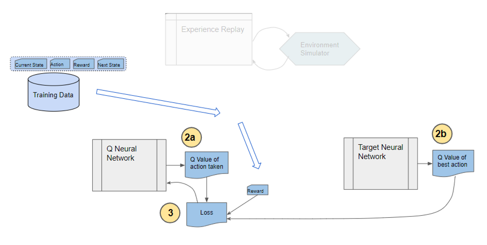
 

experience replay用于与环境交互生成要训练的数据集合 {(s,a,r,s')}；

先从要训练的随机网络，复制一个网络作目标网络；

随机网络接下来，探索c个步骤；每探索一步，即随机从experience replay生成的临时训练集合中选一个状态s预测得到动作a的价值，同时选(s,a)对应的下一个状态s'通过真值网络预测找到一个最大的动作价值作为最优的动作价值；

然后，$\bold{比较q网络得到a的价值，与目标网络得到的最优动作价值(+奖励r)，作为损失函数}$，使两者均方误差最小，因此，进行梯度下降最优计算，便可更新q网络的参数；

依此采样，不停更新q网络；更新c个步骤后，将更新了参数的q网络复制作为下一次c个步骤的目标网络；

循环上述步骤，直到参数收敛，认为q网络最优。

注意: 用experience replay的目标在于 准备充足的多样化的样本，以便训练时可以提高泛化能力，不至于过拟合。

同时，$\bold{experience replay中的样本，是在训练前，通过未训练的q网络基于\epsilon贪婪算法选择最大动作价值的动作，基于该动作与环境交互，生成(s,a,r,s')样本}$。

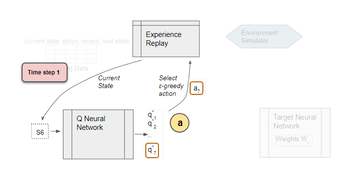
 

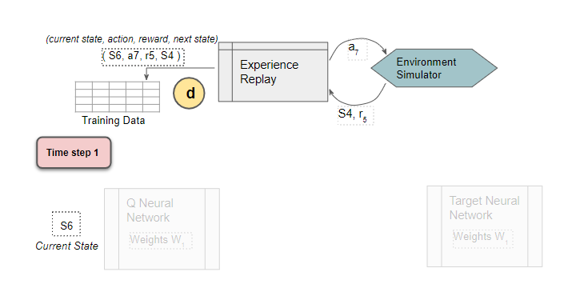
 

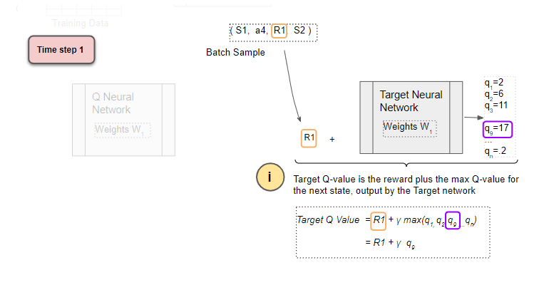
 

核心在于训练Q(s,a)得到近似最优的Q*(s,a)，要得到该最优函数，则要构造一个损失函数。

基于无模型策略方法示例。

二、Actor-Critic

Actor，即策略网络的目标函数是，折扣奖励和最大，因此是最优化算法，可以利用梯度(上升)算法来更新策略网络的权重参数；

Critic，即价值函数的目标函数是，未来的回报与当前价值函数误差，不过这个误差可以通过时序差分法(TD法)来直接更新价值函数；当然，也可以对误差进行梯度下降算法计算，来更新价值函数的权重参数；

目标函数的定义，不只基于奖励函数，一般还要利用正则化或惩罚项进行纠正，比方 熵、散度、具体奖励指标的误差等

然后，一般的训练流程是，基于策略目标函数关于策略函数及价值函数或动作价值函数的定义，利用梯度上升算法更新策略网络参数；

再利用时序差分法，计算价值误差，之后，利用梯度下降法更新价值函数或动作价值函数网络的权重参数；

依此循环更新策略及(动作)价值函数；

Critic有助于策略更新,比方相对于原始的策略梯度算法可减少梯度方差.

三、世界模型

世界模型是机器人理解真实世界的基石。当前世界模型的五+1类实现方法。

1、基于图像、视频理解的扩散生成式模型。比方，Google Genie3等。

2、基于生成式AI、侧重于内部世界(Internal world)的世界模型。比方，Li fei fei world lab 实验室的, Marble。

3、基于联合嵌量预测(Joint Embedding Predictive Architecture)。比方，Yann LeCun, LeJEPA。

4、基于主动推理及半符号的形式。对象动力学等属性基于主动推理进行建模，混合了半象征方法。比方，Karl Friston等，AXIOM，场景表示作对象的合成(Compositions)，基于逐像素线性投影建模，以获得对象间关联 。

5、神经象征世界模型(Neuro-symbolic World Models)。

6、VAE + MDN-RNN + Control Model + Reinforcement Learning .  Jürgen Schmidhuber.

四、Alpha Zero

基于蒙特卡洛树搜索(MCTS, Monte Carlo Tree Search)强化学习算法，自驱动(Self-Play)训练神经网络决策模型。

蒙特卡洛树搜索算法，基于叶节点可扩展的状态树，利用决策模型预测当前状态动作概率，选高概率动作对应的状态分支仿真，计算的奖励值反馈回当前状态。过程步骤，选择(Selection)-扩展(Expansion)-仿真(Simulation)-反向传播(Backpropagation)。

 

第四章	模仿学习

**三类算法 1、基于深度学习的监督学习思路，比方行为克隆、生成对抗模仿学习、DAgger；2、基于强化学习奖励函数的思路，先学习奖励函数(逆强化学习IRL, 比方, Maximum Causal Entropy IRL, density estimation, Adversarial IRL)或动作价值函数(Q-functions)，再学习策略。3、偏好比较算法，比方 Deep RL from Human Preferences.**

强化学习在游戏这类有着明确奖励函数的场景，超越人类的表现。但是，现实世界很难事先提供合适的奖励函数，或者即使可以明确奖励函数，但是结果目标函数很稀疏以致无法有效解决问题(the resulting objective might be so sparse that RL cannot efficiently solve it)，因此常用模仿学习的逆强化学习来学习策略模型。

模仿学习,也称作通过演示学习,从演示数据集合中学习策略.

模仿学习,不需要显式定义代价函数或奖励函数,大部分情况下,只需假定演示是基于最优策略或近优策略得到的.

在机器学习中，模仿学习属于监督式学习的范围 (Supervised learning)，所演示的动作就是模仿学习的训练集。但是与一般的监督式学习不同的是，模仿学习所习得的是一个策略 $\pi(\theta)$，要做的是 **一系列的动作**，而非单独的动作。
qiaodada, 这与MPC预测horizontal动作有些相似，与机器人基于扩散模型预测动作序列相同。

## adversarial imitation

将逆向强化学习改变装扮(pose)作两个AI模型之间的minimax游戏，该方法可简单视同对抗生成网络。

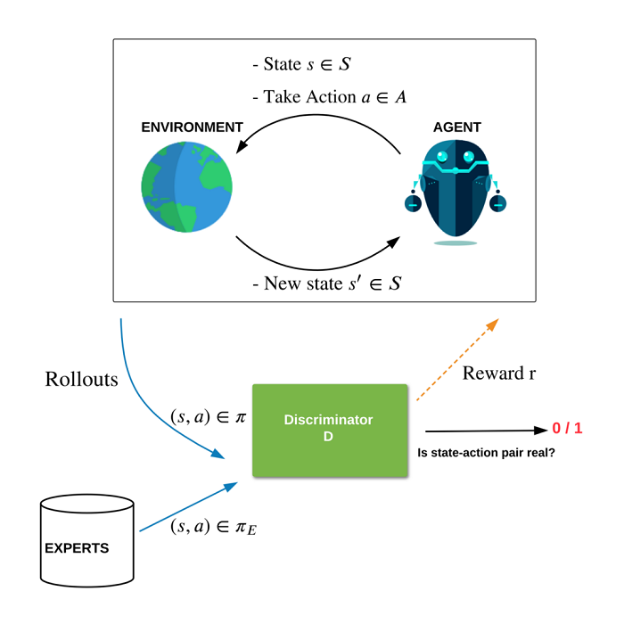
 

对抗模仿,用判别器作奖励函数,判别生成器(即策略)产生的动作是不是与专家演示的相同。

minimax游戏的均衡点解(即马鞍点, saddle point solution)，判别器学习一个奖励使得基于该判别器的策略几乎与专家策略很难区分。

不过，对抗生成网络存在模型塌缩、训练不稳定等问题，因此要求训练时仔细调试超参，并采用梯度正则化等技巧(hyperparameter tuning and tricks like gradient penalization)。更进一步的是，强化学习使训练过于复杂，以致不可能通过简单梯度下降训练一个生成器。

因此，对于像Atari游戏等基于视觉的复杂场景，对抗模仿方法并不实用。

## 学习动作价值函数(Q-functions)用于模仿

一个新的用于模仿的非对抗方法，学习Q函数用于恢复专家行为。

直接从专家行为学习动作价值Q函数.

因为对于给定的策略，单步奖励与Q函数是一一对应，因此Q函数不只是可以用于判断最优行为策略，还可以表示奖励函数。

这样，通过用单个变量，即Q函数来表示策略及奖励，可以避免对抗模仿学习方法中基于策略与奖励函数的困难的minimax游戏。

逆Q函数学习问题, 将变量的变化添加到最初的逆强化学习目标函数中可以形成基于Q函数的最小化问题.

逆Q函数学习问题实际与对抗模仿学习一一对应，每个Q函数可映射为一对判别器与生成器。

这就说明，逆Q函数学习问题通过简单的非对抗算法保持了逆强化学习的泛化能力与均衡特质。

## 分类

三大类

行为克隆(BC, Behavior Clone)，基于专家行为演示学习策略(Policy)。

逆强化学习(IRL, Inverse Reinforcement Learning)，学习奖励(Reward)，基于奖励函数学习策略。

生成对抗模仿学习(GAIL, Generative Adversarial Imitation Learning)，学习生成器(Generator) – 判别器(Discriminator)。

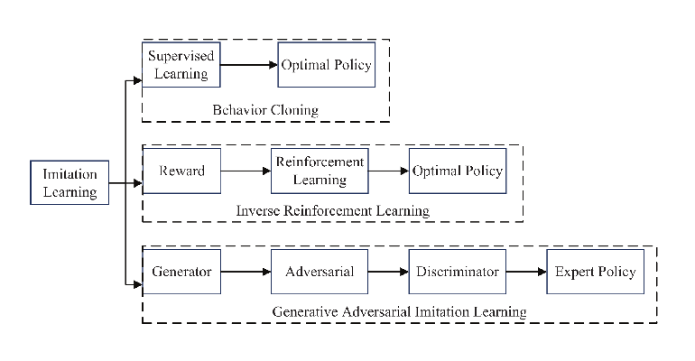
 

## minimax  最小最大化

作为决策规则(decision rule)，用于最小化最坏情况的损失。

即当对手选择的策略导致最大损失，游戏者选择策略使该最大损失最小。在游戏者同时决策的情况下，基于一些额外条件，通过minimax可以给出游戏的纳什均衡。

对于象棋等组合性游戏(Combinatorial Games), 游戏的一方目标在于使下棋的位置的估值最大，另一方，则使该棋位置的估值最小。

## 纳什均衡 Nash Equilibrium

一个纳什均衡，是一系列导致游戏者不需再更改策略的策略。该情况下，没有游戏者可以通过改变他们的策略获利。qiaodada, 比方，象棋僵局。

## 组合游戏 Combinatorial Games

比方 象棋、三连子棋(Tic-tac-toe)、checkers, Go, Dots and Boxes, and Nim.

游戏者知道全局信息，游戏动作是确定性的(不存在抛硬币、掷骰子等随机机制)

## ImitationLearning 与 ReinforcementLearning 的合并

## offline reinforcement learning  与 imitation learning

## IRL

行为克隆(Behavorial Cloning)，基本理念是基于专家策略动作轨迹训练一个预测器(predictor)模仿专家，泛化能力不好。

逆强化学习(Inverse Reinfocement Learning), 基本理念是找到一个代价函数，该代价函数对应于专家动作轨迹低代价，对应于别的轨迹高代价。基于该代价函数，训练可模仿专家的代理。

一定意义来说，IRL是对BC的改进，理论来说，可以通过无限仿真教代理从偏离轨迹迅速纠正。不过，实际不可行，因为存在很多相似却不一样的代理轨迹与别的完全不同的轨迹一样有着很高的代价。

逆强化学习的基本步骤。

1、通过专家演示收集轨迹.

2、假定存在一个状态与动作的奖励函数，可利用专家行为优化.

3、循环优化.

逆强化学习算法。

最大熵逆强化学习(MaxEnt, Maximum Entropy IRL)，假定专家行为是概率最优. 数学定义, 轨迹概率P(τ)约等于对应该分布的专家轨迹的最大似然$exp(∑_t R(s_t ,a_t ))$.

对抗逆强化学习(AIRL, Adversarial IRL)，生成器(Generator), 用于生成轨迹的策略(Agent Policy)

判别器(Discriminator), 判别专家与生成的数据，输出奖励.

目标函数, $$ min_π  max_D E_π [logD(s,a)]+E_{expert} [log(1−D(s,a))]$$

适用于学习可迁移的奖励. 比方,仿真到现实机器人.

 

第五章	联邦学习

联邦学习，在异构、分布式网络环境下的隐私保护模型训练

## 基于样本的分布式训练

$\min_w F(w), ~\text{where}~ F(w) := \sum_{k=1}^m p_k F_k(w)$

m, total number of devices

$F_k$,  the local objective function for kth device

$p_k$,  specifies the relative impact of each device

$p_k \gt 0 $ and $  \displaystyle\sum_{k=1}^m p_k = 1$

$p_k$的定义形式，

$\sum_{k=1}^m p_k = 1$ 或 $p_k = \frac{n_k}{n}$

n, 各设备总的样本数

$n_k$, 第k个设备上的样本数

## 基于任务的分布式训练

 

第六章	主动学习

主动学习, 对于未标注数据集，在有限标注成本前提条件下，从未标注的数据集中选择数据进行标记以实现模型性能改进的最大化。

半监督学习，基于标注数据集先训练一个模型，再利用该模型预测未标注的数据集。

主动学习，是半监督学习的一个形式，在给定预算前提下，先标注一些数据集，训练模型；然后用已标注的数据，去选择未标注的数据，以便最大化改进模型性能。

比方，10000张不同形状、颜色、大小的包裹的图片，要选1000张进行模型训练，选哪1000张图片？

主动学习与半监督学习，不同于弱监督学习(weak supervision)。前者，标签同源，准确；后者，存在多个数据源，标签可能来自不同的人、不同形式的标注，可能不准确。

 

第七章	元学习

元学习或"learning to learn" algorithms. 基于不同的任务数据集对(pairs)或者说任务分布，找到使这些任务损失函数**期望**最小的参数.
逻辑意义，学习或找到使不同任务(相应数据集)预测都尽量最优的模型参数. 这样该模型在新任务时，稍加训练便可实现新任务的推理.

数据集可划分为 support set 用于学习, prediction set 用于训练或测试.

三类 meta-learning 方法: metric-based, model-based, and optimization-based

metric-based, 实例包括  Convolutional Siamese Neural Network , Matching Networks  ,  Relation Network  ,  Prototypical Networks

Model-Based   实例包括 Memory-Augmented Neural Networks  ,  Meta Networks

比方, Meta Networks 利用一个模型预测另一个模型的权重，以便快速更新权重参数.(utilize one neural network to predict the parameters of another neural network and the generated weights are called fast weights.)

Optimization-Based  实例包括  LSTM Meta-Learner  ,  Model-Agnostic Meta-Learning (MAML)   ,   Reptile

Optimization-Based 方法的出现在于，基于梯度反向传播算法不适用于 元学习 测试时的少参照训练场景，同时少量优化步骤也无法收敛！因此，可以对优化算法建模！称 meta-learner . 相应的 任务对应的模型 称 learner .  元学习器可以被建模作 LSTM  , 因为 反向传播梯度更新 与 LSTM的cell-state更新 相似.

元学习，比方，学习一个模型的超参怎样才最优. 或者 比方，已训练学习了猫-鸟分类，花-自行车分类，则在测试时(选少量参照样本进行训练)，对于新的分类任务(在训练时未看到过样本)也可以实现。(goal of meta-learning is to obtain a model that can quickly adapt to a new task).

元学习不同于迁移学习(改变预训练模型的最后几层，训练这几层的参数，预训练模型余下的参数freeze，不训练；微调(finetune)包括迁移学习(transfer learning)、提示词微调、RLHF等方法，是整个预训练模型参数都可以更新)。

元学习与迁移学习都是少参照学习，相似都在于从已知任务到新任务，只是迁移学习的任务之间相似度大.

元学习，可以看作是超强的泛化与创新能力，比方只需看一两个示例，便可以对目标进行分类，或提炼创建出目标的轮廓，或分解识别目标的每个组成部分，或基于示例产生可行的创意组合。

元学习概念源于80年代末90年代初，当代基于深度学习的元学习源于2015年Brenden M. Lake发表的 Human-level concept learning through probabilistic program induction

Bayesian program learning (BPL) framework ,  包括三个关键概念， compositionality(组合性), causality(因果性), and learning to learn(学习的学习)

元学习方法包括三类, recurrent models(循环模型), metric learning(度量学习), and learning optimizers(学习优化器).

1、recurrent models(循环模型)， 比方基于LSTM模型，串行输入图像及标签对(image, label)，预测图像类型。该方法适用于稀疏训练的分类及回归，元强化学习 (few-shot classification and regression, meta-reinforcement learning).

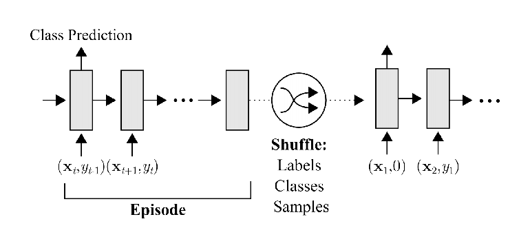
 

2、metric learning(度量学习)，学习一个度量空间，基于度量空间比对要分类目标与示例。比方基于训练的Siamese network分类，或基于最近邻算法测量要分类的图片与示例图片在学习的度量空间的距离。适用于分类。

3、learning optimizers(学习优化器)，通过强化学习或监督学习训练一个元学习器网络(Meta-Learner)，用训练的元学习器更新用于学习任务的学习器(Learner)网络。适用于图像分类。

对于图像分类来说，迁移学习与元学习的优劣存在一些争议。对于图像任务，迁移学习，基于ImageNet数据集预训练的模型，收集下游任务数据，基于收集的数据优调预模型得到目标模型。不过，迁移学习，所需要收集的数据还是多于元学习需要的数据；同时，对于语音、自然语言处理及控制等，没有相似的预训练模型可用于迁移学习。

4、Model-Agnostic Meta-Learning (MAML)方法，训练一个适用多个学习任务的模型，基于该模型只需少量新任务的样本训练可使模型适用于新任务。

实际是学习模型的参数，即基于神经网络学习可适用于所有任务的内在特征，对这些特征表示(参数)向着新任务梯度方向进行迁移。

元学习的目标函数(Meta-Objective)，是各类任务的损失函数的和最小，各类任务的损失函数是关于相应任务模型函数f(θ')的函数。

算法流程，用一个神经网络f(θ)作元学习器，对N个不同的任务，分别采样样本，训练N个神经网络f(θ');再分别基于不同任务的不同的采样样本，基于f(θ')计算各任务的损失函数；用各任务的损失函数的和的梯度，更新元学习器f(θ)。因此，训练过程中，存在N+1个同框架、不同参数的神经网络。更确切的说，存在 N+1份网络参数，即1份θ，N份θ'。

不同的学习任务，样本集、损失函数不同。对于强化学习的MAML，每个任务的损失函数是该轨迹的不同时刻的奖励的和的期望。

./
 

$\theta^* = \arg\min_\theta \mathbb{E}_{\mathcal{D}\sim p(\mathcal{D})} [\mathcal{L}_\theta(\mathcal{D})]$

与常用的学习任务的最优模型参数定义类似，区别在于一个数据集对应一个样本。

one dataset is considered as one data sample.

Few-shot classification, 通过少数几次训练学习分类, 是监督学习领域的元学习实例. 数据集分作两部分，用于学习的支撑集S, 用于训练或测试的预测集B, $\mathcal{D}=\langle S, B\rangle$.

比方，K次照面训练，N分类器, 即对于N分类器的每个分类，支撑集包括K个标签样本.

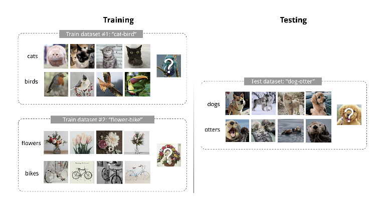
 

 

第八章	终身学习

基于MoE混合专家方式，对信息分类到不同模型进行预测，以缓解新信息对原模型的干扰是可能的；对于同类型的新信息引起的干扰，方法基本是3类，重训练模型同时加正则化以防止遗忘; 横向扩展模型，在隐含层横向添加对应于新任务的神经元；横向扩展，同时有选择的重训练；

在[Continual Lifelong Learning with Neural Networks: A Review]中。

终身学习,通过吸纳新信息持续学习,同时还保持此前学过的经验.

问题主要在, 遗忘与干扰. 比方,  基于新信息训练的模型会与此前的知识干扰, 以致模型表现急剧下降或此前知识完全为新知识替代.

section 2 , 主要讲 神经突触可塑性机制(在多个大脑区域保持稳定的可塑性平衡， Hebbian plasticity 赫布学习可塑性， compensatory homeostatic plasticity 补尝性体内可塑性)；互补学习任务，泛化及保留记忆 ，互补学习系统理论(complementary learning systems (CLS) theory)。

section 3 , 基于神经生物学发展的用于解决遗忘的机器学习与神经网络计算方法。

section 4 , 比较评估基于课程学习(curriculum learning)、学习新任务同时知识重用的迁移学习、代理探索强化学习、跨模型的多感知系统(multisensory systems)的各模型算法。

终身学习三类框架,  正则化方法(LwF, EWC, SI)，动态方法(progressive networks , dynamically expanding network (DEN) ,  combination of a pre-trained CNN with a self-organizing
incremental neural network (SOINN)  ,  Similar GWR-based approaches),   Complementary Learning Systems and Memory Replay

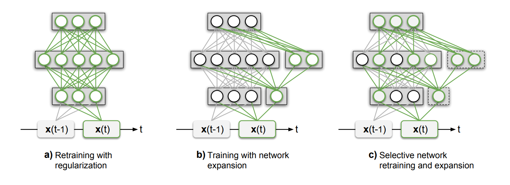
 

a, 重新训练，不过用正则化阻止遗忘之前学习的任务
b, 用扩展网络表示新任务，不过不改变此前网络参数
c, 基于可能的扩展网络与此前学习任务网络中的部分神经元进行重新训练

课程学习 , 从简单样本开始训练，再逐步训练难一些的样本。比标准的随机样本训练性能好。难点在于找到对样本简易度排序的方法及合适的用于引入更难数据的节奏函数(pace function). Curriculum learning (CL) is a training strategy that trains a machine learning model from easier data to harder data, which imitates the meaningful learning order in human curricula.

框架

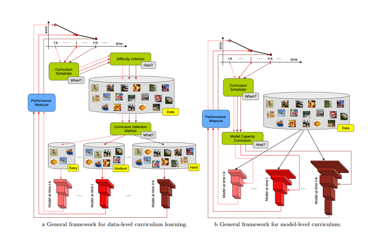
 

算法

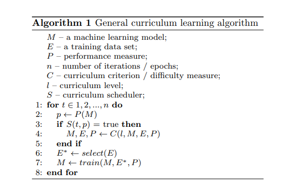
 

类型，  vanilla CL, self-paced learning (SPL), balanced CL (BCL), self-paced CL (SPCL),
teacher-student CL, implicit CL (ICL) and progressive CL (PCL)

 

第九章	世界模型

世界模型当前的五+1类不同的实现方法。

1、基于图像、视频理解的扩散生成式模型。比方，Google Genie3等。

2、基于生成式AI、侧重于内部世界(Internal world)的世界模型。比方，Li fei fei world lab 实验室的, Marble。

3、基于联合嵌量预测(Joint Embedding Predictive Architecture)。比方，Yann LeCun, LeJEPA。

4、基于主动推理及半符号的形式。对象动力学等属性基于主动推理进行建模，混合了半象征方法。比方，Karl Friston等，AXIOM，场景表示作对象的合成(Compositions)，基于逐像素线性投影建模，以获得对象间关联 。

5、神经象征世界模型(Neuro-symbolic World Models)。

6、VAE + MDN-RNN + Control Model + Reinforcement Learning .  Jürgen Schmidhuber.

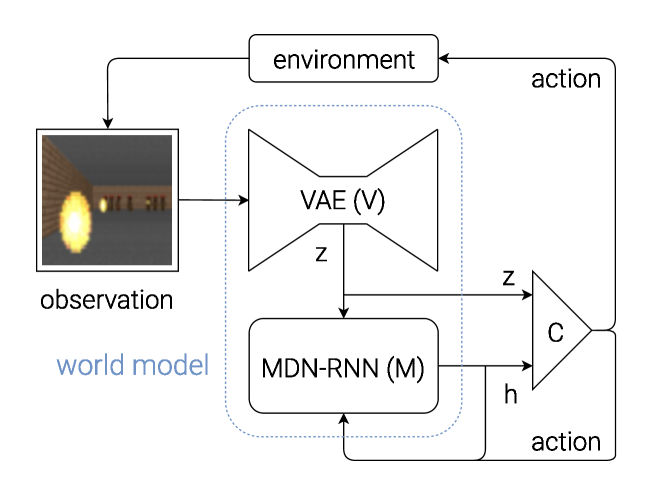
 

 

第十章	可解释AI

一、泛函分析

RAG(Retrieval Augmented Generation)、Adverserial Attack、Neural Tangent Kernel

泛函分析提供的框架可用于分析理解SVM中的映射(基函数)及设计核函数。

核方法中的核技巧(kernel trick)即核函数, 之所以可以不用显式映射数据便计算特征空间内积，原因在于核函数隐式的定义了特征空间的内积(inner product)，因为核函数的定义即基函数对A空间的两个向量映射到B空间后的两个向量之间的内积。选择合适的核函数，便可以裁剪算法以适应特定问题。

比方，用于SVM的辐射基核函数(radial basis function (RBF) kernel)，可以基于特征空间的欧几里德距离计算数据点的相似度。然后，可调整该核函数的带宽 (bandwidth)等超参来调节模型复杂度，以避免过拟合。

泛函分析可用于分析、理解神经网络框架，指导神经网络框架设计。分析方法之一便是将这些神经网络看作将输入函数映射到输出函数的算子(Operators)。然后利用泛函分析技术研究这些算子的连续性、可微分性(continuity and differentiability)等特性。以便理解神经网络多大程度可以泛化到未知数据，以及设计更好的训练算法。

比方，可以用泛函分析工具，Stone-Weierstrass Theorem,证明神经网络理论中的统一近似定理(Universal Approximation Theorem)。该近似定理是说，具有单个隐藏层有限神经元的前馈神经网络可以任意准确度，近似实数紧子集(a compact subset of the real numbers)的任何连续函数。

泛函分析可用于分析及改进PCA(Principal Component Analysis)及LDA(Linear Discriminant Analysis)等降维算法。

比方，可将PCA问题看作找到数据的最大方差方向(the directions of maximum variance)问题。可将该问题定义作泛函分析的特征值问题(eigenvalue problem , 特征值是向量空间线性变换相关的标量值，用于在变换时缩放特征向量)，通过解该问题，可以找到主成分，即捕获数据中最大方差的方向。

泛函分析可以为机器学习提供很多优化技术。

比方，将梯度下降算法看作在函数空间中找到最陡下降方向(direction of steepest descent in a function space)的方法。则可以利用泛函分析的有向导及梯度(directional derivatives and gradients)概念来定义该方法。

比方，共轭梯度(conjugate gradient)法用共轭方向加速收敛。该方法可以用泛函分析的正交投影(orthogonal projections)概念等工具进行推导。

二、神经正切核(NTK)

[A. Jacot, etc. 2018]

神经正切核(NTK, Neural Tangent Kernel)，基于不同输入数据点计算神经网络函数参数梯度之间的内积，以度量数据点的相似度。

 

基于神经正切核可分析神经网络的收敛性(Convergence)及泛化性(Generalization)，改进神经网络的性能及可解释性(Interpretability)。

带参神经网络模型函数的训练过程，可视作模型函数f相对于时间t的导数。

 

推导过程，

模型函数f是参数θ的函数。基于梯度下降算法的参数更新方程，参数θ是时间t的函数。因此，函数f相对于时间t的导数，或者说，每次更新对应模型函数的变化可定义作，

 

方程右侧，第一项，模型函数f关于参数θ的偏导向量。

 

第二项，可基于参数更新方程变换。

 

当学习率η很小时，参数变化相对于η的变化可视作参数的时间偏导。

 

可得，

 

批样本损失函数梯度。

 

结合第一项、第二项，可得模型函数f相对于时间t的导数方程。

基于方程，可知神经正切核是与输入样本及t时刻参数相关的对称半正定(Symmetric Positive Semidefinite)方形矩阵。

 

当神经网络模型无限宽时，神经正切核具备特性，在初始化时是可确定的(Deterministic)；在训练过程中，保持不变。

 

特性可基于无限宽神经网络与高斯过程(Gaussian Processes)的关系进行证明。

基于神经正切核指数加权损失函数大于等于原损失函数，或者说，损失函数与神经正切核加权的损失函数应相似，可评估神经网络架构是否可在损失空间(Loss Space)进行有效优化(Progress Effectively)。该特点可用于物理信息神经网络(PINNs, Physics-Informed Neural Networks)及神经网络架构搜索(NAS, Neural Architecture Search)等，以比较不同模型架构，选择适合的框架。

神经正切核指数加权损失函数不等式定义。

 

λ, 训练过程，t时刻或第t次更新时，神经正切核的最小特征值。

回归模型的加权损失函数比对示例。

 

 

应用篇

 

第一章	图像识别

图像识别应用，分类、目标检测、语义分割、实例分割等。

早期VGG、Inception、YOLO、FCN、Unet等。当前，基于Transformer的ViT、DETR、Segmenter等，以实现更好的泛化性。

一、图像分类

1．AlexNet

模型，基于多个卷积、全连接、ReLU激活函数定义。

 

在深度学习的反向传播计算过程中对Sigmoid求导，很容易出现梯度消失问题，或者说，Sigmoid的饱和区，Sigmoid的导数变得很小，使得几乎无法再更新权重参数。ReLU激活可较好避免该问题。

同时，模型在每一个全连接层后采用DropOut层，以一定的概率随机关闭激活函数，降低了过拟合问题。

2．ViT

 

二、目标检测

1.	YOLO

YOLO基于卷积神经网络对整张图片进行检测。相较于Faster-RNN，先找到很多可能包括目标的提议区或建议区，再基于区域判断目标及位置，训练更快。不过，边框固定，不适合处理包括小对象的图像，同时，泛化能力不足。

 

2.	DETR

DETR，基于Transformer(Encoder-Decoder)框架，通过基于集合(Set)的匈牙利损失函数(Hungarian Loss)及二分图匹配法(Bipartite Matching)直接计算、预测目标边框。

 

三、语义分割

1.	FCN

图像语义分割相对于图像分类的区别在于在像素级别或者说对像素进行分类。FCN相对于AlexNet来说，最后的全连接层改为全卷积层，这样不用对图像的输入分辨率进行限制；同时，对Encoder的结果上采样到与输入图像分辨率一样，以便与同样分辨率的标签GroundTruth进行比较。

 

上采样方法，反卷积(Deconvolution)。

实际应称为 转置卷积层( transposed convolutional layer ) 或 比例步伐卷积(fractionally-strided convolution)，深度学习中用于图像上采样.
标准卷积是减小输入量的维度，反卷积是扩大输入量的维度，或者说还原卷积前的输入量的维度(注: 不是卷积前的输入量)。

转置卷积方法，不同于插值技术(不灵活、丢失细节)。
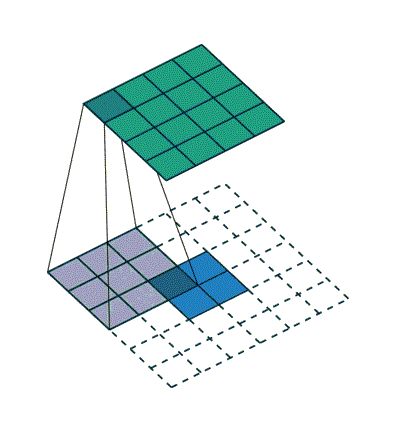
 

阴影表示卷积核，底部蓝色Grids是原始输入，白色Grids是填充用，顶部是输出的结果.

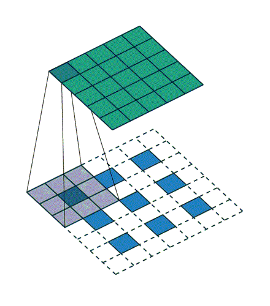
 

转置卷积，输入图像的每个元素倍乘卷积核后，再以目标布局对这些倍乘后的卷积核进行重合计算.

比方，2*2 的图像，2*2的卷积核， 4个像素值分别倍乘卷积核的每个元素，得到4个倍乘后的卷积核。目标布局是3*3，因此，每个倍乘后的卷积核扩展为3*3的矩阵，再进行逐像素(pixelwise)加计算。
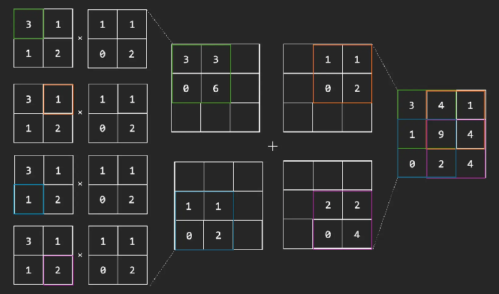
 

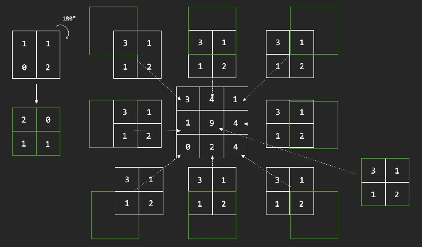
 

比方，4*4 的图像，卷积核 3*3 , 常用方法是 用 3*3 的矩阵对 4*4 的图像进行4次滑动窗扫描计算，得到 2*2 的结果；

当 4*4 的图像 reshape 成 16*1 的向量，同时用 一个 4*16 的矩阵来表示4个滑动窗对应的向量点积计算 ，则 4x16 的矩阵 * 16x1 的向量，得到的 4x1 向量，reshape后，等于滑动窗计算的结果；

因此，对此过程进行逆计算，就是 用4x16矩阵的转置 **(4x16)^T** * 4x1向量 ，得到 16x1 的向量，reshape 成 4x4 矩阵，同图像维度。

**反卷积或转置卷积，keras或pytorch中的strides 指的是倍乘卷积核之间的重合情况**，比方，倍乘后的卷积核是 2*2 ，则横向strides =1 表示两倍乘后的卷积核之间重合一列； strides = 2 ，表示不重合。

填充数量的计算方程 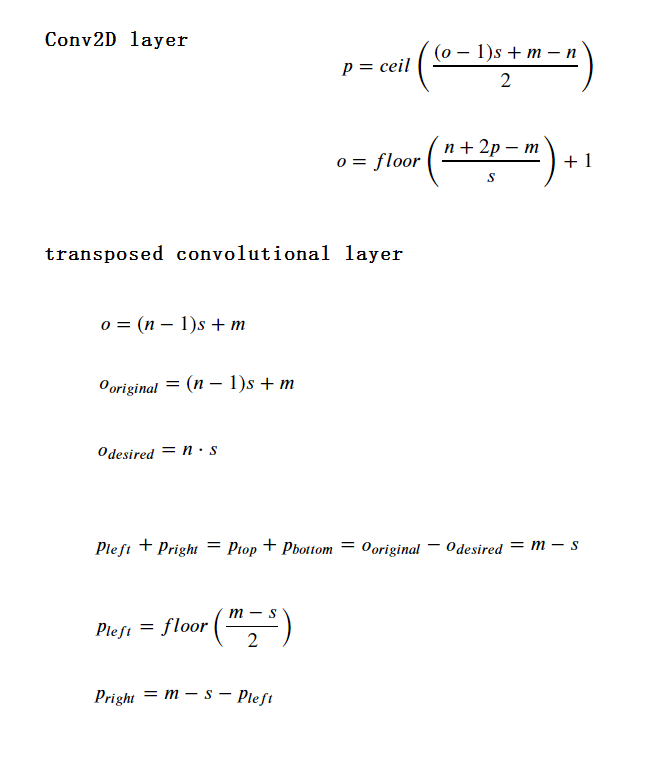。
 

2.	U-Net

[O. Ronneberger. etc. 2015]

 

U-Net，基于 FCN像素分类架构的自编码器改进形式。通过在多层编码器(Encoders)与 解码器(Decoders)之间跳连(Skip Connection)来保持解码时的高分辨率细节。

在FCN中，编码器与解码器不一定对称, U-Net则是对称的；FCN中跳连基于加法，U-Net中基于拼接(Concatenate)。

3.	Segmenter

 

Segmenter框架图，左侧，图像分片序列(Patch Sequence)基于编码器(Transformer Encoder, ViT Variants)计算分片之间的注意力或关联嵌量；右侧，分片注意力嵌量与分类嵌量(Learnable Class Embeddings)基于遮变换器(Mask Transformer)计算嵌量之间的注意力，再进行标量乘积(Scalar Product)，双线性插值到图像分辨率，与真实值对齐优化。

相对于早期方法，Segmenter同样是降采样、上采样，主要区别在于用Transformer的注意力嵌量计算替代FCN、Unet等框架中的加或拼接(Concatenation)上采样计算。

四、行为识别

人类行为识别(Human Action Recognition)，基于视频序列中目标运动的时域、空域动力学信息进行行为分析。

 

模型框架类型，双路网络(T-SN, Two-Stream Network)，注意力网络(AN, Attention Network)及变换器网络(TN, Transformer Network)，图卷积网络(GCN, Graph Convolutional Networks)；垂直方向，三维卷积网络(3DCN, 3D Convolutional Networks)，运动网络(MN, Motion Networks)，以及基于不同方法的混合网络(HN, Hybrid Networks)。

 

第二章	语音应用

一、语音识别

ChatGPT的语音识别(Whisper)基于Web收集的大规模、多样化数据进行多语言(Multilingual)、多任务(Multitask)弱监督(Weak Supervision)训练，不需优调(Fine Tuned)，具备更好的健壮性、通用性、更少的错误率。

Whisper架构，基于Encoder-Decoder Transformer端到端系统。输入音频文件划分为30秒的片段(Chunk)，进行分帧(帧长25ms，步长10ms)及短时傅立叶变换得到梅尔频谱图(Mel Spectrogram)，取对数，传给Encoder；Decoder进行相应的文本预测，同时基于特定的标记(Tokens)执行语言识别(Language Identification)、多语言语音转录识别(Multilingual Speech Transcription)及语音翻译(Speech Translation)等任务。

1.	数据处理

进行大规模、多语言、翻译集数据的收集、过滤及语音时频图谱转换。

1)、数据收集

基于Web搜索、下载对应的不同语言的语音及文本。
数据收集示例，从Wikipedia下载不同语言的Web页面文本信息，基于TF-IDF(Term Frequency Inverse Document Frequency)提炼文本短语语句，基于文本语言识别模型(Language Identification Model，Python Polyglot)过滤得到期望的短语，在YouTube平台进行短语搜索下载与文本语句相对应的视频文件。

 

YouTube平台搜索到的视频，基于文本语言识别模型对视频的标题、描述等信息进行过滤得到期望的视频文件。 

 

从视频文件中提取音频文件，将音频文件划分为多个音频片段，基于LIUM SpkDiarization(Java)过滤掉噪声、音乐或静音的片段。然后基于众包(Crowd Sourcing)及生成式分类器(RoG，Robust Generative Classifier)进一步过滤掉不期望的片段。

2)、文本质量提炼

基于启发式等方法过滤掉机器生成的质量不佳的文本。
基于优调的音频语言检测器(Audio Language Detector)确保语音与文本匹配。

基于模糊去重方法去掉重复的文本。

基于标签函数(LF，Labeling Functions)过滤掉不期望的文本(Whisper可能未用该方法)。语音片段及文本提供给标签函数，标签函数提示弃权(Abstain)等信息，去噪后，丢弃标记为弃权或不匹配的文本。

 

3)、梅尔频谱图(Mel Spectrogram)

对语音片段进行预加重、分帧、加窗及傅立叶变换，Mel滤波后，取对数得到提供给模型的对数梅尔频谱图(Log-Mel Spectrogram)。

 

2.	模型分析

1)、模型框架

对频谱信息进行卷积(2个卷积层，卷积核宽度3)及高斯误差线性单元激活(GELU，Gaussian Error Linear Unit)，通过位置编码( Sinusoidal Position Encoding)后提供给Transformer的编码栈(Encoder Blocks)。解码栈基于学习的位置嵌量及编码栈的归一化输出进行预测。

 

2)、GELU

基于高斯累积分布函数(Gaussian Cumulative Distribution Function)对输入进行非线性加权的高性能神经网络激活函数。

 

3)、Residual Block

模型Transformer基于残差块(Residual Block)进行改进，以提高性能、减少内存的使用。

 

3.	多任务

基于同一模型对同一音频信号进行文本转录识别(Transcription)、翻译(Translation)、声音激活检测(Voice Activity Detection)、文本语音对齐(Alignment)、语言识别(Language identification)等不同目的的训练及预测任务，利用不同的标记(Token)类型对任务进行定义或选择。

 

多任务流程，当前语音片段可前缀此前识别的文本作为解码器的上下文(Context)，开始识别(START OF TRANSCRIPT)后选择进行语言识别(LANGUAGE TAG)或声音激活检测，语言识别后选择进行文本转录识别(TRANSCRIBE)或翻译，选择是否进行时间戳(Timestamps)预测对齐，预测开始，预测语音帧相对于语音片段的开始时间标记(Start Time Token)、文本及结束时间标记(End Time Token)或只是文本预测，结束(EOT，END OF TRANSCRIPT)。

二、语音合成

语音合成实质是离散信号转连续信号、数字信号转模拟信号，相似于语音识别的逆过程。

语音合成方法可分为，基于拼接合成(Concatenative Synthesis)、参数合成(Parametric Synthesis)及神经网络方法。

当前，基于神经网络的语音合成框架可分为多级管路(Multi-Stage Pipeline)及端到端(End-To-End)形式。

1．多级管路框架

 

框架图，左侧，文本转换成音素(Phoneme)；居中，基于声学模型(Acoustic Model)，比方，FastPitch, Radtts等，使音素转换成频谱图(Mel-Spectrogram)；右侧，基于声码器(Vocoder)，比方，自回归的WaveNet、WaveRNN，非自回归的Parallel WaveNet、WaveGlow等，对抗生成类型的MelGAN等，使频谱图转换成音频波形(Waveform)。

声学模型可基于编解码框架定义。

 

框架图，预处理提炼文本的语言特征(Linguistic Feature)，基于编码器计算隐特征(Latent Feature)，经过解码器获得声学特征(Acoustic Feature)，传给声码器。

FastPitch框架。

 

框架图，底部，文本词(Lexical Units)标记序列，x=(x1,…,xn)，基于N个前馈变换器(FFT, Feedfoward Transformer)块编码计算注意力隐表征h(R^{n*d})；居中，基于1维卷积的音高预测器(Pitch Predictor)及时长预测器(Duration Predictor)预测隐表征音高($R^n$)及时长($N^n$)；对音高投影，加隐表征h，基于时长进行离散上采样；顶部，基于前馈变换器计算上采样隐表征的注意力，利用全连接计算频谱特征。

注，前馈变换器，标准变换器编码器块中的前馈神经网络替换成1维卷积。

上采样过程，合成的隐表征$s={s^1,…,s^n}$，隐表征相应时长$t={t_1,…,t_n}$，基于时长元素值，对隐表征相应元素进行克隆，$s’={s_1,…,s_{t_1},…,s^n_1,…,s^n_{t_n}}$。

MelGAN 框架。

 

框架图，左侧，基于转置卷积上采样及膨胀卷积等进行波形生成；右侧，波形降采样到不同分辨率，基于不同判别器(Discrminators)计算特征及标量值，以定义生成器的目标函数。

注，生成器目标函数，不同判别器对生成器计算结果的和的期望 + 真值频谱与生成频谱基于不同判别器不同层特征图的匹配。

 

$D_k$，判别器函数。

$G(s, z)$，生成器函数。

s， 生成的频谱，用于调控生成器。

z， 高斯噪声。

$L_{FM}$， 生成器、判别器的损失函数。

$D_k^{(i)}$， 第k个判别器的第i层特征图。

2．端到端框架

Google Deepmind EATS框架。

 

注，基于语音信号模拟连续的特征及因果关系，利用变换器(Transformer)、变分或扩散模型、流匹配(Flow Matching)实现端到端语音合成应是发展的方向。

三、语音翻译

Google Real Time Speech To Speech Translation级联框架。

 

SeamlessM4T端到端框架。

 

框架图，左侧，基于卷积变换器(Conformer)进行语音编码；居中，基于文本解码器(Text Decoder)，利用亚词(Subwords)对语言序列(Linguistic Sequence)建模；右侧，底部，基于文本单元编码器(Text-To-Unit Encoder)对语言表征编码，传给单元解码器(Unit Decoder)计算声学表征(Acoustic Representation)；右侧，顶部，基于单元声码器(Unit Vocoder)计算波形。

注，语言编码器基于卷积变换器，文本、单元解码器、编码器都基于变换器(Transformer)。

 

第三章	自然语言

基于深度学习模型的自然语言处理早期基于循环神经网络(RNN)、长短期记忆网络(LSTM)等，大发展始于基于Transformer框架的GPT。

因此，这里主要以ChatGPT来说明自然语言处理模型。

ChatGPT是基于GPT(Generative Pre-Trained Transformer)自然语言处理模型的多模态聊天机器人。

ChatGPT核心是基于RNN、LSTM、Attention、Transformer模型演进发展来的，通过自监督学习(SSL, Self Supervised Learning)预训练、监督学习优调(Fine Tuning)、强化学习实现非监督学习训练的自然语言处理的大语言模型(LLM, Large Language Model)。

RNN(Recurrent Neural Network)、LSTM(Long Short Term)是早期的循环网络模型，Attention是机器翻译、问答等Seq2Seq场景下用于对输入与输出Tokens进行对齐的方法，Transformer是基于Self-Attention机制，通过对输入Tokens进行语境关联改进Seq2Seq实现的模型。

自监督学习基于对部分数据自动生成标签来训练模型学习另一部分数据的特征，可用于机器视觉、自然语言处理模型预训练。

随着多模态(Multi-Modal)技术的发展，ChatGPT自然发展为多模态大语言模型(MLLM, Multi-modal Large Language Model)，该模型可以通过文字、图片等形式实现与外部的交互。

在作为大规模语言模型的训练时，GPT先基于自监督学习自动预训练模型，再基于监督学习利用人工方法实现对预训练后的GPT模型的优调(Fine-Tuning)；然后用优调后的模型预测答案，再经过人工后打分训练强化学习中的奖励模型(Reward Model)；之后基于GPT模型的策略模型生成答案，用训练的奖励模型作为价值函数对答案打分，然后，再基于打分更新策略模型参数。基于第二及第三步，循环更新模型。

一、Transformer

Transformer基于Encoders-Decoders框架实现。

Encoders，基于N个Encoder级联形成的Encoder栈。Encoders的输入为包括输入序列元素语义及位置信息的嵌向量，输出为表示输入序列高级语义及位置特征的Key及Value向量。

Decoders，基于N个Decoder级联形成的Decoder栈。Decoders的输入为预测输出序列嵌向量位置编码后的向量，输出为表示输出元素位置的向量，经过Linear及Softmax层转换为输出元素概率向量。

Encoder主要由自注意力层或多项注意力模块(Multi-Head Attention)与前馈模块(Feed Forward)组成。

Decoder相对于Encoder，主要增加了一个基于多项注意力模块的、综合Encoders的输出组成输入信息的编解码层。

 

Encoder的作用主要在于获取输入序列各元素之间语义与位置的关联信息。

自注意力层(Self-Attention Layer)，或多项注意力模块(Multi-Head Attention)，用于计算Encoder输入向量序列之间的相关性。前馈层(Feed Forward Layer)用于提取注意力信息中的特征。

第一级Encoder的输入为基于语义及位置信息的嵌向量(Embedding Vector)。

嵌向量经过自注意力层生成的向量分别提供给不同的前馈神经网络生成语义及位置信息向量作为当前Encoder的输出及下一级Encoder的输入。

自注意力层，或多项注意力模块(Multi-Head Attention)，基于多个调整点积注意力模块(Scaled Dot-Product Attention)并联实现。

调整点积注意力模块(Scaled Dot-Product Attention)，对表示输入向量特征的Query、Key、Value向量进行点积等运算以获取输入向量之间的语义及位置关联信息。

 

基于Q、K、V的权重矩阵(W)计算Encoder输入向量对应的Query、Key、Value向量。

对于第一级Encoder，基于权重矩阵计算不同嵌向量的Query、Key、Value向量。

基于Query与Key向量点积计算单词之间的相关性，进行归一化。

归一化的权重信息与相应的Value向量进行乘加运算作为Encoder自注意力层(Self-Attention Layer)的输出(z)。

基于不同的权重集W计算得到不同的Q、K、V信息，多个权重集对应多个Q、K、V信息集。

对多个注意力信息拼接后的信息进行降维，以提供给前馈层(Feed Forward Layer)。

Decoder框架与Encoder框架基本一致，主要增加了基于多项注意力模块(Multi-Head Attention)的编解码注意力层(Encoder-Decoder Attention Layer)。

编解码注意力层基于Encoders输出的Key、Value信息及Decoder中的自注意力层的Query信息计算对应于输入序列语义及位置信息的输出信息。

Decoders输出的向量基于Linear及Softmax层转换为词汇表概率向量。

二、模型优调(Fine-Tuning)

第一步，基于监督学习方法，用手工编辑的问题及答案优调(Fine-Tuning) GPT-3.5 模型。

从人工编辑的提示数据(训练)集中随机选一些提示(prompt, commands or questions)；

人为写下这些提示对应的答案，将这些答案作为调试GPT模型的标注答案(annotated answers)；

用这些对应的提示与回答对(prompt-answer pair)来调试GPT模型；

第二阶段

用GPT模型生成的答案来训练奖励模型(RM, reward model)。

从人工编辑的提示数据(验证)集中随机选一些提示(prompt, commands or questions)，提供给优调后的GPT模型来生成答案；

每个提示可以对应k个答案；

标注人员可以基于一系列标准(相关性，信息量，危害性等)对这k个答案进行排名/排序；

基于常用的成对学习排名法，将这些排序后的答案作为标注数据用于训练奖励模型(RM, Reward Model)；

将提示与答案对提供给奖励模型，由奖励模型输出一个打分(score)，对于答案排名高的，奖励模型输出的打分相应高。

第三阶段

基于策略模型与奖励模型的迭代训练更新策略模型参数。

用冷启动模型初始化PPO策略模型；

从人工编辑的提示数据(预测)集中随机选一些提示(prompt, commands or questions)，提供给策略模型，生成答案；

由第二阶段训练的奖励模型对PPO模型生成的答案进行打分；

基于强化学习策略梯度算法更新PPO参数；

重复第二步与第三步可以不断增强大语言模型的能力。

三、多模态

多模态大规模语言模型(MLLM)通过对文本、图像等进行不同维度、不同层级的特征提取，隐状态语义匹配，再经过逆运算等变换生成相应的文本、图像等信息。

图像转文本。比方，Meshed-Memory Transformer框架，基于不同Encoder层提取的不同层级的图像特征信息，进行不同层级的解码实现图像转文本预测。

文本转图像。基于不同的模型框架，生成与文本信息相应的图像。框架包括基于生成对抗网络的框架、基于变自编码器(VAE, Variational Autoencoder)的框架，基于扩散模型(Diffusion Models)的框架等。

在多模态模型训练时，可基于语言图像比对预训练(CLIP, Contrastive Language Image Pretraining)模型提取对齐的图像或文本特征。

 

第四章	内容生成

OpenAI发布的视频生成大模型SORA，基于扩散模型及扩散变换器(DiT, Diffusion Transformer)框架，利用大规模视频及图像时空域隐语义分片信息(Spacetime Patches)与调控信息进行训练，实现指令对齐视频生成。

同时，该模型可对视频进行扩展、编辑及拼接，并涌现对现实世界(Physical World)及数字世界(Digital Worlds)一定的仿真能力，有着实现世界通用仿真器(General Purpose Simulators)的前景。

模型框架

SORA通过训练的编码器神经网络对视频进行时域及空域的压缩降维，生成视频的隐语义表示；通过扩散模型框架的前向过程(Forward Process)对视频隐语义信息进行加噪；加噪的隐语义信息分片化后，基于调控信息，通过扩散模型框架的逆向过程(Reverse Process)进行去噪；去噪的隐语义信息通过解码器神经网络解码到像素空间，生成目标视频。

 

框架图，左侧(上)，源视频帧序列通过编码器形成隐语义信息；居中(上)，隐语义信息通过扩散过程形成带噪声的隐语义信息；右侧，用户指令基于大语言模型编辑后，与视频帧进行比对对齐，生成调控信息；居中(下)，带噪隐语义信息进行分片后，在调控信息的指导下，通过扩散变换器逐步去噪，生成去噪的隐语义信息；左侧(下)，去噪的隐语义信息通过解码器生成目标视频帧序列。

 

第五章	机器人运动控制

Nvidia发布的视觉语言动作模型N1.5，基于GR00T N1基础模型，通过简化视觉语言模型的多层感知器、对视觉及文本标记嵌量进行层归一化，提高语言指令遵循及泛化能力(Language Following And Generalization)；基于流匹配及未来隐表征对齐(FLARE，Future LAtent Representation Alignment)目标函数改进机器人关节策略模型性能，实现视频学习；利用DreamGen合成机器人数据训练扩大模型泛化能力。

一、总体框架

 

框架图，基本与GR00T N1相同。区别，预训练及优调时，冻结视觉语言模型；简化连接视觉编码器与视觉语言模型的多层感知器；对视觉及文本标记嵌量进行层归一化；基于流匹配及未来隐表征对齐损失训练动作生成模型；利用DreamGen合成数据训练扩展模型泛化能力。

二、未来隐表征对齐(FLARE)

 

图，顶部，基于流匹配或扩散模型预测动作状态；居中，基于动作流匹配及未来隐表征对齐目标函数训练模型；底部，基于未来隐表征对齐目标函数训练模型。

 

框架图，左侧，计算视觉语言嵌量；居中，基于流匹配损失函数的扩散变换器(DiT，Diffusion Transformer)对机器人状态标记嵌量、动作标记嵌量及未来标记嵌量的拼接序列进行自注意力计算，通过视觉语言嵌量交叉注意力计算调控动作生成；右侧，扩散变换器中间层，相应于未来标器嵌量的激活特征与观测的未来视觉语言嵌量，基于余弦相似度(Cosine Similarity)计算未来隐特征对齐损失。

损失函数

1、流匹配

损失函数定义。

 

动作序列推理定义。

基于前向欧拉积分(Forward Euler Integration)方程，通过K步去噪生成动作序列。

 

时步(Timestep)τ的分布定义，s = 0.999。

 

2、隐表征对齐

隐表征对齐损失函数定义。

 

3、模型损失函数

L=Lfm+λLalign

视觉语言模型

 

框架图，左侧，基于SigLIP-2编码视觉及语言嵌量，通过多个自注意力变换器块(Self-Attention Transformer Blocks)计算视觉语言注意力(Cross-modal Dependencies)；右侧，视觉语言注意力及查询标记(32 Learnable Query Tokens，Randomly Initialized)基于Q-former模块生成压缩的视觉语言嵌量标记(32 Compressed Vision-Language Tokens)。

查询变换器(Q-Former，Querying Transformer)

改进语言图像预训练(BLIP-2，Bootstrapping Language-Image Pre-training)框架，基于已有固参图像编码器及大语言模型改进视觉语言预训练，利用查询变换器提取文本最相关的视觉特征、弥合模态间隙(Modality Gap)。

查询变换器预训练分两阶段。

 

框架图，左侧，第一阶段，通过固参图像编码器(frozen image encoder)改进视觉语言表征学习(Bootstraps Vision-Language Representation Learning)；右侧，第二阶段，通过固参大语言模型改进视觉转语言生成学习(Bootstraps Vision-To-Language Generative Learning)。

查询变换器框架及预训练第一阶段。

 

框架图，左侧，查询变换器，基于共享自注意力层的图像变换器及文本变换器亚模块(Transformer Submodules)实现，利用多个目标函数进行预训练；图像变换器通过交叉注意力与图像编码器交互，提取视觉特征；文本变换器作文本编解码器，提取文本表征；自注意计算时基于不同的预训练任务及自注意力遮码(Self-Attention Masks)策略进行查询量与文本的交互。

右侧，预训练目标函数相应的自注意力遮码策略，图文匹配(ITM，Image-Text Matching) 基于双向自注意力遮码(Bi-Directional Self-Attention Mask)，图生文(ITG，Image-Grounded Text Generation)基于多模态因果自注意力遮码(Multimodal Causal Self-Attention Mask)，图文比对学习(ITC，Image-Text Contrastive Learning)基于单模态自注意力遮码(Unimodal Self-Attention Mask)。

预训练第二阶段。

基于全连接层对查询变换器计算的查询注意力嵌量进行投影，得到与大语言模型的文本嵌量等维度的嵌量，前置(Prepend)到文本嵌量前，调控语言模型生成文本。

 

三、DreamGen

基于图生视频模型合成适用于目标机器人具身的各类视频(Photorealistic Synthetic Videos)，再利用隐动作模型(Latent Action Model)或逆动力学模型(IDM， Inverse-Dynamics Model)还原动作序列(Pseudo-Action Sequences)。

总体框架

 

框架图，基于遥操作机器人轨迹优调视频世界模型(Video World Model)，比方，WAN；基于给定的起始视频帧及语言指令，生成执行指令意图的视频；基于隐动作模型或逆动力学模型标注视频中的动作，形成神经轨迹(Neural Trajectories)；基于神经轨迹训练视觉机器人策略(Visuomotor Robot Policies)。

视频世界模型

 

还原动作模型

 

框架图，左侧，逆动力学模型框架，不同时刻的两个视频帧通过SigLIP-2编码器计算嵌量，基于流匹配损失函数训练，调控扩散变换器生成两个视频帧之间的动作序列；右侧，基于视频隐动作预训练模型(LAPA, Latent Action Pretraining for General Action Models)，利用VQ-VAE损失函数训练，生成隐动作。

隐动作预训练。

 

框架图，左侧，基于噪声替代(NSVQ, Noise Substitution In Vector Quantization)方法的向量量化-变分自编码器模型学习连续视频帧所示的量化隐动作；居中，利用学习的隐动作训练视频语言模型，实现行为克隆(Behavior Cloning)；右侧，基于少量机器人动作数据集优调视觉语言动作模型，实现隐动作到机器人动作的映射。

Nvidia GR00T模型框架与Physical Intelligence的机器人视觉语言动作模型相似。模型当前主要侧重于短程(Short-Horizon)控制任务，要实现长程运动控制(Long-Horizon Loco-Manipulation)可能需机器人硬件、模型架构及训练数据的改进。
基于隐动作学习方法，利用云端计算优调模型应可实现机器人实时模仿学习。基于多模态动作模型，利用推理、三维空间信息、步骤对齐及强化训练，应该可实现机器人长程灵活运动控制。

 

第六章	机器人手控制

Nvidia Allegro机器人手运动控制，仿照OpenAI Shadow Hand方法，基于PPO强化学习算法框架与视觉追踪系统，在Isaac Gym仿真环境下，利用向量化自动场景域随机化(Vectorised Automatic Domain Randomisation)机制生成多样化的训练数据、尽可能扩大域随机化区间，保持策略性能的同时，提高策略的泛化能力及仿真到现实的迁移能力。

总体框架，Allegro机器人手，基于RGB相机与Mask R-CNN网络实现对机器人手心中目标物的位姿的预测；基于PPO算法训练的策略指导机器人手指的运动。PPO算法的策略(Actor)与价值函数(Value Function, Critic)基于长短期记忆网络(LSTM)。

 

一、任务定义

通过对Allegro机器人手指的控制，将随机放置在机器人手心、带颜色及标记的立方体目标物不断地重定向到指定的目标方向。

步骤，

1、立方体随机放置在机器人手心；

2、基于特定正交矩阵群(SO(3))采样，随机指定期望的立方体目标方向；

3、基于策略模型指挥机器人手指运动，将立方体调整到期望的目标方向；

4、立方体调整后与目标方向偏离小于阈值度(比方，0.4弧度)，则采样指定新的目标方向；

依此循环，不断控制机器人手指将立方体从当前方向调整到新的目标方向；

在立方体不掉落的情况下，连续将立方体调整到目标方向的次数或者保持立方体在同一个状态下的时长可作判断机器人手控制成功与否的标准；

二、环境定义

机器人手，Allegro Hand + 机械臂。

视觉追踪系统，3个基于Intel D415的RGB相机，相机相对于机器人手心连杆(Palm Link of the Hand)进行外部校准；

目标物，各面不同颜色及标记的6.5厘米的立方体，基于机器人手心表示立方体的位姿；

仿真器，Isaac Gym；

训练平台，8块Nvidia A40 GPU + 32 Nvidia V100 GPU；

通过相机-相机外部校准、相机-机器人校准可实现相机参考坐标框(Reference Frame)到机器人掌心坐标系进行变换。

三、策略学习

机器人手通过运动控制调整立方体到期望方向，是一个串行决策问题。

策略代理与环境交互实现最大化折扣奖励和。

基于PPO算法框架学习随机策略(Actor)与价值函数(Critic)。

1、策略框架

LSTM网络，层归一化隐单元(Hidden Units of Layer Normalization)的)*1024个；多层感知器(MLP)*2个(512 units)；激活函数(ELU， Exponential Linear Units)；

输入，观测量(50维度)及此前的隐状态；

输出，动作，通过指数移动均值(EMA， Exponential Moving Average)平滑因子(Smoothing Factor)进行低通过滤(Low-Pass Filtered)以防电机线缆等损坏；

动作空间，基于机器人手16个关节对应的比例差分控制器的目的位置(PD Controller Target)定义；

2、价值函数

LSTM网络, 层归一化的隐单元*2048个；多层感知器(1024 units, 512 units)；ELU激活*2个；

输入，观测量(265维度)；

输出，价值；

3、训练方法

策略，采用用线性调度学习率(Linear Scheduling of the Learning Rate)；

价值函数，采用固定学习率(Fixed Learning Rate)；

优化计算，时序反向传播(BPTT， Backpropagation Through Time)，时窗截取长度16；

4、输入定义

 

四、奖励定义

 

奖励，奖励项加权后的和。

d，立方体当前方向到指定方向的旋转距离；

pobject，立方体位置；

pgoal，目标位置；

a，当前动作；

targcurr，当前关节位置目标；

targprev，此前关节位置目标；

vjoints，当前关节速度向量；

五、仿真

基于Isaac Gym 物理仿真器，对连接力进行建模；基于单个GPU进行并行仿真。

Nvidia Allegro基于向量化自动域随机化机制生成的数据训练近端策略优化(PPO)模型与视觉追踪系统，降低了训练成本，改进了机器人手控制目标进行重定向的泛化能力。

 

第七章	三维重建

三维重建可以分为传统三维建模、基于深度学习的三维建模。

利用深度神经网络学习三维形状的四类方法。

1、基于点，神经网络直接预测三维点坐标。

2、基于网面，基于对二维平面进行变形来描述三维表面。不过，对于表面光滑连续，支持任意形状，不能兼顾。

3、基于体素，基于三维体素栅格表示形状，栅格存放占据信息或符号距离函数信息。

4、基于连续隐函数，学习连续的隐函数来表示形状。比方 occupancy network,PiFU用连续指示函数(indicator function)来指定目标形状占据的是哪些三维空间。DeepSDF用符号距离场(SDF, Signed Distance Field)来近似目标形状。

一、NeRF

NeRF，基于辐射场概念、光线可逆及相机成像原理，利用二维图像，通过多层感知器(MLP，Multilayer Perceptrons)神经网络对相机视域三维空间点位姿及相应的颜色、体密度(Volume Density)的映射函数进行拟合，利用函数预测的泛化能力实现不同视角的视图的合成。

 

1、核心，误差函数，预测的图像与真实的图像进行比对。本质与光束平差法有些相似，对多个相机位姿观测与预测的误差和进行优化计算。区别在于，优化训练获得的神经网络具有泛化能力，可以推理生成别的相机位姿看到的空间目标。

2、预测图像的方法，基于相机位姿沿光线方向定义空间目标；再对定义的目标进行体渲染计算，得到预测的图像。

3、具体，不同的相机位姿输入到MLP网络，输出空间目标点的颜色及密度(控制透明度)。对光线方向的空间目标点颜色及密度进行积分或和计算，得到渲染图像。

4、MLP实际分两部分，一部分以相机坐标为输入，输出体密度及特征向量；另一部分，以该特征向量及相机光线方向作输入，输出颜色。

5、为了MLP可以更好的表示目标几何及颜色变化剧烈的高频区域，可通过对坐标及方向分别进行类似蛋白质结构预测、Transformer架构中的位置变换的高维变换来改进。

6、为提高渲染效率，规避目标空间空闲区及遮挡区，分别利用一个粗神经网络、一个细神经网络来表示场景。先选取采样片段，对粗神经网络的输出进行渲染评估，找到目标体相关区域，筛选掉那些无目标体的图像区；再选取一些采样片段，基于所有的采样片段，对细神经网络的输出进行渲染评估。

 

框架图，左侧，沿着相机光线方向进行三维空间点坐标(x, y, z, θ, φ)采样；居中，基于多层感知器得到三维空间采样点颜色及体密度；右侧，基于体渲染(Volume Rendering)流程，对相机光线方向三维空间采样点颜色及密度信息进行加权和计算，得到光线在二维图像平面投影，对光线投影得到的二维图像与真实图像的方差进行优化计算，更新多层感知器网络参数。

二、Gaussian Splatting

基于三维场景空间稀疏点云实例化三维高斯椭球体(Ellipsoids)，利用图像瓦片投影原理(Tile-Based Splatting)及相机光线方向椭球体光辐射量计算图像像素颜色，通过误差优化计算更新三维高斯参数，同时调控三维场景椭球体数量及形状。

 

框架图，左侧，基于移动重建(SfM，Structure from Motion)算法、利用相机图像序列生成三维场景空间的稀疏点云，实例化以点云点位置作均值的三维高斯；居中，基于相机视锥区域及光辐射场原理计算相机光线方向三维高斯椭球体到相机图像空间的投影；右侧，基于瓦片渲染器(Differentiable Tile Rasterizer)计算投影像素对应的颜色。

优化控制(蓝线)，基于图像像素颜色误差及图像相似度误差进行优化计算，更新三维高斯参数，同时基于视域空间位置梯度(View Space Positional Gradients)等信息对三维高斯椭球体进行调控。

 

第八章	SLAM

基于深度学习的视觉SLAM , DROID-SLAM、DeepVO、UnDeepVO、DeepFactors等；激光Lidar SLAM, Lo-Net、SHINE-Mapping等。

一、DROID-SLAM

DROID(Differentiable Recurrent Optimization-Inspired Design)，基于单目、立体或RGB-D相机及深度学习的端到端可微分架构，利用光流预测循环迭代校准投影预测，再通过神经网络稠密光束平差层(DBA, Dense Bundle Adjustment Layer)预测优化相机位姿及像素(Pixelwise)深度，实现实时稠密SLAM。

相似于卡尔曼滤波测量方程加权运动方程更新预测，DROID利用光流循环网络模型加权重投影函数更新预测；预测更新后的像素栅格坐标，基于神经网络稠密光束平差层预测更新相机位姿及像素深度。

光流预测模型基于RAFT(Recurrent All-Pairs Field Transforms For Optical Flow)循环迭代更新机制，实现基于任意数量的视频帧迭代更新相机位姿及像素深度。

 

框架图，左下，起始(Init)或预测的相机位姿G、像素深度d，联合视频帧i的像素栅格坐标$p_i$，基于逆投影$\prod_c^{-1}$转换成三维点云坐标，左乘以相机在视频帧i的位姿到相机在视频帧j的位姿变换$G_{ij}$，再进行投影变换$\prod_c$，得到视频帧i像素栅格$p_i$对应在视频帧j中的坐标$p_{ij}$；

左上，计算得到视频帧像素之间的关联信息$C_{ij}$，基于关联查询器(Correlation Lookup Operator)$L_r$查询坐标$p_{ij}$关联的信息；

左中，查询到的关联信息连同隐状态$h_{ij}$输入卷积门循环单元(ConvGRU)，输出图像间光流$r_{ij}$及置信图$w_{ij}$；

中下，光流模型门循环单元预测的光流加重投影预测的坐标$p_{ij}$，连同置信图输入稠密光束平差层模块，预测相机位姿及像素深度变化，并更新G、d；

右侧，基于图像序列共视关系循环迭代更新相机位姿及像素深度。

二、NeRF-SLAM

NeRF-SLAM，基于单目稠密SLAM系统估计的位姿及深度图，通过置信加权，监督训练哈希层级表征的神经辐射场，实现定位追踪及光学、几何准确的三维重建。

NeRF-SLAM基于Instant-NGP的哈希层级表征方法拟合神经辐射场，利用DROID-SLAM系统估计的相机位姿、像素深度图及深度置信(Uncertainty)进行色彩、深度对齐，优化模型。实际实现时，分别基于追踪线程(Tracking Thread)生成关键帧，优化光束平差，计算位姿、深度及置信；基于建图线程(Mapping Thread)进行建图、渲染及展示。 

框架图，左侧，相似于DROID-SLAM方法，基于起始(Init)或预测的相机位姿、像素深度，利用逆投影、投影变换计算视频帧i到j的光流pij；再结合 RAFT的卷积门循环单元(ConvGRU, Convolutional GRU)预测更新光流pij及相应的权重Σpij；基于视频帧图(Frame Graph)的光束平差法代价函数利用高斯-牛顿法进行一阶泰勒展开，得到包括相机位姿矩阵及像素深度矩阵的稀疏块状的海森矩阵(Block-Sparse Hessian)H；利用块状矩阵的互补方法(Schur Complement)计算相机位姿矩阵HT；矩阵分解(Cholesky factorization)为下三角矩阵(Lower-Triangular Matrix)与上三角矩阵(Upper-Triangular Matrix)积；利用前代、回代算法(Front And Back Substitution)分别计算下、上三角矩阵，得到相机位姿；基于相机位姿计算像素深度；右侧，下方，基于矩阵互补及分解计算，可分别得到像素深度、相机位姿的边缘协方差(Marginal Covariances)Σd、ΣT；右侧，上方，基于协方差及预测的像素深度D、相机位姿T定义哈希层级表征的神经辐射场的损失函数，进行优化训练；

三、Gaussian Splatting SLAM

3D Gaussian Splatting SLAM，基于三维空间类椭圆球体的三维高斯位置及形状泼溅或投影到相机图像平面，计算像素颜色、深度信息与观测的真值进行对齐优化，以更新相机位姿，调整三维空间三维高斯的稠密度、形状等。

DGS SLAM基于三维高斯泼溅，改进实现在线SLAM。

一、基于栅格化(Rasterization Pipeline)优化时，利用相机位姿李群关于三维高斯的解析雅可比进行计算，以更新相机位姿及场景几何结构。同时，禁用球谐波(Spherical Harmonics)表示三维高斯色彩，以降低计算量。

二、在轨迹追踪及建图时，使三维高斯维持各向同性(Isotropic)，以免连续(Continous)SLAM三维稠密重建(Incremental 3D Dense Reconstruction)时，三维高斯在视线方向过度拉伸(Elongation)带来模糊遮挡噪点(Artefacts)。

三、基于高斯资源分配及剪枝方法使三维重建几何特性明确(Clean)、相机轨迹追踪准确。

 

框架图，左侧(Tracking)，基于相机帧图，估计相机位姿，实例化三维高斯；居中(Keyframing)，基于相机帧图共视特性，提炼关键帧；右侧，基于栅格化图像损失函数进行优化计算，更新三维高斯参数；居中(3D Gaussian Map)，剪枝、稠密化三维高斯，更新相机位姿估计。

 
第九章	推荐系统

推荐系统框架。

 

召回，确定推荐内容。主要基于协同过滤、内容匹配算法。

排序，预测召回内容的点击率进行优先级排序。

相关算法，比方，KNN、GBDT_LR、DeepFM等。

 

实践篇

第一章 深度学习框架

PyTorch、TensorFlow、Keras、JAX(Just-In-Time Accelerator for XLA)等。

JAX 介于 google brain 发布的tensorflow 静态图计算 与 meta FAIR 发布的Pytorch 动态图计算方法之间. 生产环境，google , airbnb, uber用tensorflow ; meta , nvidia , tesla 用 pytorch ; deepmind 用JAX; 学院 用 pytorch 创建原型 , 用 JAX 进行大模型计算 ;

Keras, pytorchlighting, flax 分别是 tensorflow, pytorch, jax的高层级简化版. 当然 keras 也支持后端是 pytorch, jax.

JAX，适合于大模型训练，比方 JAX的矩阵乘显著快于Pytorch。Google Research 在训练BERT时用到的用于优化机器学习、神经网络、科学计算等python程序的高性能计算库或框架,相较于tensorflow, pytorch等传统机器学习框架, JAX 速度及效率很高. 利用了JiT(Just-in-time), 无缝自动微分, 具有高效的向量化及并行代码以方便的适应不同的GPUs(Nvidia, AMD)或TPUs. 类似 Numpy 接口风格。

第二章 大模型训练

一、预处理

文本预处理(Text Preprocess)主要包括:

移除停止符 ( stop word removal ), 

标记化 ( tokenization ), 

词干化/提取( stemming ) 

词形还原( lemmatization ). 

注: 标记化后的标记进行嵌量计算，转成向量 ; 嵌量方法可以用于文本标记，也可以用于图像。

标记化，是将文本分割成小的、可控的标记(tokens)单元的过程，是一个降维过程，同时不损失上下文信息。

基于OpenAI统计，英文中， 一个标记长度大约4个字符，约等于3/4个单词，即100个标记等于 75个单词。

标记化框架

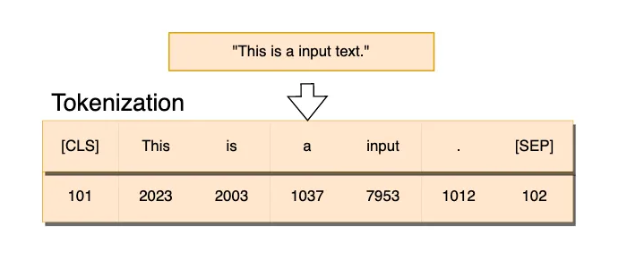

嵌量， 将标记序列表示作连续的高维向量的过程。相似的标记，有着相近的向量表示。这些向量即嵌量，定长，用于捕获标记的语义及相互的关系。计算嵌量可以用 Word2Vec or GloVe等方法。

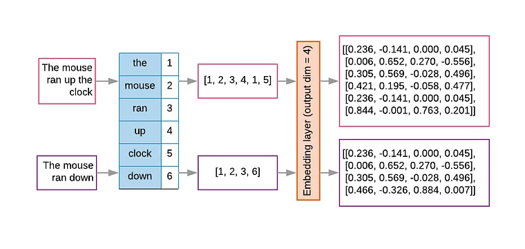

可以看到，基于嵌量计算匡架，文本序列转成嵌量矩阵。对于深度学习模型来说，输入的将是嵌量矩阵(实际，图像，也正是嵌量矩阵)。

注: 标记化与语言相关，嵌量化则与语言无关。

标记化器, Byte Pair Encoding, SentencePiece, or WordPiece.  常用库, spaCy, nltk, and transformers.

嵌量化器, GloVe, BERT, Word2Vec, DeBERTa. 常用库  torch.nn.Embedding, gensim, and transformers.

## 标记化类型

句子、单词、字符、亚词(subwords), 相应的可称  句子标记化、词标记化等

字符标记化，粒度过小，标记化序列太长，对于模型不能提供有意义的语言表示

单词标记化，单词密相关模型(closed-vocabulary models)，标记虽有意义，但是过于与单词相关或拟合，无法解决训练过程中未见过的单词

亚词标记化，主流方法

## 标记化步骤(Tokenization Pipeline)

1、归一化 Normalization: Cleaning - lower casing, removing accents, etc

2、预标记化(可选，机遇空格分割文本) Pre-tokenization: Optional stage of splitting up text into words based on whitespace (if applicable for that language)

3、建模(将文本或一系列单词分割成一系列标记的标记化算法) Model: The tokenization algorithm that takes in text/ list of words and spits out a list of tokens

4、后处理(添加特定标记，比方序列分割符、序列标记起始符、结束符等，参考在语音识别whisper中的应用) Post-processor : Adds special tokens like sequence separators, beginning and end of sequence tokens, etc

编码,  sentencepiece,  bpe(byte pair encoding)

## 标记化方法

1、最简单形式，用空格分隔(delimiter)  python 的  split() 可实现

2、NLTK , 可以进行词、句子标记化 (Word Tokenize ,  sentence tokenize )等

wordnet , 可用于语料及词汇资源的处理

一系列文本处理库 , 可用于分类、标记化、词干化及标签(classification, tokenization, stemming, and tagging)

比方

Punctuation-based tokenizer , 基于标点符号标记化

Treebank Word tokenizer , 基于常用规则进行英语单词的标记化

Tweet tokenizer ，针对twitter(emojis等)的标记化

MWET tokenizer , 多单词标记化(合并等)

3、TextBlob

可用于 语音标签 , 名词短语提取, 情感分析, 分类 , 翻译 等 (part-of-speech tagging, noun phrase extraction, sentiment analysis, classification, translation, and more.)

4、spaCy Tokenizer

open source python library.

5、Gensim word tokenizer

Python library for topic modeling, document indexing, and similarity retrieval with large corpora.

6、Tokenization with Keras

### 亚词标记化

1、BPE(Byte-pair encoding)

先对语料进行字符标记化

基于合并规则，即将出现频率最高的相邻字符对转成新的、2个字符长的标记，并替代所有相同的相邻字符

重复该过程，直到这个混合着标记与字符的序列长度不可再变小或者达到要求的词汇量大小(desired vocabulary size)

类似的，如果基于出现频率最高的相邻字节对进行合并，用新的字节替代，则称 BPE.

测试时的标记化，与训练时的标记化方法一样。先对语料进行字符标记化，再合并最高频率的相邻字符对为新的字符，重复直到序列长度不可减小。

2、WordPiece Tokenization

与BPE相似，不过不是基于最高频率，是基于自定义的一个得分函数来选择要合并的字符对或字节对

score=(freq_of_pair)/(freq_of_first_element×freq_of_second_element)

测试时的标记化方法，与训练时相似。

3、Unigram Tokenization

大概来说，基于统计语言模型对标记概率建模。

训练过程

先基于亚字符串(substrings)或BPE方法确定序列对应的词汇表(vocabulary)

再对当前的词汇表训练计算损失函数

对于引起损失误差变大的标记，进行移除

测试时，给定一个单词，看单词可能分割成哪些标记; 基于训练的 unigram model 计算各标记的概率 ;  选择概率最大的标记;

注: SentencePiece 是支持BPE、UniGram这些算法的标记化、反标记化框架，不是标记化算法。主流标记化方法是BPE算法。

## 嵌量 embedding

1、词嵌量  Word Embeddings

one-hot 方法， 表示单词过于冗余，同时无法表示词之间的关系.

Word2Vec , 只有一个隐藏层的浅(shallow)神经网络. 隐藏层的维度即嵌量的维度.

分布假设( distributional hypothesis ), 相似语义的单词用于相似上下文，相似上下文用的单词意义相似。

模型迭代分析每个单词，当前每个单词作central word，通过窗口大小(window size)确定上下文大小，即当前单词前后分别多少个单词作上下文。

word2vec， 包括两个建模方法

Skip-gram model , 基于当前词预测上下文单词的概率

Continuous bag of words model (CBOW) , 基于上下文单词预测当前词的概率

比方, The quick brown fox jumps over the lazy cat.

Skip-gram model ，对应  P( {“the”, “quick”, “fox”, “jumps”} | “brown” ).

CBOW, 即 P( “brown” | {“the”, “quick”, “fox”, “jumps”} ).

概率的定义

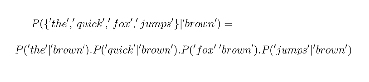

训练语料的整个概率

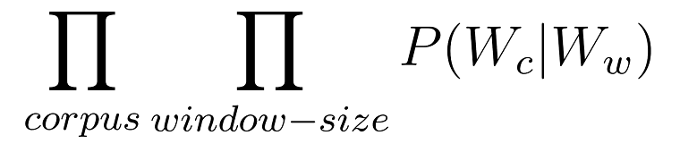

给定central word，上下文概率等于

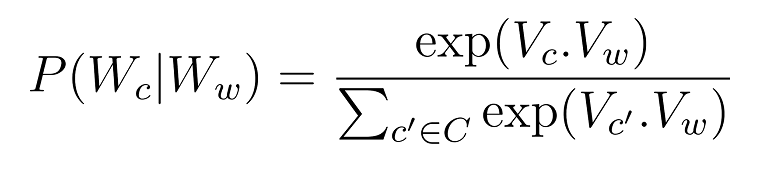

不过,word2vec 模型训练好后，只能针对于训练时的语料场景，即嵌量对应的语义是与该场景相关的，换一个上下文场景，尽管语义应该不同，却依然是该嵌量

因此，word2vec 只是适合于 单词语义比较通用，不随场景变化的情况，比方 general motors，不管在什么场景，一般都表示通用动力.

对于 word2vec 的问题的改进，要用到大语言模型中的  注意力机制.

大语言模型中，将文本分解成亚词、然后标记化。标记不再像文本一样进行编码，相反编码成单个整数(不是向量)。 BPE便是这样的常用标记化算法.

基于注意力机制，每个标记的向量表示基于该标记前后的标记，因此不同上下文中相同的单词可以有着不同的向量表示。

注: word2vec 编码的是单词在整个词汇表词典中的意义，基于注意力机制则是编码单词上下文的意义(比方，BERT中掩码要嵌量化的单词)，因此同一个词的向量不是固定唯一的，是随上下文变化的。并且由于标记化是subword级别的标记化编码，可以对标记进行合成以表示新的单词，因此可以理解未知单词。

注: word2vec 中的标记化，标记词汇表中不包括逗号等标记符, 用 [UNK]即unknown替代; text 单词分解成多个单词碎片，比方 Gandalf  分解成 “ganda”  “##l”  “##f” ,这样便于通过组合形式，使得标记可以涵盖更多的单词。

word2vec 中的词嵌量化，每个标记的嵌量维度是300, [UNK] 用维度300的 [0,0,...,0] 向量表示

word2vec 中的句子嵌量化，基于词嵌量化，句子太长则截取固定数量的标记，不足则用 嵌量是 [0,0,...,0] 的标记填充。然后，可以在每个维度方向进行均值计算，得到句子对应的维度是300的向量。

word2vec 的损失函数

word2vec 可看作lookup表，将单词映射成静态的嵌量.  基于transformer的模型，则可以看作是一系列度量或加权的向量.

训练时，优化计算得到这些度量的值，然后用这些度量计算给定句子中每个标记的嵌量。因此，不同句子中，同样的标记有着不同的嵌量.

2、句子嵌量

基于tranformer模型，将变长句子转成定长向量.

注: 词嵌量作为高维向量，可以通过词与词之间的加减计算得到或接近新的词的嵌量。嵌量之间可以通过cosine方法可以计算嵌量的接近程度,这与transformer 注意力机制中注意力计算有相似之处。

二、训练

大语言模型训练，当前主要依赖于模仿学习，特别是在预训练与监督优调阶段，用最大似然估计预测下一个标记. 这样的方法面临的问题是, 自回归模型中的复合误差(compounding error), 曝光偏差(exposure bias), 模型应用过程中的分布漂移(distribution shift).  序列越长，这些问题越严重.

现有的解决方法主要是，行为克隆与逆强化学习. 行为克隆，类似于通过最大似然估计进行监督优调, 直接模仿专家演示. 问题在于会遇到复合误差，同时要求大量数据收敛. 逆强化学习推测策略及奖励函数，一定程度解决了行为克隆的问题, 通过游戏理论、熵正则化等方法提高了稳定性及可扩展性. 但是还是只能限定于特定场景.

三、微调

微调与RAG是平行的两类方法，微调适用于特定任务存在大量标签数据，RAG适用于利用外部数据或数据更新很频繁的情况.

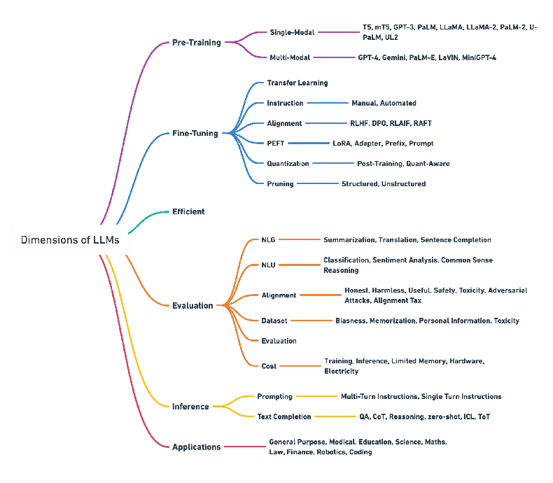
 

微调方法
Adapter Tuning
Prompt Tuning
prefix tuning
p-tuning & P-tuning V2
LoRA & AdaLoRA & QLoRA

parameters-efficient fine tuning, 既不是微调预训练模型的所有参数，也不是只更改微调预训练模型的最后几层。通过在transformer的注意力层及前馈层中添加adaptor层来实现微调.

prefix tuning, prefix tuning依然是固定预训练参数,但除为每一个任务额外添加一个或多个embedding之外,利用多层感知编码prefix,注意多层感知机就是prefix的编码器,不再像prompt tuning继续输入LLM。

p-tuning, 即 提示词微调 prompt tuning 或 pseduo fine tuning。 p-tuning依然是固定LLM参数,利用多层感知机和LSTM对prompt进行编码,编码之后与其他向量进行拼接之后正常输入LLM。注意,训练之后只保留prompt编码之后的向量即可,无需保留编码器。

p-tuning v2, p-tuning的问题是在小参数量模型上表现差(如上图所示),于是有了V2版本,类似于LoRA每层都嵌入了新的参数(称之为Deep FT). 具体来说, P-Tuning v2是基于P-Tuning v1的升级版, 主要的改进在于采用了更加高效的剪枝方法, 可以进一步减少模型微调的参数量。

LoRA, LoRA冻结了预训练模型的参数,并在每一层decoder中加入dropout+Linear+Conv1d额外的参数. 那么,LoRA是否能达到全参数微调的性能呢? 根据实验可知,全参数微调要比LoRA方式好的多,但在低资源的情况下也不失为一种选择. LoRA允许通过优化密集层在适应过程中的变化的秩分解矩阵来间接地训练神经网络中的一些密集层, 而保持预训练的权重冻结。

Instruction tuning, 利用各式各样的包括多类型任务的指令-输出对(instruction-output pairs)来微调大模型，以便提高模型的泛化能力、对用户意图的理解能力、降低幻觉。

AdaLoRA, QLoRA

PEFT(parameters efficient fine tuning) 包括 LoRA 及 QLoRA等.

peft的方法的分类. 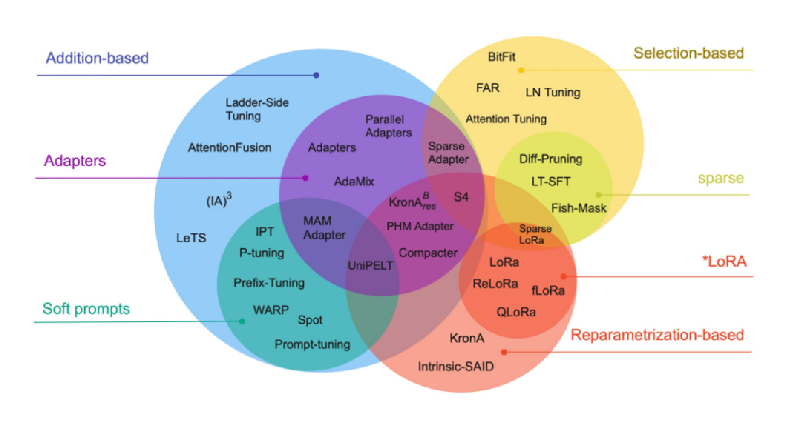
 

peft中的adapter方法可以看作是对transformer的bloks中的前馈层的串行方法，lora 是对transformer的blocks中的前馈层的并行方法。
lora 可以解决或缓解 优调可能带来的 catastrophic forget.

训练的LORA适配器可以作为单独模块独立保存。

HuggingFace 实现了 PEFT库，要支持PEFT LORA微调的模型需要提供adapters(Models that want to support LoRA fine-tuning need to provide adapters.). Huggingface罗列了支持LORA的相关模型.

四、压缩

剪枝 prune , 蒸馏 distill (teacher and student)  , 量化,  LoRA , 权重共享(weight sharing)

剪枝，去掉对输出影响小的卷积核，过滤标准，权重绝对值累加最小的卷积核，过滤时，要去掉该最小卷积核后续层的卷积核，然后对神经网络重新整理。

蒸馏，用(训练)得到的教师大模型  训练 学生小模型，以便将大模型的泛化能力快速迁移到小模型。可看作横向迁移。即用教师大模型的预测值作真值，与小模型的预测值进行比对。

自监督学习的模型，迁移到下游任务进行训练，可看作是纵向迁移。即自监督学习模型的前部、中部层freeze作下游任务模型的backbone，与下游任务相关的latter部用新的层，进行训练。

LoRA(Low Rank Adaption)，对稠密矩阵分解，是另一类优调方法，最早是微软研究院开发，基于基础模型(foundation/base model)进行优调。

后来通过调试(adaption)后用于优调扩散模型(diffusion)以降低对硬件的要求实现图像生成。通过冻住模型权重，对稠密层的矩阵(full rank)进行分解，用低秩(low rank)矩阵进行训练。

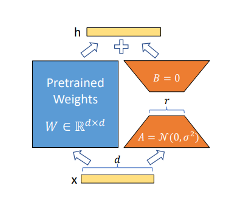
 

第三章 大模型推理

实际应用中，开发者通常使用 PyTorch 训练模型，然后将模型导出为 ONNX 格式，利用 TensorRT 进行优化和部署。这类结合使用方式既能利用 PyTorch 的灵活性，又能发挥 TensorRT 的高效推理能力。

Pytorch-Tensorrt 不用转onnx，适合原型验证。 生产环境对性能特别要求、模型跨多个框架(pytorch、tensorflow等)时 ，则依然用 TensorRT.

部分大模型可基于Ollama(Omni-Layer Learning Language Acquisition Model)进行推理。Ollama会对模型封装为类似容器镜像(container image)的 .mod 格式文件.

.mod 文件内容，预训练权重，通常GGUF格式；分词器定义(Tokenizer Configuration)；指令模板；系统提示及角色定义；模型大小、License等元数据。

第四章 大模型评估

大模型评估方法

1, 多项选择问答(Multiple Choice Question Answering) 
比方 MMLU(Massive Multitask Language Understanding) 测试台,
https://huggingface.co/datasets/cais/mmlu

学科(Subjects)，约57。涉及高等数学、生物学等，共1.6万多选题。

基于回答的正确率进行评估。

编码(Code), 需要加载MMLU数据集, 编写 提示函数, 标记化提示,  定义得分函数、检验函数.

2, 检验器(Verifiers )方法，与多项选择回答不同的是，不限定选项，允许LLM自由回答，然后提取与答案相关部分进行比较。

只适用于数学及编程(Math And Code)等容易验证的场景; 同时可能需要用到第三方工具进行比较。

优点在于允许生成无限的数学或编程问题，同时展示逐步推理过程，因此，适合推理模型的评估及开发。

3、基于用户偏好投票或对两两模型进行比较排名(LLM leaderboards),得到包括对回答风格等的整体评价. 不同于多项选择问答、检验器等基于模型准确率的方法.
比方  LM Aren  排行榜

4、基于别的指定评估标准的大模型来对待评估模型进行比较排名.
早期方法是 BLEU , 粗略的比较生成的文本与参考文本.  现在, 用提示词训练gpt-oss作 判断模型(judge model). 
比方 提示告诉 gpt-oss 要判断的内容的格式及应该具备什么样的回答风格较好. 

可在lap-top本地机器用 ollama 运行不同权重规模的 gpt-oss 模型进行推理.

命令行运行, 比方 ollama run gpt-oss:20b  或  ollama run qwen3:4b

然后 在命令行进行交互  >>> What is 1+2?

第五章 文件格式

大模型文件格式 safetensor、pt、ckpt、onnx、bin、GGUF等。

Safetensor格式示例。

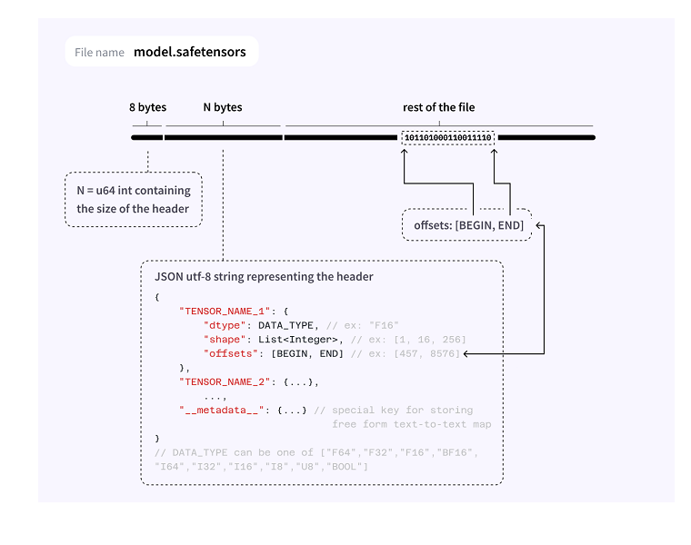

 

参考文献

医学基础

医学百科. 组织学/神经节、脊髓、大脑皮质和小脑皮质的结构.

Anirudh G. etc. Inductive Biases for Deep Learning of Higher-Level Cognition. 2022.

数学基础

David.C.Royster. Functions: How they have changed through History. Chapter 5, 2009.

Michele Benzi. Key Moments in the History of Numerical Analysis.

Nils J. Nilsson. INTRODUCTION TO MACHINE LEARNING. Stanford University, 1998.

Shai Shalev-Shwartz and Shai Ben-David. Understanding Machine Learning: From Theory to Algorithms. Cambridge University, 2014.

William J. Deuschle. Undergraduate Fundamentals of Machine Learning. 2017.

Laurent Younes. Introduction to Machine Learning. 2024.

Alexander Jung. Machine Learning: The Basics. 2023.

James R. Munkres. Topology. 2000.

Vectors, Matrices, and Norms. CS 357 @ Illinois.

JA N VA N N E ERV E N. Functional Analysis. Delft University of Technology, 2022.

Cornell. Function Spaces.

Harvard. LINEAR ALGEBRA AND VECTOR ANALYSIS.

M. Hajij. etc. Topological Deep Learning: Going Beyond Graph Data. 2023.

M. Ragheb. FLUID MECHANICS, EULER AND BERNOULLI EQUATIONS.

Abdul. Aziz. Schrödinger Wave Equation: Derivation & Explanation. 2024.

Sigurdur H. Sophus Lie and the Role of Lie Groups in Mathematics. 2004.

M. Hicke. An introduction to Taylor series and their applications: from proving Euler’s formula to computing π. 2025.

MSU. Overview of Fourier Series. 2013.

Justin A. T. AN INTRODUCTION TO FOURIER SERIES AND TRANSFORMS. 2023.

OX. The Discrete Fourier Transform.

Brian Ichter. etc. FAST: Efficient Action Tokenization for Vision-Language-Action Models. 2025.

MTU. B-spline Basis Functions: Definition.

David L. F. B-Splines and NURBS.

David A. B. Miller. An introduction to functional analysis for science and engineering. Stanford University.

HogoNext Editor team. How to Apply Functional Analysis in Machine Learning. 2024.

概率统计

F. M. Dekking. etc. A Modern Introduction to Probability and Statistics. 2005.

J. Calvin Berry. An Introduction to Probability and Statistics. 2025.

机器学习

Omar Elharrouss. Loss Functions in Deep Learning: A Comprehensive Review. 2025.

Yoshua Bengio. etc. Representation Learning: A Review and New Perspectives. 2014.

MIT. Intro to Machine Learning.

Laurent Younes. Introduction to Machine Learning. 2025.

Sefik Ilkin Serengil. A Step by Step Gradient Boosting Decision Tree Example. 2018.

Statmixedml. Understanding How Gradient Boosted Decision Trees Work.

LDS Team. AdaBoost: The Definitive Guide to Adaptive Boosting. 2025.

LDS Team. LightGBM: The Definitive Guide to Speed and Efficiency. 2025.

A. P. Dempster. Maximum Likelihood from Incomplete Data via the EM Algorithm. 1977.

C. Elkan. The Expectation-Maximization Algorithm. 2007.

Gregory. Expectation–Maximization. 2019.

Juan R. Terven, Diana M. Cordova-Esparza etc. LOSS FUNCTIONS AND METRICS IN DEEP LEARNING. 2024.

Danna Gurari. Feedforward Neural Networks. University of Colorado Boulder,2022.

Yann LeCun, Leon Bottou, Yoshua Bengio etc. Gradient-Based Learning Applied to Document Recognition. 1998.

Fei-Fei Li etc, Generative Models, Stanford University, 2019.

Peter B. A FRIENDLY INTRODUCTION TO PRINCIPAL COMPONENT ANALYSIS. 2020.

深度学习

Kourosh T. B. etc. Deep representation learning: Fundamentals, Perspectives, Applications, and Open Challenges. 2022.

Sepp H. etc. Long Short Term Memory. 1997.

D. E. Rumelhart. etc. Learning Internal Representations by Error Propagation. 1986.

Pierre B. Autoencoders, Unsupervised Learning, and Deep Architectures. 2012.

Geoffrey E. Hinton. etc. A fast learning algorithm for deep belief nets. 2006.

Geoffrey E. Hinton. Boltzmann Machines. 2007.

Abdel-R. M. etc. Deep Belief Networks for phone recognition. 2012.

变分自编码器

Diederik P. Kingma etc. Auto-Encoding Variational Bayes. 2013.

Stephen G. Odaibo. Tutorial: Deriving the Standard Variational Autoencoder (VAE) Loss Function. 2019.

James Lucas. etc. Understanding Posterior Collapse in Generative Latent Variable Models. 2019.

对抗生成

Ian J. Goodfellow. etc. Generative Adversarial Nets. 2014.

大模型

Transformer. Ashish Vaswani etc. Attention Is All You Need. 2017.

GPT-2. Alec Radford etc. Language Models are Unsupervised Multitask Learners.2019.

CLIP. Alec Radford etc. Learning Transferable Visual Models From Natural Language Supervision. 2021.

ViT. Alexey Dosovitskiy etc. AN IMAGE IS WORTH 16X16 WORDS: TRANSFORMERS FOR IMAGE RECOGNITION AT SCALE. 2021.

DiT. William Peebles etc. Scalable Diffusion Models with Transformers. 2023.

Jay Alammar. The Illustrated Transformer. 2018.

SEBASTIAN RASCHKA. From GPT-2 to gpt-oss: Analyzing the Architectural Advances. 2025.

Giorgos Nikolaou. etc. LANGUAGE MODELS ARE INJECTIVE AND HENCE INVERTIBLE. 2025.

扩散模型

J. Sohl-Dickstein. etc. Deep Unsupervised Learning using Nonequilibrium Thermodynamics. 2015.

Peter Holderrieth. etc. An Introduction to Flow Matching and Diffusion Models. 2025.

Jonathan Ho. etc. Denoising Diffusion Probabilistic Models. 2020.

Tim S. etc. PIXELCNN++: IMPROVING THE PIXELCNN WITH DISCRETIZED LOGISTIC MIXTURE LIKELIHOOD AND OTHER MODIFICATIONS. 2017.

Sergios K. etc. How diffusion models work: the math from scratch. 2022.

Lilian W. What Are Diffusion Models? 2021.

流匹配

Yaron L. etc. FLOW MATCHING FOR GENERATIVE MODELING. 2022.

Yaron L. etc. Flow Matching Guide and Code. 2024.

Peter R. Flow Matching: A visual introduction. 2025.

启发式算法

Tansel Dokeroglu. etc. A survey on pioneering metaheuristic algorithms between 2019 and 2024. 2024.

Edmund K. Burke. A Classification of Hyper-Heuristic Approaches: Revisited. 2019.

Zemin Mi. Heuristic Algorithms. 2024.

扩展研究

A.	Chaudhuri. etc. A Closer Look at Multimodal Representation Collapse. 2025.

M. Laskin. etc. Reinforcement Learning with Augmented Data. 2020.

Danijar H. etc. Mastering Diverse Domains through World Models. 2024.

Nicklas H. ect. TD-MPC2: Scalable, Robust World Models for Continuous Control. 2024.

Lucas M. etc. LeWorldModel: Stable End-to-End Joint-Embedding Predictive Architecture from Pixels. 2026.

S. Vilhes. Understanding Neural Tangent Kernel : Key Theories and Experimental Insights. 2024.

终身学习

German I. Parisi. etc. Continual Lifelong Learning with Neural Networks: A Review. 2019.

K. Zakka. etc. MuJoCo Playground. 2025.

应用篇

Shaina R. A Comprehensive Review of Recommender Systems: Transitioning from Theory to Practice. 2025.

